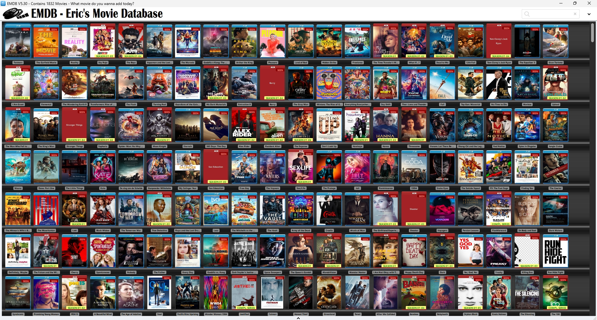

# My Movie Database

##### Find me:<br/><br/>[IMDB](https://www.imdb.com/user/ur35750288/)<br/>[TV Time](https://www.tvtime.com/en/user/16664345/profile)
##### Interested in PC Games? [PC games I played!](https://github.com/tdwns/games)
##### How to setup:
- Clone (or download as zip)
- Download and install EMDB: https://www.emdb.eu/downloads.html
- Open EMDB → Options → Database → Browse and select this (cloned/downloaded) folder (EMDB)
#### List of movies & TV series I've watched (with ratings):
`* marked - best movies / TV series ❤️`
```
No.   Fav❤️ User Rating:    IMDb Rating:         Year: Title:                                                                           Country:                  Genres:                                                           Certification:  Runtime:       
------------------------------------------------------------------------------------------------------------------------------------------------------------------------------------------------------------------------------------------------------------------
1832       7.0             6.7  (92.4K votes)   2024  Twisters                                                                         United States             Action, Adventure, Thriller                                       PG-13           122 minutes    
1831       6.0             5.7  (16.3K votes)   2024  The Garfield Movie                                                               United States             Animation, Adventure, Comedy, Family, Fantasy                     PG              101 minutes    
1830       6.0             6.7  (22.5K votes)   2023  Reality                                                                          United States             Drama                                                             TV-MA           83 minutes     
1722       7.5             6.6  (11.4K votes)   2021  Sky Rojo - Season 01-03                                                          Spain                     Action, Adventure, Crime, Drama, Thriller                         TV-MA           1 minutes      
1697  *    9.0             8.7  (226.3K votes)  2019  The Boys - Season 01-04                                                          United States             Action, Sci-Fi, Comedy, Crime                                     TV-MA           104 hours      
1829       6.0             5.6  (92.8K votes)   2023  Aquaman and the Lost Kingdom                                                     United States             Action, Adventure, Fantasy, Sci-Fi                                PG-13           124 minutes    
1828       6.0             5.5  (129.9K votes)  2023  The Marvels                                                                      United States             Action, Adventure, Fantasy                                        PG-13           105 minutes    
1827       6.0             6.2  (76.1K votes)   2024  Godzilla x Kong: The New Empire                                                  United States             Action, Adventure, Fantasy, Sci-Fi, Thriller                      PG-13           115 minutes    
1825       8.0             7.0  (14.8K votes)   2024  Arthur the King                                                                  United States             Adventure, Drama                                                  PG-13           107 minutes    
1826       6.5             6.4  (22.8K votes)   2021  Pleasure                                                                         Sweden                    Drama                                                             R               109 minutes    
1824       7.0             6.5  (18.1K votes)   2024  Land of Bad                                                                      United States             Action, Thriller                                                  R               113 minutes    
1823       6.5             5.3  (18.4K votes)   2023  Hidden Strike                                                                    China                     Action, Adventure, Comedy, Thriller                               TV-14           102 minutes    
1822       6.0             5.5  (15.2K votes)   2023  Freelance                                                                        United States             Action, Comedy                                                    R               108 minutes    
1821       8.0             7.7  (17.4K votes)   2022  The Time Traveler's Wife - Season 01                                             United States             Drama, Sci-Fi                                                     TV-MA           300 minutes    
1765  *    10              7.6  (41.7K votes)   2021  What If...? - Season 01-02                                                       United States             Animation, Action, Adventure                                      TV-14           576 minutes    
1714       8.0             8.0  (55.6K votes)   2019  Dead to Me - Season 01-03                                                        United States             Drama, Comedy                                                     TV-MA           15 hours       
1820       8.0             9.1  (98.4K votes)   2023  12th Fail                                                                        India                     Biography, Drama                                                                  147 minutes    
1522       8.0             8.2  (56.4K votes)   2018  Tom Clancy's Jack Ryan - Season 01-04                                            United States             Action, Thriller, Drama                                           TV-MA           26 hours       
1819       7.5             6.9  (44.1K votes)   2023  The Equalizer 3                                                                  United States             Action, Crime, Thriller                                           R               109 minutes    
1818  *    8.0             7.2  (43.4K votes)   2023  Gran Turismo                                                                     United States             Action, Adventure, Drama, Sport                                   PG-13           134 minutes    
1817       7.5             6.7  (36.9K votes)   2022  I Am Groot - Season 01-02                                                        United States             Animation, Short, Action, Adventure, Comedy, Fantasy, Sci-Fi      TV-PG           40 minutes     
1816  *    8.5             7.0  (36K votes)     2023  Elemental                                                                        United States             Animation, Adventure, Comedy, Drama, Family, Fantasy, Sci-Fi      PG              101 minutes    
1815       7.0             7.0  (10.8K votes)   2022  The Wandering Earth II                                                           China                     Action, Adventure, Drama, Sci-Fi                                                  173 minutes    
1814       6.0             6.1  (64.5K votes)   2023  Transformers: Rise of the Beasts                                                 United States             Action, Adventure, Sci-Fi                                         PG-13           127 minutes    
1813       7.0             6.9  (129.8K votes)  2023  The Flash                                                                        United States             Action, Adventure, Fantasy, Sci-Fi                                PG-13           144 minutes    
1812       7.0             7.0  (137.4K votes)  2022  Turning Red                                                                      United States             Animation, Adventure, Comedy, Drama, Family, Fantasy              PG              100 minutes    
1811  *    9.0             8.1  (222.4K votes)  2023  Guardians of the Galaxy Vol. 3                                                   United States             Action, Adventure, Comedy, Sci-Fi                                 PG-13           150 minutes    
1725       8.5             7.9  (53.4K votes)   2019  His Dark Materials - Season 01-03                                                United States             Drama, Adventure, Fantasy, Family                                 TV-PG           22 hours       
1810  *    8.0             7.1  (90.9K votes)   2023  Extraction II                                                                    Czech Republic            Action, Thriller                                                  R               122 minutes    
1597       8.0             8.3  (33.9K votes)   2018  Barry - Season 01-04                                                             United States             Action, Drama, Comedy, Crime                                      TV-MA           15 hours       
1794       8.0             6.5  (193.8K votes)  2022  The Gray Man                                                                     United States             Action, Thriller                                                  PG-13           122 minutes    
1791       7.5             6.6  (51.8K votes)   2022  Minions: The Rise of Gru                                                         United States             Animation, Adventure, Comedy, Crime, Family, Sci-Fi               PG              2 minutes      
1792  *    9.0             8.1  (199.1K votes)  2022  Everything Everywhere All at Once                                                United States             Action, Adventure, Comedy, Fantasy, Sci-Fi                        R               2 minutes      
1793       6.5             6.1  (59.2K votes)   2022  Day Shift                                                                        United States             Action, Comedy, Fantasy, Horror, Thriller                         R               2 minutes      
1789       7.0             6.6  (200.6K votes)  2022  Thor: Love and Thunder                                                           Australia                 Action, Adventure, Comedy, Fantasy, Romance, Sci-Fi               PG-13           31 minutes     
1790       7.0             6.3  (15K votes)     2022  Fall                                                                             United Kingdom            Thriller                                                          PG-13           2 minutes      
1788  *    10              8.5  (306.4K votes)  2022  Top Gun: Maverick                                                                United States             Action, Drama                                                     PG-13           130 minutes    
1787  *    9.0             7.3  (385.4K votes)  2021  No Time to Die                                                                   United Kingdom            Action, Adventure, Thriller                                       PG-13           163 minutes    
1786       7.0             5.2  (98.2K votes)   2022  Morbius                                                                          United States             Action, Adventure, Horror, Sci-Fi, Thriller                       PG-13           104 minutes    
1674       8.0             8.0  (31K votes)     2020  Upload - Season 01-02                                                            United States             Sci-Fi, Comedy, Mystery                                           TV-MA           510 minutes    
1785       8.0             6.8  (5.4K votes)    2022  The Man Who Fell to Earth - Season 01                                            United States             Sci-Fi                                                            TV-MA           550 minutes    
1784       8.0             6.3  (128K votes)    2021  The King's Man                                                                   United Kingdom            Action, Adventure, Thriller                                       R               131 minutes    
1371  *    9.5             8.9  (454.5K votes)  2016  Stranger Things - Season 01-04                                                   United States             Thriller, Horror, Drama, Sci-Fi, Fantasy, Mystery                 TV-14           34 hours       
1720       8.0             8.4  (67K votes)     2019  Euphoria - Season 01-02                                                          United States             Drama                                                             TV-MA           18 hours       
1781  *    9.0             8.4  (628.8K votes)  2021  Spider-Man: No Way Home                                                          United States             Action, Adventure, Fantasy, Sci-Fi                                PG-13           148 minutes    
1783  *    8.5             7.5  (135.9K votes)  2022  Moon Knight - Season 01                                                          United States             Action, Adventure, Fantasy                                        TV-14           318 minutes    
1780       7.5             6.3  (302.4K votes)  2021  Eternals                                                                         United States             Action, Adventure, Fantasy, Sci-Fi                                PG-13           156 minutes    
1782       4.0             2.5  (12K votes)     2022  365 Days: This Day                                                               Poland                    Drama, Romance                                                    TV-MA           111 minutes    
1715       8.5             7.5  (8.4K votes)    2020  Alex Rider - Season 01-02                                                        UK                        Action, Thriller, Adventure, Family                               TV-14           11 hours       
1724       8.5             8.4  (13.1K votes)   2021  Resident Alien - Season 01-02                                                    United States             Drama, Sci-Fi, Comedy, Mystery                                    TV-14           13 hours       
1675       9.0             8.5  (95.2K votes)   2015  The Expanse - Season 01-06                                                       Canada                    Thriller, Drama, Sci-Fi, Mystery                                  TV-14           85 hours       
1779  *    9.0             7.3  (395.7K votes)  2021  Don't Look Up                                                                    United States             Comedy, Drama, Sci-Fi                                             R               138 minutes    
1778  *    8.0             7.7  (112.9K votes)  2021  Hawkeye - Season 01                                                              United States             Action, Adventure, Crime, Drama, Mystery, Sci-Fi                  TV-14           300 minutes    
1529  *    8.0             7.6  (32.6K votes)   2019  Hanna - Season 01-03                                                             United States             Action, Drama                                                     TV-MA                          
1777       7.5             7.0  (599 votes)     2021  Threesome - Season 01                                                            Sweden                    Drama                                                                             192 minutes    
1776       7.5             6.1  (91.3K votes)   2021  Venom: Let There Be Carnage                                                      United States             Action, Adventure, Sci-Fi                                         PG-13           97 minutes     
1775  *    9.0             7.6  (213.8K votes)  2021  Shang-Chi and the Legend of the Ten Rings                                        United States             Action, Adventure, Fantasy                                        PG-13           132 minutes    
1774  *    8.0             6.4  (103K votes)    2021  Red Notice                                                                       United States             Comedy, Crime, Thriller                                           PG-13           118 minutes    
1773  *    8.0             6.8  (43.1K votes)   2019  Spies in Disguise                                                                United States             Animation, Action, Adventure                                      PG              102 minutes    
1772       7.5             6.6  (119.3K votes)  2021  Jungle Cruise                                                                    United States             Action, Adventure, Comedy                                         PG-13           127 minutes    
1771  *    8.5             7.6  (298.9K votes)  2016  Moana                                                                            United States             Animation, Adventure, Comedy                                      PG              107 minutes    
1770  *    8.5             8.3  (138.3K votes)  2021  Dune: Part One                                                                   United States             Action, Adventure, Drama                                          PG-13           155 minutes    
1769       7.0             6.3  (77.9K votes)   2021  The Little Things                                                                United States             Crime, Drama, Mystery                                             R               128 minutes    
1768       7.5             6.3  (41.4K votes)   2021  Kate                                                                             United States             Action, Adventure, Crime                                          R               106 minutes    
1767       8.0             7.3  (5.1K votes)    2020  De slag om de Schelde                                                            Netherlands               Drama, War                                                        TV-MA           124 minutes    
1766       7.0             6.0  (30.6K votes)   2021  Gunpowder Milkshake                                                              France                    Action, Crime, Thriller                                           R               114 minutes    
1764       7.0             6.4  (2.7K votes)    2020  My Salinger Year                                                                 Canada                    Drama                                                             R               101 minutes    
1456       8.5             8.4  (58.8K votes)   2019  Sex Education - Season 01-03                                                     United States             Drama, Comedy                                                     TV-MA           21 hours       
1763  *    9.0             7.5  (75.8K votes)   2021  Free Guy                                                                         United States             Action, Adventure, Comedy                                         PG-13           115 minutes    
1762       7.0             5.8  (3.9K votes)    2021  The Voyeurs                                                                      United States             Drama, Mystery, Thriller                                          R               120 minutes    
1761       6.0             5.3  (15.4K votes)   2021  Sex/Life - Season 01                                                             United States             Comedy, Drama, Romance                                            TV-MA           416 minutes    
1760       7.0             6.1  (7.1K votes)    2021  The Protege                                                                      United States             Action, Crime, Thriller                                           R               109 minutes    
1759       7.0             5.6  (20.2K votes)   2021  Jolt                                                                             United States             Action, Thriller                                                  R               91 minutes     
1758       8.0             5.9  (20.5K votes)   2021  Reminiscence                                                                     United States             Mystery, Romance, Sci-Fi                                          PG-13           116 minutes    
1757  *    9.0             8.1  (11.4K votes)   2021  CODA                                                                             United States             Drama, Music                                                      PG-13           111 minutes    
1756       7.0             5.5  (8K votes)      2021  Snake Eyes                                                                       Canada                    Action, Adventure, Fantasy                                        PG-13           121 minutes    
1755       8.0             7.6  (90.7K votes)   2021  The Suicide Squad                                                                United States             Action, Comedy, Adventure                                         R               132 minutes    
1754       7.0             5.4  (42.8K votes)   2021  F9: The Fast Saga                                                                United States             Action, Adventure, Crime                                          PG-13           143 minutes    
1753       8.0             6.1  (722 votes)     2021  Finding You                                                                      United States             Drama, Romance                                                    PG              119 minutes    
1752       8.0             7.1  (22.2K votes)   2020  The Courier                                                                      United Kingdom            Thriller                                                          PG-13           112 minutes    
1751       7.0             6.2  (21.6K votes)   2021  The Hitman's Wife's Bodyguard                                                    United States             Action, Comedy, Crime                                             R               100 minutes    
1749       8.5             7.4  (30.6K votes)   2021  The Mauritanian                                                                  United Kingdom            Thriller, Drama                                                   R               129 minutes    
1750  *    9.0             8.6  (114.2K votes)  2021  Loki - Season 01                                                                 United States             Action, Adventure, Fantasy                                        TV-14           312 minutes    
1748       7.5             7.0  (51.9K votes)   2021  Black Widow                                                                      United States             Action, Sci-Fi, Adventure                                         PG-13           133 minutes    
1747       7.5             6.7  (68.2K votes)   2021  The Tomorrow War                                                                 United States             Action, Drama, Adventure                                          PG-13           140 minutes    
1744  *    8.5             8.9  (511.6K votes)  2014  True Detective - Season 01-03                                                    United States             Drama, Crime, Mystery                                             TV-MA           26 hours       
1746       8.0             7.4  (84.5K votes)   2021  Raya and the Last Dragon                                                         United States             Action, Adventure, Animation                                      PG              107 minutes    
1745       8.5             7.6  (32.4K votes)   2021  Luca                                                                             United States             Comedy, Adventure, Animation                                      PG              95 minutes     
1743  *    9.0             7.8  (58.6K votes)   2021  The Mitchells vs the Machines                                                    United States             Comedy, Adventure, Animation                                      PG              113 minutes    
1742       7.5             6.4  (7.5K votes)    2021  The Vault                                                                        Spain                     Action, Thriller, Adventure                                       R               118 minutes    
1741       6.5             5.9  (96.5K votes)   2021  Army of the Dead                                                                 United States             Action, Thriller, Horror, Sci-Fi, Crime                           R               148 minutes    
1740  *    9.0             7.4  (14K votes)     2021  Cruella                                                                          United States             Comedy, Crime                                                     PG-13           134 minutes    
1739  *    8.0             7.3  (23K votes)     2021  Wrath of Man                                                                     UK                        Action, Thriller                                                  R               119 minutes    
1738       7.0             7.1  (9.2K votes)    2016  The Girlfriend Experience - Season 01-03                                         United States             Drama                                                             TV-MA           17 hours       
1348       8.0             7.6  (18.1K votes)   2016  Shooter - Season 01-03                                                           United States             Action, Drama                                                     TV-14           20 hours       
1737       7.0             5.3  (4.6K votes)    2021  Voyagers                                                                         United States             Thriller, Sci-Fi, Adventure                                       PG-13           108 minutes    
1736  *    9.0             7.4  (2.8K votes)    2020  Persian Lessons                                                                  Russia                    Drama, War                                                                        127 minutes    
1735       9.0             7.6  (59.3K votes)   2009  Flashforward - Complete Series                                                   United States             Thriller, Drama, Sci-Fi, Mystery                                  TV-14           16 hours       
1734       8.5             7.6  (24.8K votes)   2017  On Body and Soul                                                                 Hungary                   Drama, Fantasy, Romance, Mystery                                  Not Rated       116 minutes    
1733  *    9.0             7.6  (66.6K votes)   2019  Dark Waters                                                                      United States             Thriller, Drama, History, Biography                               PG-13           126 minutes    
1732       8.0             7.1  (157K votes)    2008  Definitely, Maybe                                                                UK                        Drama, Comedy, Romance                                            PG-13           112 minutes    
1731       8.0             7.7  (57.9K votes)   2021  The Falcon and the Winter Soldier - Season 01                                    United States             Action, Drama, Sci-Fi, Adventure                                  TV-14           300 minutes    
1730       8.0             6.6  (18.8K votes)   2021  Cherry                                                                           United States             Drama, Crime                                                      R               142 minutes    
1729       7.0             6.5  (5.8K votes)    2020  Spontaneous                                                                      United States             Sci-Fi, Comedy, Fantasy                                           R               101 minutes    
1728  *    9.0             7.5  (25.5K votes)   2021  Nobody                                                                           United States             Action, Thriller, Crime                                           R               92 minutes     
1727  *    9.0             8.3  (28.2K votes)   2020  The Father                                                                       UK                        Drama                                                             PG-13           97 minutes     
1726       8.0             6.4  (19K votes)     2018  Every Day                                                                        Canada                    Drama, Fantasy, Romance                                           PG-13           97 minutes     
1723       7.5             7.1  (31.1K votes)   2021  Godzilla vs. Kong                                                                United States             Action, Thriller, Sci-Fi                                          PG-13           113 minutes    
1721  *    9.0             8.4  (127.6K votes)  2021  Zack Snyder's Justice League                                                     UK                        Action, Sci-Fi, Adventure, Fantasy                                R               242 minutes    
1719  *    8.0             6.6  (14.7K votes)   2021  Space Sweepers                                                                   South Korea               Action, Drama, Sci-Fi, Adventure, Fantasy                         TV-MA           136 minutes    
1718  *    9.0             8.6  (274.4K votes)  2020  The Queen's Gambit - Season 01                                                   United States             Drama, Sport                                                      TV-MA           472 minutes    
1717  *    9.0             8.3  (88.5K votes)   2021  WandaVision - Season 01                                                          United States             Action, Drama, Sci-Fi, Comedy, Fantasy                            TV-14           342 minutes    
1716       7.0             5.3  (17K votes)     2020  Monster Hunter                                                                   Germany                   Action, Adventure, Fantasy                                        PG-13           103 minutes    
1713       8.0             7.6  (40.9K votes)   2020  I Am Not Okay with This - Season 01                                              United States             Sci-Fi, Comedy                                                    TV-MA           161 minutes    
1712       7.0             6.6  (117.3K votes)  2017  Happy Death Day                                                                  United States             Thriller, Horror, Comedy, Mystery                                 PG-13           96 minutes     
1711  *    10              8.8  (283.6K votes)  2017  Dark - Season 01-03                                                              Germany                   Thriller, Drama, Sci-Fi, Crime, Mystery                           TV-MA           22 hours       
1710       7.0             6.1  (9.2K votes)    2019  Yes, God, Yes                                                                    United States             Drama, Comedy                                                     R               78 minutes     
1709       7.0             6.3  (22K votes)     2020  Freaky                                                                           United States             Thriller, Horror, Comedy                                          R               102 minutes    
1708       8.5             8.3  (85.1K votes)   2018  Killing Eve - Season 01-03                                                       United States             Action, Thriller, Drama, Adventure                                TV-14           16 hours       
1707       8.0             7.5  (3K votes)      2020  Run Hide Fight                                                                   United States             Action                                                                            109 minutes    
1706       8.0             6.3  (2.9K votes)    2019  Synchronic                                                                       United States             Horror, Drama, Sci-Fi                                             R               102 minutes    
1705       8.0             7.5  (10.2K votes)   2020  Promising Young Woman                                                            UK                        Thriller, Drama, Crime                                            R               113 minutes    
1704       7.5             8.0  (5.7K votes)    2019  PEN15 - Season 01-02                                                             United States             Comedy                                                            TV-MA           510 minutes    
1703  *    10              8.2  (843.8K votes)  2001  A Beautiful Mind                                                                 United States             Drama, Biography                                                  PG-13           135 minutes    
1702  *    9.0             7.2  (153.9K votes)  2015  The Age of Adaline                                                               United States             Drama, Fantasy, Romance                                           PG-13           112 minutes    
1700  *    9.0             8.2  (68.8K votes)   2020  Soul                                                                             United States             Music, Comedy, Adventure, Fantasy, Animation, Family              PG              100 minutes    
1701       7.0             5.6  (105.4K votes)  2018  Pacific Rim: Uprising                                                            UK                        Action, Sci-Fi, Adventure                                         PG-13           111 minutes    
1698       7.0             5.7  (73.9K votes)   2020  Wonder Woman 1984                                                                United States             Action, Adventure, Fantasy                                        PG-13           151 minutes    
1699       8.0             8.6  (85.6K votes)   2010  Justified - Complete Series                                                      United States             Action, Thriller, Drama, Crime, Western, Mystery                  TV-MA           58 hours       
1696       6.5             5.9  (10.3K votes)   2020  Fatman                                                                           UK                        Action, Thriller, Comedy, Fantasy                                 R               100 minutes    
1695       6.5             6.0  (7.9K votes)    2020  Honest Thief                                                                     United States             Action, Thriller, Drama, Crime, Romance                           PG-13           99 minutes     
1694       7.0             6.3  (27.5K votes)   2020  Greenland                                                                        United States             Action, Thriller, Drama                                           PG-13           119 minutes    
1693  *    9.0             7.7  (174.2K votes)  2020  Tenet                                                                            UK                        Action, Sci-Fi                                                    PG-13           150 minutes    
1692       6.5             5.1  (10.1K votes)   2020  After We Collided                                                                United States             Drama, Romance                                                    R               105 minutes    
1691  *    9.0             8.4  (84.6K votes)   2013  Banshee - Season 01-04                                                           United States             Action, Thriller, Drama, Crime, Mystery                           TV-MA           75 hours       
1690       8.0             7.1  (5.9K votes)    2019  Babyteeth                                                                        Australia                 Drama, Music, Comedy, Romance                                     MA-17           118 minutes    
1689  *    10              8.3  (99.4K votes)   2013  Orphan Black - Season 01-05                                                      Canada                    Action, Drama, Sci-Fi                                             TV-MA           42 hours       
1688       7.5             6.7  (74.7K votes)   2020  Enola Holmes                                                                     UK                        Drama, Adventure, Crime, Mystery                                  PG-13           123 minutes    
1687       7.0             6.1  (7K votes)      2020  The Silencing                                                                    Canada                    Action, Thriller, Crime                                           R               93 minutes     
1686  *    8.5             7.7  (204.6K votes)  2014  The 100 - Complete Series                                                        United States             Drama, Sci-Fi, Mystery                                            TV-MA           75 hours       
1685       6.0             6.4  (10.5K votes)   2019  Swallow                                                                          United States             Thriller, Drama                                                   R               94 minutes     
1683  *    8.5             7.1  (24.1K votes)   2020  The King of Staten Island                                                        United States             Drama, Comedy                                                     R               136 minutes    
1682       8.0             7.1  (38.9K votes)   2020  The Devil All the Time                                                           United States             Thriller, Drama, Crime                                            R               138 minutes    
1684       8.0             7.5  (118K votes)    2017  The Big Sick                                                                     United States             Drama, Comedy, Romance                                            R               120 minutes    
1681       7.0             5.5  (7.8K votes)    2020  Love, Guaranteed                                                                 United States             Comedy, Romance                                                   TV-PG           90 minutes     
1680       6.5             6.2  (31.8K votes)   2013  Adore                                                                            Australia                 Drama, Romance                                                    R               112 minutes    
1679       7.0             7.8  (249.6K votes)  2005  Pride & Prejudice                                                                France                    Drama, Romance                                                    PG              129 minutes    
1677       6.5             6.1  (1.7K votes)    2020  Unpregnant                                                                       United States             Drama, Comedy                                                     PG-13           103 minutes    
1678       7.5             6.2  (5.8K votes)    2020  Lost Bullet                                                                      France                    Action, Thriller, Crime                                           TV-MA           92 minutes     
1676       6.5             5.9  (12K votes)     2020  The Babysitter: Killer Queen                                                     United States             Horror, Comedy                                                    TV-MA           101 minutes    
1673       8.0             7.1  (9.7K votes)    2020  I'm Thinking of Ending Things                                                    United States             Thriller, Drama                                                   R               134 minutes    
1672       8.0             6.7  (9.5K votes)    2020  The Outpost                                                                      United States             Action, Drama, War, History                                       R               123 minutes    
1671       6.0             3.3  (33.3K votes)   2020  365 Days                                                                         Poland                    Drama, Romance                                                    TV-MA           114 minutes    
1670       7.5             6.3  (3.6K votes)    2019  Coma                                                                             Russia                    Action, Sci-Fi, Adventure, Fantasy                                                111 minutes    
1669  *    9.0             8.1  (42.4K votes)   2016  Travelers - Complete Series                                                      Canada                    Thriller, Drama, Sci-Fi, Mystery                                  TV-MA           25 hours       
1668       7.0             6.1  (7.1K votes)    2020  The Kissing Booth 2                                                              UK                        Comedy, Romance                                                   TV-14           134 minutes    
1665  *    8.5             5.3  (406 votes)     2019  Volition                                                                         Canada                    Thriller, Sci-Fi                                                                  91 minutes     
1667       6.5             5.2  (5.4K votes)    2020  Survive the Night                                                                United States             Action, Thriller, Drama                                           R               90 minutes     
1666  *    8.5             6.3  (1.7K votes)    2020  Archive                                                                          UK                        Sci-Fi                                                                            109 minutes    
1664       7.5             5.4  (1.4K votes)    2019  Life Like                                                                        United States             Thriller, Sci-Fi                                                  R               95 minutes     
1663       8.0             7.1  (23.6K votes)   2020  Greyhound                                                                        United States             Action, Drama, War, History                                       PG-13           91 minutes     
1661  *    8.0             6.7  (53.8K votes)   2020  The Old Guard                                                                    United States             Action, Thriller, Adventure, Fantasy                              R               125 minutes    
1662       7.5             7.3  (51.4K votes)   2015  The Last Man on Earth - Complete Series                                          United States             Action, Drama, Sci-Fi, Comedy, Romance                            TV-14           29 hours       
1660       7.5             8.4  (6.3K votes)    2019  Wayne - Complete Series                                                          United States             Action, Comedy                                                                    350 minutes    
1659       8.0             7.9  (59.7K votes)   2019  Russian Doll - Season 01-02                                                      United States             Drama, Comedy, Adventure, Mystery                                 TV-MA           270 minutes    
1658  *    8.5             7.9  (34.2K votes)   2016  Lethal Weapon - Complete Series                                                  United States             Action, Thriller, Drama, Comedy, Crime                            TV-14           41 hours       
1656       8.0             8.5  (154.2K votes)  2017  The Handmaid's Tale - Season 01-04                                               United States             Thriller, Drama, Sci-Fi                                           TV-MA           75 hours       
1657       7.0             7.0  (16.5K votes)   2020  The Half of It                                                                   United States             Drama, Comedy, Romance                                            PG-13           104 minutes    
1655       8.0             7.7  (34.2K votes)   2016  Timeless - Season 01-02                                                          United States             Action, Drama, Sci-Fi, Adventure                                  Not Rated       21 hours       
1654       8.0             6.6  (60.9K votes)   2020  Sonic the Hedgehog                                                               United States             Action, Sci-Fi, Comedy, Adventure, Family                         PG              99 minutes     
1653  *    8.5             7.4  (27.9K votes)   2016  Colony - Complete Series                                                         United States             Action, Drama, Sci-Fi, Adventure                                  TV-14           28 hours       
1652       7.5             8.0  (678.1K votes)  2010  Black Swan                                                                       United States             Thriller, Drama                                                   R               108 minutes    
1651       7.5             5.7  (35.6K votes)   2020  Bloodshot                                                                        United States             Action, Drama, Sci-Fi                                             PG-13           109 minutes    
1650  *    10              8.1  (131.7K votes)  2018  Altered Carbon - Season 01-02                                                    United States             Action, Thriller, Drama, Sci-Fi                                   TV-MA                          
1649       7.0             7.0  (31.5K votes)   2018  Dragged Across Concrete                                                          Canada                    Action, Thriller, Drama, Crime                                    R               159 minutes    
1647       7.5             6.6  (32.8K votes)   2018  Peter Rabbit                                                                     United States             Comedy, Adventure, Fantasy, Family                                PG              95 minutes     
376        7.5             7.1  (215.2K votes)  2012  Hotel Transylvania                                                               United States             Horror, Comedy, Fantasy, Animation, Family                        PG              91 minutes     
1648  *    9.0             7.0  (22.3K votes)   2019  Abominable                                                                       China                     Comedy, Adventure, Fantasy, Animation, Family                     PG              97 minutes     
1646       6.5             6.1  (42.4K votes)   2015  Love                                                                             France                    Drama, Romance                                                    Not Rated       135 minutes    
1645       8.0             6.5  (42.5K votes)   2019  The Secret Life of Pets 2                                                        United States             Comedy, Adventure, Animation, Family                              PG              86 minutes     
1644       8.0             6.5  (176.1K votes)  2016  The Secret Life of Pets                                                          United States             Comedy, Adventure, Animation, Family                              PG              87 minutes     
1643       8.5             7.1  (44.8K votes)   2015  Ip Man 3                                                                         China                     Action, Drama, Biography                                          PG-13           105 minutes    
1642       7.5             6.6  (59.5K votes)   2001  Kiss of the Dragon                                                               France                    Action, Thriller, Drama, Crime                                    R               98 minutes     
1641       8.0             7.1  (40.8K votes)   2015  The Peanuts Movie                                                                United States             Comedy, Animation, Family                                         G               88 minutes     
1640       6.5             5.4  (6.4K votes)    2011  You May Not Kiss the Bride                                                       United States             Action, Comedy, Crime, Romance                                    PG-13           99 minutes     
1639       7.0             6.6  (138.4K votes)  2006  Idiocracy                                                                        United States             Thriller, Sci-Fi, Comedy, Adventure                               R               84 minutes     
1638       7.5             5.9  (2K votes)      2020  Arkansas                                                                         United States             Thriller, Drama, Crime                                            R               117 minutes    
1635       7.5             7.2  (13.7K votes)   2019  Ip Man 4: The Finale                                                             Hong Kong                 Action, Drama, History, Biography                                 Unrated         107 minutes    
1637       7.0             5.7  (53.2K votes)   2016  Ice Age: Collision Course                                                        United States             Sci-Fi, Comedy, Adventure, Fantasy, Animation, Family, Romance    PG              94 minutes     
1636       8.0             7.0  (20.5K votes)   2020  Extraction                                                                       United States             Action                                                            R               116 minutes    
1634       8.5             7.8  (238.6K votes)  2007  Atonement                                                                        UK                        Drama, War, Romance, Mystery                                      R               123 minutes    
1633  *    8.5             7.6  (91.1K votes)   2017  Gifted                                                                           United States             Drama                                                             PG-13           101 minutes    
1632       7.5             7.3  (15.3K votes)   2019  Honey Boy                                                                        United States             Drama                                                             R               94 minutes     
1631       8.0             7.4  (16K votes)     2011  Red Dog                                                                          Australia                 Drama, Comedy, Family, Romance, Biography                         PG              92 minutes     
1630       8.0             6.7  (6.8K votes)    2020  Escape from Pretoria                                                             UK                        Thriller                                                          PG-13           106 minutes    
1629  *    8.5             8.0  (89.7K votes)   2019  The Gentlemen                                                                    UK                        Action, Comedy, Crime                                             R               113 minutes    
1628       7.0             5.7  (1.2K votes)    2020  My Spy                                                                           United States             Action, Comedy, Family                                            PG-13           99 minutes     
1627       8.0             7.7  (302.5K votes)  2018  A Star Is Born                                                                   United States             Drama, Music, Romance                                             R               136 minutes    
1626       7.5             6.4  (14.2K votes)   2015  Ashby                                                                            United States             Drama, Comedy, Crime, Romance                                     R               100 minutes    
1625       8.0             6.8  (72.1K votes)   2005  Stay                                                                             United States             Thriller, Drama, Mystery                                          R               99 minutes     
1624       8.0             6.3  (1.7K votes)    2020  I Still Believe                                                                  United States             Drama, Music, Romance                                             PG              116 minutes    
1623       6.5             7.1  (51.9K votes)   2020  Bad Boys for Life                                                                United States             Action, Thriller, Comedy, Crime                                   R               124 minutes    
1621       7.5             7.5  (135.9K votes)  2019  Uncut Gems                                                                       United States             Thriller, Drama, Crime                                            R               135 minutes    
1622       8.5             6.8  (9.8K votes)    2020  The Call of the Wild                                                             United States             Drama, Adventure, Family                                          PG              100 minutes    
1620  *    9.0             8.6  (334.2K votes)  2019  Parasite                                                                         South Korea               Thriller, Drama, Comedy                                           R               132 minutes    
1619       8.0             7.8  (402.1K votes)  2013  Captain Phillips                                                                 United States             Thriller, Drama, Crime, Biography                                 PG-13           134 minutes    
1618  *    9.0             7.6  (51.9K votes)   2017  Only the Brave                                                                   United States             Action, Drama, Biography                                          PG-13           134 minutes    
1617       8.5             8.4  (242.3K votes)  2019  1917                                                                             United States             Drama, War                                                        R               119 minutes    
1616       8.0             7.3  (16.3K votes)   2019  Official Secrets                                                                 UK                        Thriller, Drama, War, Crime, Romance, Biography                   R               112 minutes    
1615       7.5             7.7  (421.1K votes)  2007  Zodiac                                                                           United States             Thriller, Drama, Crime, Mystery                                   R               157 minutes    
1614       8.0             8.1  (803.1K votes)  2007  No Country for Old Men                                                           United States             Thriller, Drama, Crime                                            R               122 minutes    
1613  *    8.5             7.4  (86.2K votes)   2019  Doctor Sleep                                                                     UK                        Thriller, Horror, Drama, Fantasy                                  R               152 minutes    
1612       8.0             6.7  (35.4K votes)   2019  Midway                                                                           China                     Action, Drama, War, History                                       PG-13           138 minutes    
1611       8.5             7.7  (7.3K votes)    2019  Sorry We Missed You                                                              UK                        Drama                                                                             101 minutes    
1610       8.0             7.5  (25K votes)     2019  Richard Jewell                                                                   United States             Drama, Crime, Biography                                           R               131 minutes    
1609       7.0             6.8  (103.9K votes)  2019  Jumanji: The Next Level                                                          United States             Action, Comedy, Adventure, Fantasy                                PG-13           123 minutes    
1608       6.5             6.5  (6.2K votes)    2019  Guns Akimbo                                                                      UK                        Action, Comedy                                                    R               95 minutes     
1607       8.0             7.7  (132.4K votes)  2003  Good Bye Lenin!                                                                  Germany                   Drama, Comedy, Romance                                            R               121 minutes    
1606       7.0             6.3  (43.3K votes)   2004  After the Sunset                                                                 United States             Action, Drama, Comedy, Crime                                      PG-13           97 minutes     
1605       8.0             7.7  (388.6K votes)  2003  Lost in Translation                                                              United States             Drama                                                             R               102 minutes    
1604       8.0             8.2  (382K votes)    2017  Three Billboards Outside Ebbing, Missouri                                        UK                        Drama, Comedy, Crime                                              R               115 minutes    
1603  *    8.5             8.0  (169.1K votes)  2019  Knives Out                                                                       United States             Thriller, Drama, Comedy, Crime, Mystery                           PG-13           131 minutes    
1602       7.5             7.1  (69K votes)     2019  Frozen II                                                                        United States             Comedy, Adventure, Fantasy, Animation, Family, Musical            PG              103 minutes    
1601       7.0             5.7  (109.3K votes)  2010  Valentine's Day                                                                  United States             Comedy, Romance                                                   PG-13           125 minutes    
1600       7.5             6.6  (12K votes)     2019  21 Bridges                                                                       United States             Action, Thriller, Drama, Crime                                    R               99 minutes     
1599       8.0             8.0  (89.9K votes)   2019  Jojo Rabbit                                                                      United States             Drama, Comedy, War                                                PG-13           108 minutes    
1598       8.0             7.7  (71.9K votes)   2011  Detachment                                                                       United States             Drama                                                             Not Rated       98 minutes     
1596       7.5             6.5  (8.7K votes)    2019  The Good Liar                                                                    UK                        Thriller, Drama, Crime, Mystery                                   R               109 minutes    
1595       7.5             7.8  (107K votes)    2007  Once                                                                             Ireland                   Drama, Music, Romance                                             R               86 minutes     
1594  *    9.0             8.2  (110.7K votes)  2019  Ford v Ferrari                                                                   United States             Action, Drama, Sport, Biography                                   PG-13           152 minutes    
1593       6.0             5.9  (6.4K votes)    2019  Jay and Silent Bob Reboot                                                        United States             Comedy                                                            R               105 minutes    
1592  *    8.5             8.0  (433.5K votes)  2012  The Perks of Being a Wallflower                                                  United States             Drama, Romance                                                    PG-13           103 minutes    
1591       7.0             6.4  (64.3K votes)   2019  Terminator: Dark Fate                                                            United States             Action, Sci-Fi, Adventure                                         R               128 minutes    
1590       8.0             8.0  (78.5K votes)   2016  Sing Street                                                                      Ireland                   Drama, Music, Comedy, Romance                                     PG-13           106 minutes    
1588       8.0             7.7  (182.3K votes)  2017  Wind River                                                                       UK                        Thriller, Drama, Crime, Mystery                                   R               107 minutes    
1589  *    9.0             7.8  (489.5K votes)  2004  The Notebook                                                                     United States             Drama, Romance                                                    PG-13           123 minutes    
1587       7.5             6.8  (46K votes)     2015  Man Up                                                                           UK                        Drama, Comedy, Romance                                            R               88 minutes     
1586       7.5             6.2  (7.5K votes)    2019  The Goldfinch                                                                    United States             Drama                                                             R               149 minutes    
1584       7.5             6.1  (6.9K votes)    2019  Jexi                                                                             United States             Comedy                                                            R               84 minutes     
1585       7.5             5.9  (3.5K votes)    2019  Black and Blue                                                                   United States             Action, Thriller, Drama, Crime                                    R               108 minutes    
1582       6.5             6.6  (29.9K votes)   2017  Ingrid Goes West                                                                 United States             Drama, Comedy                                                     R               98 minutes     
1583       8.0             7.9  (93.1K votes)   2016  Hunt for the Wilderpeople                                                        New Zealand               Drama, Comedy, Adventure                                          PG-13           101 minutes    
1581  *    9.0             7.1  (72.2K votes)   2015  The Longest Ride                                                                 United States             Drama, Romance                                                    PG-13           123 minutes    
1580       6.5             6.0  (76.9K votes)   2010  The Last Song                                                                    United States             Drama, Music, Romance                                             PG              107 minutes    
1579       8.0             7.1  (32.1K votes)   2014  The One I Love                                                                   United States             Thriller, Drama, Sci-Fi, Fantasy, Romance, Mystery                R               91 minutes     
1578  *    9.0             8.6  (1.3M votes)    1995  Se7en                                                                            United States             Thriller, Drama, Crime, Mystery                                   R               127 minutes    
1577       8.0             8.1  (402.2K votes)  2011  The Help                                                                         United States             Drama                                                             PG-13           146 minutes    
1576       8.0             8.2  (13.8K votes)   2019  Apollo 11                                                                        United States             Documentary, History                                              G               93 minutes     
1575       7.5             7.1  (40.1K votes)   2019  Zombieland: Double Tap                                                           United States             Action, Horror, Comedy                                            R               99 minutes     
1574       6.5             6.5  (1.9K votes)    2019  The Informer                                                                     UK                        Drama, Crime                                                                      113 minutes    
1573  *    10              8.1  (232K votes)    2009  Hachi: A Dog's Tale                                                              UK                        Drama, Family                                                     G               93 minutes     
1572       7.5             6.6  (4.6K votes)    2019  The Aeronauts                                                                    UK                        Action, Drama, Adventure, Romance, Biography                      PG-13           100 minutes    
1568       8.0             8.3  (737.4K votes)  2000  Snatch                                                                           UK                        Comedy, Crime                                                     R               102 minutes    
566   *    9.0             8.1  (404.5K votes)  2013  Rush                                                                             UK                        Drama, Sport, Biography                                           R               123 minutes    
1570       7.0             6.9  (44.5K votes)   2019  Ready or Not                                                                     Canada                    Thriller, Horror, Comedy, Mystery                                 R               95 minutes     
1569       6.5             5.7  (2.3K votes)    2019  Killerman                                                                        United States             Action, Thriller, Drama, Crime, Mystery                           R               112 minutes    
1571  *    9.0             8.2  (268.7K votes)  2018  Green Book                                                                       United States             Drama, Music, Comedy, Biography                                   PG-13           130 minutes    
1567  *    9.0             8.1  (684.8K votes)  2008  Gran Torino                                                                      Germany                   Drama                                                             R               116 minutes    
1566  *    9.5             8.7  (527.7K votes)  2019  Joker                                                                            United States             Thriller, Drama, Crime                                            R               122 minutes    
1565       7.5             6.3  (3.2K votes)    2019  Code 8                                                                           Canada                    Thriller, Drama, Sci-Fi, Crime                                                    98 minutes     
1564  *    8.0             6.0  (2.7K votes)    2019  The Room                                                                         France                    Drama, Sci-Fi, Mystery                                                            100 minutes    
1563  *    8.0             6.2  (34.9K votes)   2019  6 Underground                                                                    United States             Action, Thriller                                                  R               127 minutes    
1562       7.5             6.7  (149.1K votes)  1993  Demolition Man                                                                   United States             Action, Thriller, Sci-Fi, Crime                                   R               115 minutes    
1561       7.5             6.3  (37.6K votes)   2019  Rambo: Last Blood                                                                United States             Action, Thriller, Adventure                                       R               89 minutes     
1560       7.5             7.8  (272.4K votes)  2019  Once Upon a Time... in Hollywood                                                 United States             Drama, Comedy                                                     R               161 minutes    
1559       7.0             8.4  (35.2K votes)   2019  Marriage Story                                                                   UK                        Drama, Comedy, Romance                                            R               136 minutes    
1558       6.5             6.8  (7.5K votes)    2019  A Rainy Day in New York                                                          United States             Comedy, Romance                                                   PG-13           92 minutes     
475        7.0             6.3  (30K votes)     2007  The Invisible                                                                    United States             Thriller, Drama, Fantasy, Crime, Mystery                          PG-13           102 minutes    
1556       7.5             6.3  (12.6K votes)   2016  The 9th Life of Louis Drax                                                       Canada                    Thriller, Mystery                                                 R               108 minutes    
1557       8.0             6.6  (4K votes)      2018  Freaks                                                                           Canada                    Thriller, Drama, Sci-Fi, Mystery                                  R               105 minutes    
1555  *    8.5             8.4  (1.3M votes)    2012  Django Unchained                                                                 United States             Drama, Western                                                    R               165 minutes    
1554       7.5             6.7  (49.1K votes)   2016  Popstar: Never Stop Never Stopping                                               United States             Music, Comedy                                                     R               87 minutes     
1553       7.5             7.7  (364.1K votes)  2011  Midnight in Paris                                                                Spain                     Comedy, Fantasy, Romance                                          PG-13           94 minutes     
1552       8.0             7.7  (449.4K votes)  2009  500 Days of Summer                                                               United States             Drama, Comedy, Romance                                            PG-13           95 minutes     
1551  *    9.0             7.8  (551.8K votes)  2008  The Curious Case of Benjamin Button                                              United States             Drama, Fantasy, Romance                                           PG-13           166 minutes    
1548       8.0             7.2  (109.6K votes)  2014  Love, Rosie                                                                      Germany                   Comedy, Romance                                                   R               102 minutes    
1550       7.5             7.9  (370.4K votes)  2008  In Bruges                                                                        UK                        Thriller, Drama, Comedy, Crime                                    R               107 minutes    
1549       6.5             6.5  (23.1K votes)   2019  Hustlers                                                                         United States             Thriller, Drama, Comedy, Crime                                    R               110 minutes    
1547       7.5             5.8  (7.6K votes)    2019  Let It Snow                                                                      United States             Comedy, Romance                                                   PG-13           92 minutes     
1546       6.5             5.6  (3.5K votes)    2019  The Knight Before Christmas                                                      United States             Drama, Comedy, Adventure, Fantasy, Romance                        TV-PG           92 minutes     
1545       8.0             6.7  (11.8K votes)   2018  Forever My Girl                                                                  United States             Drama, Music, Romance                                             PG              108 minutes    
1544       8.0             7.1  (2.1K votes)    2019  Danger Close                                                                     Australia                 Action, Drama, War                                                R               118 minutes    
1543       8.0             8.6  (1.2M votes)    1991  The Silence of the Lambs                                                         United States             Thriller, Drama, Crime                                            R               118 minutes    
1542       6.0             6.2  (29.5K votes)   2010  Tomorrow, When the War Began                                                     Australia                 Action, Drama, Adventure                                          R               103 minutes    
1541       8.0             7.1  (62.9K votes)   1999  The Thirteenth Floor                                                             United States             Thriller, Sci-Fi, Mystery                                         R               100 minutes    
1539  *    9.0             7.6  (208.4K votes)  2017  The Greatest Showman                                                             United States             Drama, Biography, Musical                                         PG              105 minutes    
1540       7.0             5.7  (64.6K votes)   2013  Oldboy                                                                           United States             Action, Thriller, Drama, Mystery                                  R               104 minutes    
1537       6.0             7.0  (9.5K votes)    2014  The Tribe                                                                        Ukraine                   Drama, Crime                                                      Unrated         126 minutes    
1538       8.0             7.8  (404.9K votes)  2004  Crash                                                                            United States             Thriller, Drama, Crime                                            R               112 minutes    
1534       6.0             6.0  (37.2K votes)   2018  The House with a Clock in Its Walls                                              United States             Horror, Sci-Fi, Comedy, Fantasy                                   PG              105 minutes    
1536       7.5             6.9  (8.8K votes)    2019  Blinded by the Light                                                             UK                        Drama, Music, Comedy                                              PG-13           118 minutes    
1535       7.0             6.6  (21.3K votes)   2019  Angel Has Fallen                                                                 United States             Action, Thriller                                                  R               121 minutes    
1533  *    8.5             7.9  (7.9K votes)    2019  The Peanut Butter Falcon                                                         United States             Drama, Comedy, Adventure, Sport                                   PG-13           97 minutes     
1532  *    9.0             7.8  (201.6K votes)  2009  Mr. Nobody                                                                       Belgium                   Drama, Sci-Fi, Fantasy, Romance                                   R               141 minutes    
1530       7.0             5.2  (1.8K votes)    2019  Lying and Stealing                                                               United States             Drama, Crime                                                      R               100 minutes    
1531       7.0             6.8  (19.2K votes)   2019  Good Boys                                                                        United States             Comedy, Adventure                                                 R               90 minutes     
1528  *    9.0             7.4  (4.2K votes)    2019  The Art of Racing in the Rain                                                    United States             Drama, Comedy, Romance, Sport                                     PG              109 minutes    
1527       7.5             6.4  (6.1K votes)    2019  The Angry Birds Movie 2                                                          Finland                   Comedy, Adventure, Animation, Family                              PG              97 minutes     
1525       6.5             6.0  (82.4K votes)   2016  The Purge: Election Year                                                         United States             Action, Thriller, Horror, Sci-Fi                                  R               108 minutes    
1526       7.0             6.2  (76.1K votes)   2004  Taking Lives                                                                     United States             Thriller, Crime, Mystery                                          R               103 minutes    
1524       7.5             6.6  (93.6K votes)   2019  Fast & Furious Presents: Hobbs & Shaw                                            United States             Action, Adventure                                                 PG-13           137 minutes    
1523       8.0             8.5  (661.8K votes)  2002  The Pianist                                                                      UK                        Drama, Music, War, Biography                                      R               150 minutes    
1521       7.0             6.2  (19.4K votes)   2003  Code 46                                                                          UK                        Thriller, Drama, Sci-Fi, Romance                                  R               93 minutes     
1520       8.0             6.3  (14.2K votes)   2019  Fractured                                                                        United States             Thriller                                                          TV-MA           99 minutes     
1519       8.0             7.7  (77.7K votes)   2019  El Camino: A Breaking Bad Movie                                                  United States             Action, Drama                                                     TV-MA           122 minutes    
1517  *    8.5             7.4  (182K votes)    2016  Me Before You                                                                    UK                        Drama, Romance                                                    PG-13           106 minutes    
1516       7.0             5.8  (101.7K votes)  2003  Gothika                                                                          United States             Thriller, Horror, Mystery                                         R               98 minutes     
207        8.0             6.4  (88.8K votes)   2011  Colombiana                                                                       France                    Action, Thriller, Drama                                           PG-13           108 minutes    
1518       8.0             8.2  (72.9K votes)   2018  Bodyguard - Complete Series                                                      UK                        Thriller, Drama, Crime                                            Not Rated                      
1513  *    8.5             7.7  (321.2K votes)  2014  The Fault in Our Stars                                                           United States             Drama, Romance                                                    PG-13           126 minutes    
1514       7.5             6.6  (17.9K votes)   2018  Midnight Sun                                                                     United States             Drama, Romance                                                    PG-13           91 minutes     
1515       7.5             8.1  (779.2K votes)  2014  Gone Girl                                                                        United States             Thriller, Drama, Mystery                                          R               149 minutes    
1512       7.0             6.4  (71.7K votes)   2013  Delivery Man                                                                     United States             Drama, Comedy                                                     PG-13           105 minutes    
1511  *    8.0             6.3  (32.1K votes)   2016  The Take                                                                         UK                        Action, Thriller, Drama, Crime                                    R               92 minutes     
1509       7.5             6.3  (87.7K votes)   2010  The American                                                                     United States             Thriller, Drama, Crime                                            R               105 minutes    
1507       7.0             6.2  (11.4K votes)   2019  Stuber                                                                           United States             Action, Thriller, Comedy, Crime                                   R               93 minutes     
1510       7.5             6.4  (150.1K votes)  2000  Road Trip                                                                        United States             Comedy, Adventure                                                 R               93 minutes     
1508       7.5             6.9  (91.1K votes)   2004  Primer                                                                           United States             Thriller, Drama, Sci-Fi                                           PG-13           77 minutes     
1506       8.0             7.8  (458.1K votes)  2015  The Hateful Eight                                                                United States             Thriller, Drama, Crime, Western, Mystery                          R               168 minutes    
1505  *    8.5             7.3  (320.8K votes)  2017  The Shape of Water                                                               United States             Thriller, Drama, Adventure, Fantasy, Romance                      R               123 minutes    
436   *    8.0             7.3  (57.2K votes)   2006  Eight Below                                                                      United States             Drama, Adventure, Family                                          PG              120 minutes    
1504  *    8.0             7.7  (191.1K votes)  2019  Spider-Man: Far from Home                                                        United States             Action, Sci-Fi, Adventure                                         PG-13           129 minutes    
1502       6.0             5.3  (44.8K votes)   2006  The Covenant                                                                     United States             Action, Thriller, Horror, Fantasy                                 PG-13           97 minutes     
1503       6.5             7.3  (222.6K votes)  2004  Dawn of the Dead                                                                 United States             Action, Horror                                                    R               101 minutes    
1497       7.0             6.8  (157.9K votes)  2011  The Tree of Life                                                                 United States             Drama, Fantasy                                                    PG-13           139 minutes    
1501  *    9.0             8.4  (258.2K votes)  2018  Spider-Man: Into the Spider-Verse                                                United States             Action, Sci-Fi, Adventure, Animation, Family                      PG              117 minutes    
1498       8.5             7.1  (51.7K votes)   2011  Perfect Sense                                                                    UK                        Drama, Sci-Fi, Romance                                            R               92 minutes     
1499       7.5             7.1  (130.6K votes)  2019  Aladdin                                                                          United States             Adventure, Fantasy, Family, Romance, Musical                      PG              128 minutes    
1500  *    8.5             6.7  (9.4K votes)    2019  A Dog's Way Home                                                                 China                     Drama, Adventure, Family                                          PG              96 minutes     
1496       6.0             5.1  (34.9K votes)   2015  Hot Tub Time Machine 2                                                           United States             Sci-Fi, Comedy, Mystery                                           R               93 minutes     
1495  *    9.0             7.4  (7.6K votes)    2019  A Dog's Journey                                                                  China                     Drama, Comedy, Adventure, Fantasy, Family                         PG              109 minutes    
1494       7.0             5.4  (21.4K votes)   2018  Replicas                                                                         UK                        Thriller, Drama, Sci-Fi                                           PG-13           107 minutes    
1493  *    8.0             7.2  (21.6K votes)   2019  Five Feet Apart                                                                  United States             Drama, Romance                                                    PG-13           116 minutes    
1492  *    8.5             6.2  (13.5K votes)   2017  Rememory                                                                         Canada                    Drama, Sci-Fi, Mystery                                            PG-13           111 minutes    
1491       7.5             5.9  (72.8K votes)   2019  Dark Phoenix                                                                     United States             Action, Sci-Fi, Adventure                                         PG-13           113 minutes    
1489       7.0             5.6  (49.3K votes)   2019  Men in Black: International                                                      United States             Action, Sci-Fi, Comedy, Adventure                                 PG-13           114 minutes    
1490       7.5             6.2  (75.9K votes)   2019  Godzilla: King of the Monsters                                                   United States             Action, Sci-Fi, Adventure, Fantasy                                PG-13           132 minutes    
1488       7.5             6.1  (33.2K votes)   2018  Hotel Artemis                                                                    UK                        Action, Thriller, Drama, Sci-Fi                                   R               94 minutes     
1487  *    8.0             7.8  (125.7K votes)  2019  John Wick: Chapter 3 - Parabellum                                                United States             Action, Thriller, Crime                                           R               131 minutes    
1486       8.0             6.9  (235.2K votes)  2018  Annihilation                                                                     UK                        Thriller, Horror, Drama, Sci-Fi, Adventure, Mystery               R               115 minutes    
1485       8.0             6.1  (30.1K votes)   2018  Anon                                                                             Germany                   Thriller, Sci-Fi                                                  TV-MA           100 minutes    
1484       6.5             6.3  (44K votes)     2017  The Beguiled                                                                     United States             Thriller, Drama                                                   R               93 minutes     
1483       7.0             6.2  (3.9K votes)    2018  Stockholm                                                                        Canada                    Drama, Comedy, Crime, History                                     R               92 minutes     
1481  *    8.0             6.7  (81.3K votes)   2019  Pokémon Detective Pikachu                                                        United States             Action, Sci-Fi, Comedy, Adventure, Family, Mystery                PG              104 minutes    
1482       7.5             6.8  (42.4K votes)   2019  I Am Mother                                                                      Australia                 Thriller, Horror, Drama, Sci-Fi                                   TV-14           113 minutes    
1480       7.5             6.3  (36.9K votes)   2019  Captive State                                                                    United States             Thriller, Drama, Sci-Fi                                           PG-13           109 minutes    
1479  *    10              8.7  (504.2K votes)  2019  Avengers: Endgame                                                                United States             Action, Sci-Fi, Adventure                                         PG-13           181 minutes    
1478  *    8.0             6.9  (86.8K votes)   2017  What Happened to Monday                                                          UK                        Action, Thriller, Drama, Sci-Fi, Crime, Mystery                   TV-MA           123 minutes    
1477       7.0             7.2  (147.2K votes)  2019  Shazam!                                                                          United States             Action, Comedy, Adventure, Fantasy                                PG-13           132 minutes    
1476       8.0             7.0  (5.1K votes)    2019  The Wolf's Call                                                                  France                    Action, Thriller                                                  TV-14           115 minutes    
1475       5.0             5.2  (7.6K votes)    2017  Bushwick                                                                         United States             Action, Adventure                                                 TV-MA           94 minutes     
1474  *    8.5             7.5  (114.6K votes)  2019  Alita: Battle Angel                                                              United States             Action, Thriller, Sci-Fi, Adventure                               PG-13           122 minutes    
1473       7.0             6.4  (2.9K votes)    2019  Avengement                                                                       UK                        Action, Crime                                                                     90 minutes     
1471       7.0             6.4  (16.6K votes)   2019  Shaft                                                                            United States             Action, Comedy, Crime                                             R               111 minutes    
1472       7.0             6.4  (48.1K votes)   2019  Escape Room                                                                      United States             Action, Thriller, Horror, Adventure, Mystery                      PG-13           99 minutes     
1470       7.0             6.0  (46.7K votes)   2019  Murder Mystery                                                                   United States             Action, Comedy, Crime, Romance, Mystery                           PG-13           97 minutes     
1469       7.5             6.7  (7.6K votes)    2018  The Professor                                                                    United States             Drama, Comedy                                                     R               90 minutes     
1467  *    8.5             7.0  (295.6K votes)  2019  Captain Marvel                                                                   United States             Action, Sci-Fi, Adventure                                         PG-13           123 minutes    
1468       7.0             5.4  (2K votes)      2018  A Vigilante                                                                      United States             Thriller, Drama, Crime, Mystery                                   R               91 minutes     
1466  *    8.0             7.5  (219K votes)    2006  Perfume: The Story of a Murderer                                                 Germany                   Drama, Crime                                                      R               147 minutes    
1465       7.0             6.3  (21.1K votes)   2019  Cold Pursuit                                                                     UK                        Action, Thriller, Drama, Crime                                    R               119 minutes    
1464  *    9.0             8.6  (902.6K votes)  1995  The Usual Suspects                                                               United States             Thriller, Crime, Mystery                                          R               106 minutes    
1463       7.5             6.7  (73.3K votes)   2002  Unfaithful                                                                       France                    Thriller, Drama, Romance                                          R               124 minutes    
1462       8.0             7.3  (57.7K votes)   2017  Shot Caller                                                                      United States             Thriller, Drama, Crime                                            R               121 minutes    
1461       7.0             6.1  (22.8K votes)   2018  Braven                                                                           Canada                    Action, Drama                                                     R               94 minutes     
1460       6.0             6.2  (55.6K votes)   2018  Blockers                                                                         United States             Comedy                                                            R               102 minutes    
1459       7.5             6.7  (166.9K votes)  2010  Love & Other Drugs                                                               United States             Drama, Comedy, Romance                                            R               112 minutes    
1458       5.5             5.4  (5.3K votes)    2017  Submergence                                                                      Germany                   Thriller, Drama, Romance                                          Not Rated       112 minutes    
1457  *    8.0             7.3  (9.7K votes)    2015  Spare Parts                                                                      United States             Drama                                                             PG-13           114 minutes    
1455       6.5             6.4  (38.7K votes)   2014  Laggies                                                                          United States             Drama, Comedy, Romance                                            R               99 minutes     
1452       6.0             5.6  (13.3K votes)   2013  The Lifeguard                                                                    United States             Drama, Romance                                                    R               98 minutes     
1453       7.0             8.5  (268.8K votes)  1968  Once Upon a Time in the West                                                     Italy                     Western                                                           PG-13           165 minutes    
1454       8.5             7.4  (128.9K votes)  2013  Begin Again                                                                      United States             Drama, Music, Comedy, Romance                                     R               104 minutes    
1449       6.0             4.7  (10K votes)     2017  The Layover                                                                      United States             Comedy, Romance                                                   R               88 minutes     
1450       8.0             7.7  (265.5K votes)  2009  The Blind Side                                                                   United States             Drama, Sport, Biography                                           PG-13           129 minutes    
1451       6.5             5.6  (1.9K votes)    2018  Revenger                                                                         South Korea               Action, Thriller, Crime                                                           101 minutes    
1448       7.0             6.0  (50.3K votes)   2001  Original Sin                                                                     France                    Thriller, Drama, Romance, Mystery                                 R               116 minutes    
1446  *    8.0             7.7  (43.6K votes)   2019  How to Train Your Dragon: The Hidden World                                       United States             Action, Comedy, Adventure, Fantasy, Animation, Family             PG              104 minutes    
1445  *    8.0             6.9  (94.1K votes)   2019  Glass                                                                            United States             Thriller, Drama, Sci-Fi                                           PG-13           129 minutes    
1447       6.0             5.6  (13.4K votes)   2019  Close                                                                            UK                        Action, Thriller                                                  TV-MA           94 minutes     
1444       6.0             6.5  (55.2K votes)   2019  Triple Frontier                                                                  United States             Action, Thriller, Drama, Adventure, Crime                         R               125 minutes    
1443       7.0             7.0  (73.3K votes)   2018  Bumblebee                                                                        United States             Action, Sci-Fi, Adventure                                         PG-13           114 minutes    
1442       7.0             6.1  (5.8K votes)    2011  Confessions of a Brazilian Call Girl                                             Brazil                    Drama, Biography                                                  TV-14           131 minutes    
1441       8.0             7.1  (130.7K votes)  2016  Deepwater Horizon                                                                Hong Kong                 Action, Thriller, Drama, History                                  PG-13           107 minutes    
1440       7.5             6.8  (43.5K votes)   2018  Overlord                                                                         United States             Action, Horror, Sci-Fi, Adventure, War, Mystery                   R               110 minutes    
1437       7.0             6.6  (130.1K votes)  2018  Red Sparrow                                                                      United States             Action, Thriller, Drama                                           R               140 minutes    
1438       6.5             5.3  (6.5K votes)    2017  November Criminals                                                               United States             Drama, Crime, Mystery                                             PG-13           107 minutes    
1439       7.5             7.4  (105.2K votes)  2002  Irreversible                                                                     France                    Thriller, Drama, Crime, Mystery                                   Not Rated       97 minutes     
1436       7.0             6.3  (64.4K votes)   2009  Chloe                                                                            United States             Thriller, Drama, Romance, Mystery                                 R               96 minutes     
1435       7.5             6.3  (43.5K votes)   2019  Polar                                                                            Germany                   Action, Drama, Crime                                              TV-MA           118 minutes    
1434  *    9.0             8.1  (355.7K votes)  2016  Hacksaw Ridge                                                                    Australia                 Drama, War, History, Biography                                    R               139 minutes    
1433       7.0             7.5  (17.7K votes)   2018  Instant Family                                                                   United States             Drama, Comedy                                                     PG-13           118 minutes    
1432  *    8.5             7.2  (56.2K votes)   2018  Ralph Breaks the Internet                                                        United States             Comedy, Adventure, Fantasy, Animation, Family                     PG              111 minutes    
1430       8.0             7.6  (73.8K votes)   2007  The Kite Runner                                                                  United States             Drama                                                             PG-13           128 minutes    
1429       5.5             5.1  (14K votes)     2018  The Hurricane Heist                                                              United States             Action, Thriller, Crime                                           PG-13           103 minutes    
1427       7.0             6.9  (17.8K votes)   2017  Last Flag Flying                                                                 United States             Drama, Comedy, War                                                R               125 minutes    
1431       7.5             5.8  (2.7K votes)    2018  Jonathan                                                                         United States             Drama, Sci-Fi                                                                     95 minutes     
1426       8.0             6.6  (22.6K votes)   2018  Hunter Killer                                                                    UK                        Action, Thriller                                                  R               122 minutes    
1428       5.0             5.2  (7.1K votes)    2018  Father of the Year                                                               United States             Comedy                                                            TV-14           94 minutes     
1423       6.5             5.7  (12.5K votes)   2017  Security                                                                         United States             Action, Thriller, Crime                                           R               88 minutes     
1425       6.0             4.5  (39.4K votes)   2018  Fifty Shades Freed                                                               United States             Thriller, Drama, Romance                                          R               105 minutes    
1424       6.0             5.9  (5.4K votes)    2018  Assassination Nation                                                             United States             Action, Thriller, Drama, Comedy, Crime                            R               108 minutes    
1419       5.0             5.9  (17K votes)     2014  Welcome to Me                                                                    United States             Drama, Comedy                                                     R               87 minutes     
1417       7.0             5.8  (4.4K votes)    2017  Walking Out                                                                      United States             Thriller, Drama, Adventure, Mystery                               PG-13           95 minutes     
1422       7.0             5.8  (1.4K votes)    2018  Time Freak                                                                       United States             Drama, Sci-Fi, Comedy, Romance                                    PG-13           104 minutes    
1416       6.0             5.8  (40.9K votes)   2017  Pitch Perfect 3                                                                  United States             Music, Comedy                                                     PG-13           93 minutes     
1421       6.0             5.3  (73.2K votes)   2017  Geostorm                                                                         United States             Action, Thriller, Sci-Fi                                          PG-13           109 minutes    
1418       8.0             7.6  (50.9K votes)   2018  Black Mirror: Bandersnatch                                                       United States             Thriller, Drama, Sci-Fi, Mystery                                  TV-MA           90 minutes     
1420       7.0             6.8  (112.9K votes)  2018  Bird Box                                                                         United States             Thriller, Horror, Drama, Sci-Fi                                   R               124 minutes    
1415       7.0             6.5  (6K votes)      2018  Under the Silver Lake                                                            United States             Thriller, Drama, Comedy, Crime, Mystery                           R               139 minutes    
1413       7.5             6.5  (19.6K votes)   2018  Peppermint                                                                       Hong Kong                 Action, Thriller, Drama                                           R               101 minutes    
1414       6.0             6.4  (20.4K votes)   2018  Johnny English Strikes Again                                                     UK                        Action, Comedy, Adventure                                         PG              89 minutes     
1412       6.0             5.5  (63K votes)     2018  The Nun                                                                          United States             Thriller, Horror, Mystery                                         R               96 minutes     
1409       7.5             6.0  (30.4K votes)   2018  The Spy Who Dumped Me                                                            United States             Action, Comedy, Adventure                                         R               117 minutes    
1410  *    8.5             7.8  (44.5K votes)   2018  Searching                                                                        United States             Thriller, Drama, Mystery                                          PG-13           102 minutes    
1411       8.0             6.8  (25.4K votes)   2018  Alpha                                                                            United States             Drama, Adventure, Family                                          PG-13           96 minutes     
1406       7.5             6.8  (51K votes)     2018  The Equalizer 2                                                                  United States             Action, Thriller, Crime                                           R               121 minutes    
1408       7.5             7.1  (66K votes)     2018  Sicario: Day of the Soldado                                                      United States             Action, Thriller, Drama, Crime                                    R               122 minutes    
1407  *    8.5             8.0  (162.4K votes)  2018  Mission: Impossible - Fallout                                                    United States             Action, Thriller, Adventure                                       PG-13           147 minutes    
1405  *    8.0             7.9  (134.4K votes)  2018  Incredibles 2                                                                    United States             Action, Sci-Fi, Comedy, Adventure, Animation, Family              PG              118 minutes    
1300       7.5             6.9  (69.4K votes)   2017  Iron Fist - Complete Series                                                      United States             Action, Adventure, Crime, Sci-Fi                                  TV-MA           55 minutes     
1150  *    9.5             8.7  (254.8K votes)  2015  Daredevil - Complete Series                                                      United States             Action, Thriller, Drama, Sci-Fi, Crime                            TV-MA           54 minutes     
1404       6.5             6.6  (11.9K votes)   2017  Disobedience                                                                     UK                        Drama, Romance                                                    R               114 minutes    
1403       7.5             6.4  (132.4K votes)  2018  Tomb Raider                                                                      UK                        Action, Thriller, Adventure, Fantasy                              PG-13           118 minutes    
1402       7.0             6.3  (64.3K votes)   2018  The Commuter                                                                     France                    Action, Thriller, Drama, Crime, Mystery                           PG-13           105 minutes    
1401  *    8.0             7.3  (114.7K votes)  2018  Ant-Man and the Wasp                                                             United States             Action, Sci-Fi, Adventure                                         PG-13           118 minutes    
1399  *    9.0             7.6  (50.8K votes)   2018  Upgrade                                                                          Australia                 Action, Thriller, Horror, Sci-Fi                                  R               100 minutes    
1398       6.0             6.5  (22.3K votes)   2018  Set It Up                                                                        United States             Comedy, Romance                                                   TV-14           105 minutes    
1400       7.5             5.7  (8K votes)      2017  24 Hours to Live                                                                 South Africa              Action, Thriller, Sci-Fi                                          R               93 minutes     
1397       6.5             6.6  (42.2K votes)   2018  Tag                                                                              United States             Comedy                                                            R               100 minutes    
1395       7.0             6.1  (15.1K votes)   2018  Gringo                                                                           Australia                 Action, Drama, Comedy, Crime                                      R               111 minutes    
1396       7.0             7.0  (114K votes)    2018  Game Night                                                                       United States             Action, Comedy, Crime, Mystery                                    R               100 minutes    
1394  *    7.5             5.7  (13.9K votes)   2018  Tau                                                                              United States             Thriller, Sci-Fi                                                  R               97 minutes     
1393       7.0             6.3  (65.3K votes)   2018  Ocean's Eight                                                                    United States             Action, Thriller, Comedy, Crime                                   PG-13           110 minutes    
1391  *    9.5             9.5  (294.3K votes)  2001  Band of Brothers - Complete Series                                               United States             Action, Drama, War, History                                       TV-MA                          
1392       7.5             6.6  (15.4K votes)   2018  Adrift                                                                           United States             Action, Thriller, Drama, Adventure, Romance                       PG-13           96 minutes     
1145       8.0             7.7  (58.6K votes)   2016  Luke Cage - Complete Series                                                      United States             Action, Thriller, Drama, Sci-Fi, Crime                            TV-MA           55 minutes     
1390  *    8.5             8.0  (198.8K votes)  2018  Deadpool 2                                                                       United States             Action, Sci-Fi, Comedy, Adventure                                 R               119 minutes    
1389  *    9.0             8.7  (425.7K votes)  2018  Avengers: Infinity War                                                           United States             Action, Sci-Fi, Adventure, Fantasy                                PG-13           149 minutes    
1388  *    9.0             6.3  (36.9K votes)   2016  Spectral                                                                         United States             Action, Thriller, Sci-Fi, Mystery                                 PG-13           107 minutes    
1386       6.0             5.6  (68K votes)     2018  The Cloverfield Paradox                                                          United States             Thriller, Horror, Sci-Fi, Mystery                                 TV-MA           102 minutes    
1387       7.0             6.2  (62.2K votes)   2018  Rampage                                                                          United States             Action, Sci-Fi, Adventure                                         PG-13           107 minutes    
1385       7.5             6.4  (24.9K votes)   2016  ARQ                                                                              United States             Thriller, Sci-Fi                                                                  88 minutes     
1384       7.0             6.4  (30.3K votes)   2018  Death Wish                                                                       United States             Action, Thriller, Drama, Crime                                    R               107 minutes    
1383       7.5             7.8  (170.6K votes)  2018  A Quiet Place                                                                    United States             Thriller, Horror, Drama, Sci-Fi                                   PG-13           90 minutes     
1382       7.5             8.1  (102.6K votes)  2017  The End of the F***ing World - Season 01-02                                      UK                        Thriller, Drama, Comedy, Adventure, Crime, Romance                TV-MA                          
1381       8.0             7.5  (356K votes)    2018  Black Panther                                                                    United States             Action, Sci-Fi, Adventure                                         PG-13           134 minutes    
1299  *    9.0             8.9  (161.7K votes)  2011  Black Mirror - Season 01-05                                                      UK                        Drama, Sci-Fi, Thriller                                           TV-MA           60 minutes     
1380       7.5             7.8  (52.1K votes)   2015  Limitless - Complete Series                                                      United States             Thriller, Drama, Sci-Fi, Comedy, Crime                            TV-14           42 minutes     
1306       8.5             8.3  (77.5K votes)   2010  The Pacific - Complete Series                                                    United States             Action, Adventure, Drama, History, War                            TV-MA           530 minutes    
1301  *    8.5             7.7  (43.9K votes)   2017  The Defenders - Season 01                                                        United States             Action, Adventure, Crime, Sci-Fi                                  TV-MA           50 minutes     
1379       7.5             6.7  (16.6K votes)   2018  12 Strong                                                                        United States             Action, Drama, War, History                                       R               130 minutes    
1378       7.5             6.6  (36.9K votes)   2018  Maze Runner: The Death Cure                                                      United States             Action, Thriller, Sci-Fi                                          PG-13           141 minutes    
1377       7.5             8.1  (363.2K votes)  2016  La La Land                                                                       United States             Drama, Music, Comedy, Romance, Musical                            PG-13           128 minutes    
1376       6.5             5.5  (7.8K votes)    2018  Game Over, Man!                                                                  United States             Action, Comedy                                                    TV-MA           101 minutes    
1375       6.0             5.1  (32.7K votes)   2017  The Snowman                                                                      UK                        Thriller, Drama, Crime, Mystery                                   R               119 minutes    
1374       7.0             7.1  (14.1K votes)   2013  The Young and Prodigious T.S. Spivet                                             France                    Action, Drama, Comedy, Adventure, Family                          PG              105 minutes    
1372       6.0             5.6  (3.9K votes)    2000  Cheeky                                                                           Italy                     Drama, Comedy                                                     Not Rated       86 minutes     
1373       5.0             5.2  (1.3K votes)    2002  Black Angel                                                                      Italy                     Thriller, Drama, Romance                                          Unrated         128 minutes    
1370  *    8.0             8.0  (238.2K votes)  2017  Thor: Ragnarok                                                                   United States             Action, Sci-Fi, Comedy, Adventure, Fantasy                        PG-13           130 minutes    
1368       7.0             7.0  (18.2K votes)   2017  Stronger                                                                         United States             Drama, Biography                                                  R               119 minutes    
1369       7.0             5.6  (15K votes)     2017  A Bad Moms Christmas                                                             United States             Comedy, Adventure                                                 R               104 minutes    
1367       6.5             6.1  (13.3K votes)   2017  Daddy's Home 2                                                                   United States             Comedy                                                            PG-13           100 minutes    
1366       5.0             4.0  (174 votes)     2016  Escape from Pleasure Planet                                                      United States             Action, Sci-Fi, Comedy, Fantasy, Romance                          Not Rated       81 minutes     
1365  *    9.0             8.8  (73.5K votes)   2017  The Punisher - Complete Series                                                   United States             Action, Thriller, Drama, Sci-Fi, Adventure, Crime                 TV-MA           53 minutes     
1309  *    9.0             8.5  (17.9K votes)   2013  Generation War - Complete Series                                                 Germany                   Action, Drama, History, War                                       TV-MA           270 minutes    
1346       8.0             7.6  (9.7K votes)    2016  Frequency - Complete Series                                                      United States             Thriller, Drama, Sci-Fi, Fantasy, Mystery                                         42 minutes     
1341       5.5             5.8  (490 votes)     2009  Forbidden Science - Complete Series                                              Canada                    Thriller, Sci-Fi                                                  TV-MA           30 minutes     
1334  *    9.0             8.2  (50K votes)     2016  11.22.63 - Season 1                                                              United States             Thriller, Drama, Sci-Fi, Mystery                                  TV-MA           60 minutes     
1364       8.0             8.3  (200.5K votes)  2017  Blade Runner 2049                                                                United States             Thriller, Drama, Sci-Fi, Mystery                                  R               164 minutes    
1363  *    8.0             6.6  (55.2K votes)   2017  Bright                                                                           United States             Action, Thriller, Sci-Fi, Fantasy, Crime                          TV-MA           117 minutes    
1362       7.0             7.1  (146.3K votes)  1999  Three Kings                                                                      United States             Action, Drama, Comedy, Adventure, War                             TV-14           114 minutes    
1361       6.0             6.8  (71.7K votes)   2017  Mother!                                                                          United States             Horror, Drama, Mystery                                            R               121 minutes    
1360       7.0             7.2  (12.8K votes)   2017  Brawl in Cell Block 99                                                           United States             Drama, Crime                                                      Not Rated       132 minutes    
1359       5.5                                  2018  Kickboxer: Retaliation                                                           United States             Action, Drama                                                     R                              
1358       7.0             8.1  (2.5K votes)    2017  Psych: The Movie                                                                 United States             Comedy, Crime, Mystery                                            TV-PG           88 minutes     
1357       7.5             6.3  (10.2K votes)   2017  The Mountain Between Us                                                          United States             Action, Thriller, Drama, Adventure, Romance                       PG-13           112 minutes    
1355       7.0             7.9  (149.5K votes)  2015  Straight Outta Compton                                                           United States             Drama, Music, History, Biography                                  R               147 minutes    
1356       5.0             4.6  (6.1K votes)    2016  Precious Cargo                                                                   Canada                    Action, Thriller, Drama, Comedy, Crime                            R               90 minutes     
1354       8.0             8.3  (250.4K votes)  2017  Dunkirk                                                                          UK                        Action, Thriller, Drama, War, History                             PG-13           106 minutes    
1353       7.0             6.3  (23.3K votes)   2017  American Assassin                                                                United States             Action, Thriller                                                  R               112 minutes    
1352       8.0             7.2  (34.9K votes)   2015  The Man Who Knew Infinity                                                        UK                        Drama, Biography                                                  PG-13           108 minutes    
1351  *    8.0             7.1  (89.6K votes)   2017  Kingsman: The Golden Circle                                                      UK                        Action, Comedy, Adventure                                         R               141 minutes    
1349       6.0             6.3  (6.2K votes)    2016  The Limehouse Golem                                                              UK                        Thriller, Horror                                                  Not Rated       109 minutes    
1350       7.5             6.6  (8.3K votes)    2017  The Book of Henry                                                                United States             Thriller, Drama, Crime                                            PG-13           105 minutes    
1347       7.0             5.7  (63.1K votes)   2017  The Dark Tower                                                                   United States             Action, Horror, Sci-Fi, Adventure, Fantasy, Western               PG-13           95 minutes     
1340       5.5             4.9  (22.5K votes)   2014  The Woman in Black 2: Angel of Death                                             UK                        Thriller, Horror, Drama                                           PG-13           98 minutes     
1339       6.0             6.4  (155.1K votes)  2012  The Woman in Black                                                               UK                        Thriller, Horror, Drama, Fantasy                                  PG-13           95 minutes     
1343       7.5             8.1  (319.8K votes)  1939  The Wizard of Oz                                                                 United States             Adventure, Fantasy, Family, Musical                               Passed          102 minutes    
1342       5.0             5.2  (1.8K votes)    2003  Private                                                                          Italy                     Drama, Romance                                                                    90 minutes     
1344  *    8.5             8.7  (750.5K votes)  1975  One Flew Over the Cuckoo's Nest                                                  United States             Drama                                                             R               133 minutes    
1345       7.5             8.2  (237.5K votes)  1939  Gone with the Wind                                                               United States             Drama, War, Romance, History                                      TV-PG           238 minutes    
1338       6.5             7.1  (19.9K votes)   2016  Brimstone                                                                        Netherlands               Thriller, Horror, Western                                         R               148 minutes    
1336       5.0             5.9  (4.6K votes)    2013  As Cool as I Am                                                                  United States             Drama, Comedy                                                     R               92 minutes     
1337       7.5             6.8  (14.6K votes)   2015  A Perfect Day                                                                    Spain                     Drama, Comedy, War                                                R               106 minutes    
852   *    9.0             7.7  (41.9K votes)   2010  Nikita - Specials                                                                United States             Action, Thriller, Drama, Crime                                                    60 minutes     
1335       7.5             7.2  (28K votes)     2017  Logan Lucky                                                                      United States             Drama, Comedy, Crime                                              PG-13           118 minutes    
1313  *    9.0             8.3  (45.7K votes)   2014  Forever - Complete Series                                                        United States             Crime, Drama, Fantasy, Mystery, Sci-Fi                            TV-PG           43 minutes     
904   *    9.0             7.5  (161.9K votes)  2013  Agents of S.H.I.E.L.D. - Season 01-07                                            United States             Action, Drama, Sci-Fi, Thriller                                   TV-PG           110 hours      
1330  *    8.5             6.6  (61.5K votes)   2017  Valerian and the City of a Thousand Planets                                      France                    Action, Sci-Fi, Adventure, Fantasy                                PG-13           137 minutes    
1332       5.0             3.7  (578 votes)     2014  SEAL Patrol                                                                      United States             Action, Thriller, Sci-Fi                                          R               80 minutes     
1331       8.0             8.6  (124.8K votes)  1931  City Lights                                                                      United States             Drama, Comedy, Romance                                            Passed          87 minutes     
1333       5.0             6.3  (4.7K votes)    2009  Amer                                                                             France                    Thriller, Horror                                                  Not Rated       90 minutes     
1328       5.5             5.6  (14.4K votes)   2017  The House                                                                        United States             Comedy                                                            R               88 minutes     
1329       6.5             5.7  (970 votes)     2017  M.F.A.                                                                           United States             Thriller                                                                          95 minutes     
1326       5.0             4.3  (1K votes)      2017  Killing Hasselhoff                                                                                         Comedy                                                            R               80 minutes     
1327       6.5             6.2  (5.6K votes)    2017  6 Days                                                                           UK                        Action, Thriller, Drama, History                                  R               94 minutes     
1296  *    9.0             8.0  (26.9K votes)   2015  Humans - Complete Series                                                         UK                        Drama, Sci-Fi                                                     TV-14           42 minutes     
1323       6.0             4.7  (2.5K votes)    2017  The Vault                                                                        United States             Thriller, Horror                                                                  91 minutes     
1325       7.5             6.8  (1.6K votes)    2017  Bon Cop Bad Cop 2                                                                Canada                    Action, Comedy, Crime                                                             126 minutes    
1324       7.0             6.9  (10K votes)     2006  Bon Cop Bad Cop                                                                  Canada                    Action, Thriller, Comedy, Crime                                   R               116 minutes    
1321       7.0             6.2  (11.1K votes)   2017  Unlocked                                                                         Czech Republic            Action, Thriller, Drama, Mystery                                  R               98 minutes     
1322       7.5             6.3  (52.9K votes)   2017  Despicable Me 3                                                                  United States             Action, Sci-Fi, Comedy, Adventure, Animation, Family              PG              90 minutes     
1319       7.5             6.4  (5.3K votes)    2017  Wheelman                                                                         United States             Action, Thriller, Crime, Mystery                                  TV-MA           82 minutes     
1320       7.0             5.3  (4.5K votes)    2017  Overdrive                                                                        France                    Action, Thriller                                                  PG-13           93 minutes     
1318  *    8.0             7.8  (202.6K votes)  2017  Baby Driver                                                                      UK                        Action, Thriller, Music, Crime                                    R               112 minutes    
1317       5.0             6.0  (8.9K votes)    1996  Kama Sutra: A Tale of Love                                                       United States             Drama, Crime, Romance, History                                    R               114 minutes    
1316  *    8.0             6.9  (59.7K votes)   2017  Atomic Blonde                                                                    Germany                   Action, Thriller, Mystery                                         R               115 minutes    
1314       8.0             7.6  (220.9K votes)  2017  Spider-Man: Homecoming                                                           United States             Action, Sci-Fi, Adventure                                         PG-13           133 minutes    
1315       4.0             4.8  (106.4K votes)  2003  Charlie's Angels: Full Throttle                                                  United States             Action, Comedy, Adventure, Crime                                  TV-14           106 minutes    
1312       6.0             5.2  (76.1K votes)   2017  Transformers: The Last Knight                                                    China                     Action, Adventure, Sci-Fi                                         PG-13           149 minutes    
1311  *    8.0             6.7  (152.6K votes)  2017  Pirates of the Caribbean: Dead Men Tell No Tales                                 United States             Action, Adventure, Fantasy                                        PG-13           129 minutes    
1310  *    8.0             7.0  (75.3K votes)   2017  The Hitman's Bodyguard                                                           United States             Action, Comedy                                                    R               118 minutes    
1308       8.0             7.6  (315.1K votes)  2017  Wonder Woman                                                                     Hong Kong                 Action, Sci-Fi, Adventure, War, Fantasy                           PG-13           141 minutes    
1307       6.0             5.6  (76.5K votes)   2017  Baywatch                                                                         UK                        Action, Comedy, Crime                                             R               116 minutes    
1305       6.0             5.2  (21.9K votes)   2017  Rough Night                                                                      United States             Comedy                                                            R               101 minutes    
1304       5.5             4.9  (3.5K votes)    2017  First Kill                                                                       Canada                    Action, Thriller                                                  R               97 minutes     
1302       6.0             7.0  (159K votes)    2009  Orphan                                                                           United States             Horror, Mystery, Thriller                                         R               123 minutes    
1303       7.0             5.4  (5.4K votes)    2007  Jump In!                                                                         United States             Comedy, Drama, Family, Romance, Sport                             TV-G            85 minutes     
1298       6.0             6.2  (5.3K votes)    2017  The Wall                                                                         United States             Thriller, Drama, War                                              R               88 minutes     
1297  *    9.5             8.0  (198.1K votes)  2017  Guardians of the Galaxy Vol. 2                                                   United States             Action, Sci-Fi, Adventure                                         PG-13           136 minutes    
1294       7.0             8.0  (181K votes)    2004  Before Sunset                                                                    United States             Drama, Romance                                                    R               80 minutes     
1293       7.5             8.1  (203.8K votes)  1995  Before Sunrise                                                                   United States             Drama, Romance                                                    R               101 minutes    
1295       7.0             7.9  (106.4K votes)  2013  Before Midnight                                                                  United States             Drama, Romance                                                    R               109 minutes    
1292       6.0             6.9  (225.3K votes)  2008  Step Brothers                                                                    United States             Comedy                                                            R               98 minutes     
1290       7.0             6.5  (160.9K votes)  2001  Swordfish                                                                        United States             Action, Thriller, Crime                                           R               99 minutes     
1291       7.0             6.2  (15.6K votes)   2015  MI-5                                                                             UK                        Action, Thriller, Drama                                           R               104 minutes    
1289       7.0             6.5  (101.6K votes)  2010  From Paris with Love                                                             France                    Action, Thriller, Crime                                           R               92 minutes     
1288  #    8.0             6.9  (54.9K votes)   2012  The First Time                                                                   United States             Drama, Comedy, Romance                                            PG-13           95 minutes     
1287       5.0             5.3  (21.8K votes)   2017  The Circle                                                                       United Arab Emirates      Thriller, Drama, Sci-Fi                                           PG-13           110 minutes    
1286       6.5             6.7  (19.3K votes)   2017  Going in Style                                                                   United States             Comedy, Crime                                                     PG-13           96 minutes     
1284       5.0             5.2  (533 votes)     2016  The Midnight Man                                                                 United States             Thriller, Crime                                                                   105 minutes    
1285       7.0             6.3  (17.7K votes)   2016  Colossal                                                                         Canada                    Action, Drama, Sci-Fi, Comedy, Fantasy                            R               109 minutes    
1283       7.0             6.6  (74.4K votes)   2016  Nerve                                                                            United States             Thriller, Adventure, Crime, Mystery                               PG-13           96 minutes     
1281       6.0             6.4  (183.6K votes)  2011  Just Go with It                                                                  United States             Comedy, Romance                                                   PG-13           117 minutes    
1282  *    8.0             6.6  (82.9K votes)   2017  Ghost in the Shell                                                               United States             Action, Thriller, Drama, Sci-Fi, Crime, Mystery                   PG-13           107 minutes    
1279  #    7.0             6.5  (2.4K votes)    2015  The Great Gilly Hopkins                                                          United States             Drama, Comedy, Family                                             PG              99 minutes     
1280       6.5             5.5  (53K votes)     2015  Mortdecai                                                                        UK                        Action, Comedy, Crime, Romance, Mystery                           R               107 minutes    
1276       7.5             6.3  (167.5K votes)  2013  The Internship                                                                   United States             Comedy                                                            PG-13           119 minutes    
1277       5.0             5.3  (3.7K votes)    2017  Once Upon a Time in Venice                                                       United States             Action, Thriller, Comedy                                                          94 minutes     
1278       7.0             6.4  (41.7K votes)   2016  Blood Father                                                                     France                    Action, Thriller, Drama, Crime                                    R               88 minutes     
1275       6.0             5.5  (53.3K votes)   2010  When in Rome                                                                     United States             Comedy, Romance                                                   PG-13           91 minutes     
1274       6.5             6.5  (21.3K votes)   2014  Son of a Gun                                                                     Australia                 Action, Thriller, Drama, Crime                                    R               108 minutes    
1273  #    8.0             7.2  (29.2K votes)   2016  The Light Between Oceans                                                         UK                        Drama, Romance                                                    PG-13           133 minutes    
1270  *    8.5             6.4  (35.7K votes)   2017  The Boss Baby                                                                    United States             Comedy, Fantasy, Animation, Family                                PG              97 minutes     
1272  #    7.5             6.9  (243.2K votes)  2010  The Book of Eli                                                                  United States             Action, Thriller, Drama, Adventure                                R               118 minutes    
1271       6.5             5.9  (1.8K votes)    2016  Realive                                                                          Belgium                   Sci-Fi                                                                            112 minutes    
1269  #    8.0             7.6  (194.8K votes)  2006  Stranger Than Fiction                                                            United States             Drama, Comedy, Fantasy, Romance                                   PG-13           113 minutes    
1268       5.0             6.0  (6.4K votes)    2014  Plastic                                                                          UK                        Action, Drama, Comedy, Crime                                      R               102 minutes    
1267       6.5             6.3  (73.7K votes)   2015  Paper Towns                                                                      United States             Drama, Romance, Mystery                                           PG-13           109 minutes    
1266       3.0             3.6  (359 votes)     2014  One Shot                                                                         United States             Action, Sci-Fi, War                                                               91 minutes     
1265       6.5             5.3  (1.2K votes)    2016  Sniper: Ghost Shooter                                                            United States             Action, Thriller, Drama, War                                      R               99 minutes     
1264       6.5             5.9  (12K votes)     2013  Phantom                                                                          United States             Action, Thriller, Drama, War, History                             R               98 minutes     
1262       6.5             7.0  (202.2K votes)  2013  The World's End                                                                  UK                        Action, Sci-Fi, Comedy                                            R               109 minutes    
1263       5.0             5.7  (108.6K votes)  2012  The Watch                                                                        United States             Action, Sci-Fi, Comedy                                            R               102 minutes    
1143  *!   9.0             8.4  (77.7K votes)   2015  Sense8 - Complete Series                                                         United States             Thriller, Drama, Sci-Fi, Mystery                                                  60 minutes     
1261  #    7.5             6.2  (40.4K votes)   2011  Seeking Justice                                                                  United States             Action, Thriller, Drama                                           R               105 minutes    
1144       9.0             8.2  (120.4K votes)  2015  Jessica Jones - Season 01-03                                                     United States             Action, Thriller, Drama, Sci-Fi, Crime                            TV-MA           56 minutes     
1142  *    10              9.5  (957K votes)    2008  Breaking Bad - Complete Series                                                   United States             Thriller, Drama, Crime                                            TV-14           49 minutes     
1260  #    8.0             7.7  (121K votes)    2016  Hell or High Water                                                               United States             Thriller, Drama, Crime, Western                                   R               102 minutes    
1259       7.0             6.7  (53.3K votes)   2005  Goal! The Dream Begins                                                           United States             Drama, Romance, Sport                                             PG-13           118 minutes    
1258       6.5             6.2  (747 votes)     1978  Stay as You Are                                                                  Italy                     Drama, Romance                                                    R               95 minutes     
1257       6.5             5.7  (13K votes)     2013  Stalingrad                                                                       Russia                    Action, Drama, War                                                R               131 minutes    
1256       6.0             5.6  (25.6K votes)   2010  Death Race 2                                                                     South Africa              Action, Thriller, Sci-Fi                                          R               96 minutes     
271        7.5             6.4  (174.5K votes)  2008  Death Race                                                                       United States             Action, Thriller, Sci-Fi                                          R               105 minutes    
1255       5.0             5.1  (55.6K votes)   2006  My Super Ex-Girlfriend                                                           United States             Sci-Fi, Comedy, Romance                                           PG-13           95 minutes     
1254       7.0             7.0  (265.6K votes)  2004  Mean Girls                                                                       United States             Comedy                                                            PG-13           97 minutes     
1253       6.5             7.1  (8.4K votes)    2014  Kilo Two Bravo                                                                   UK                        Thriller, Drama, Adventure, War, Biography                        R               108 minutes    
1252  *    8.5             7.0  (98.8K votes)   2017  The Fate of the Furious                                                          United States             Action, Thriller, Adventure, Crime                                PG-13           136 minutes    
1250       5.0             4.7  (49.1K votes)   2016  Zoolander 2                                                                      United States             Comedy                                                            PG-13           102 minutes    
1251       5.5             5.5  (30.7K votes)   2013  The Last Days on Mars                                                            UK                        Thriller, Horror, Sci-Fi                                          R               98 minutes     
1246       6.0             5.7  (12.6K votes)   2016  Skiptrace                                                                        China                     Action, Thriller, Comedy, Adventure, Crime                        PG-13           107 minutes    
1247       6.0             5.7  (26.9K votes)   2015  Regression                                                                       Spain                     Thriller, Drama, Crime, Mystery                                   R               106 minutes    
1249       7.0             7.5  (7K votes)      2010  Fortress of War                                                                  Belarus                   Action, Drama, War, History                                                       138 minutes    
1248       7.0             6.1  (16.9K votes)   2015  Equals                                                                           United States             Drama, Sci-Fi, Romance                                            PG-13           101 minutes    
1245       6.5             7.2  (78.9K votes)   2015  Carol                                                                            UK                        Drama, Romance                                                    R               118 minutes    
1244       6.5             5.7  (8.1K votes)    2016  Collide                                                                          UK                        Action, Thriller, Crime                                           PG-13           99 minutes     
1243  #    7.5             7.1  (111.2K votes)  2016  War Dogs                                                                         United States             Drama, Comedy, War, Crime                                         R               114 minutes    
1241       6.0             6.0  (124.6K votes)  2007  I Now Pronounce You Chuck & Larry                                                United States             Comedy, Romance                                                   PG-13           115 minutes    
1240       6.5             6.4  (77K votes)     2012  Here Comes the Boom                                                              United States             Action, Comedy, Sport                                             PG              105 minutes    
1242       7.0             6.4  (49.3K votes)   2013  Grudge Match                                                                     United States             Drama, Comedy, Sport                                              PG-13           113 minutes    
1239       7.0             7.6  (177.4K votes)  2015  Creed                                                                            United States             Drama, Sport                                                      PG-13           133 minutes    
1238       6.0             5.9  (29.1K votes)   2001  Captain Corelli's Mandolin                                                       UK                        Drama, Music, War, Romance                                        R               131 minutes    
1237       6.5             5.9  (10.2K votes)   2016  Barbershop: The Next Cut                                                         United States             Drama, Comedy                                                     PG-13           111 minutes    
1232       6.5             7.1  (13.1K votes)   2008  Wendy and Lucy                                                                   United States             Drama                                                             R               80 minutes     
1233  #    7.0             6.0  (43.7K votes)   2014  Walk of Shame                                                                    United States             Comedy                                                            R               95 minutes     
1234       7.0             6.4  (51.2K votes)   2014  Two Night Stand                                                                  United States             Comedy, Romance                                                   R               86 minutes     
1236       6.0             5.1  (39.4K votes)   2015  Hot Pursuit                                                                      United States             Action, Comedy, Crime                                             PG-13           87 minutes     
1235       7.0             7.3  (11.7K votes)   2002  Amen.                                                                            France                    Drama, War, Crime, Biography                                      Unrated         132 minutes    
1230       7.0             6.2  (115K votes)    2011  Tower Heist                                                                      United States             Action, Comedy, Crime                                             PG-13           104 minutes    
1231       7.0             7.0  (2.8K votes)    2009  The Perfect Game                                                                 Canada                    Drama, Comedy, Family, Sport                                      PG              118 minutes    
1225       5.5             5.6  (20.8K votes)   2016  Mother's Day                                                                     United States             Drama, Comedy                                                     PG-13           118 minutes    
1224  #    7.0             7.8  (375.5K votes)  2006  Little Miss Sunshine                                                             United States             Drama, Comedy                                                     R               101 minutes    
1228       7.0             6.7  (74.9K votes)   2017  Life                                                                             United States             Thriller, Horror, Sci-Fi                                          R               104 minutes    
1229       7.0             6.7  (51.4K votes)   2002  K-19: The Widowmaker                                                             UK                        Thriller, Drama, War, History                                     PG-13           138 minutes    
1223       6.0             5.9  (54.9K votes)   1993  Free Willy                                                                       United States             Drama, Adventure, Family                                          PG              112 minutes    
1226       6.5             5.9  (7.7K votes)    2017  CHIPS                                                                            United States             Action, Comedy, Crime                                             R               100 minutes    
1227       6.5             6.5  (94.3K votes)   2014  Blended                                                                          United States             Comedy, Romance                                                   PG-13           117 minutes    
1218       6.5             6.3  (150.6K votes)  1996  Twister                                                                          United States             Action, Thriller, Drama, Adventure                                PG-13           113 minutes    
1216       5.0             4.4  (30.5K votes)   2006  The Butterfly Effect 2                                                           United States             Thriller, Horror, Sci-Fi                                          R               92 minutes     
1222       6.5             5.6  (2.5K votes)    2014  Listening                                                                        Cambodia                  Thriller, Drama, Sci-Fi                                                           100 minutes    
1221       6.0             5.8  (15.9K votes)   2001  Just Visiting                                                                    France                    Sci-Fi, Comedy, Fantasy                                           PG-13           88 minutes     
1220       6.0             6.0  (191.2K votes)  2010  Grown Ups                                                                        United States             Comedy                                                            PG-13           102 minutes    
1219       7.0             6.9  (35K votes)     2006  Gridiron Gang                                                                    United States             Drama, Crime, Sport                                               PG-13           125 minutes    
1217       5.0             5.2  (6.6K votes)    2014  Addicted                                                                         United States             Thriller, Drama                                                   R               106 minutes    
1215  *    8.5             7.7  (380.2K votes)  2004  The Butterfly Effect                                                             United States             Thriller, Sci-Fi                                                  R               113 minutes    
1209       6.5             8.0  (419.2K votes)  2004  Shaun of the Dead                                                                UK                        Horror, Comedy                                                    R               99 minutes     
1213       6.5             6.8  (73.6K votes)   2011  Goon                                                                             United States             Comedy, Sport                                                     R               92 minutes     
1212       7.5             6.4  (6.6K votes)    2014  Dolphin Tale 2                                                                   United States             Drama, Family                                                     PG              107 minutes    
1211  #    8.0             6.9  (18.8K votes)   2011  Dolphin Tale                                                                     United States             Drama, Family                                                     PG              113 minutes    
1210       7.0             6.9  (74.1K votes)   1993  Cool Runnings                                                                    United States             Comedy, Adventure, Family, Sport                                  PG              98 minutes     
1214       6.0             6.3  (67.6K votes)   2005  Assault on Precinct 13                                                           France                    Action, Thriller, Drama, Crime                                    R               109 minutes    
1205       6.0             6.2  (110.8K votes)  2012  The Campaign                                                                     United States             Comedy                                                            R               85 minutes     
1204       5.5             4.6  (1.8K votes)    2016  Paradox                                                                          United States             Action, Drama, Sci-Fi                                                             90 minutes     
1206       7.0             7.2  (191.9K votes)  2003  Old School                                                                       United States             Comedy                                                            R               88 minutes     
1208       6.0             6.0  (26.9K votes)   2015  Absolutely Anything                                                              UK                        Sci-Fi, Comedy                                                    R               85 minutes     
1207       6.0             6.1  (18.1K votes)   2014  About Last Night                                                                 United States             Comedy, Romance                                                   TV-14           100 minutes    
1201       6.5             5.2  (48K votes)     2017  xXx: Return of Xander Cage                                                       United States             Action, Thriller, Adventure                                       PG-13           107 minutes    
1199       2.0             3.6  (1.2K votes)    2015  Tooken                                                                           United States             Comedy                                                            R               80 minutes     
1203       7.5             6.8  (44.9K votes)   2016  The Finest Hours                                                                 United States             Action, Thriller, Drama, History                                  PG-13           117 minutes    
1200       4.5             6.4  (226.1K votes)  2012  The Dictator                                                                     United States             Comedy                                                            R               83 minutes     
1202       7.0             6.6  (20.9K votes)   2016  The Choice                                                                       United States             Drama, Romance                                                    PG-13           111 minutes    
1197       5.0             6.7  (164.4K votes)  2012  Project X                                                                        United States             Comedy                                                            R               88 minutes     
1193       7.0             7.3  (262 votes)     2017  McLaren                                                                          New Zealand               Action, Drama, Documentary                                                        92 minutes     
1194       6.0             6.4  (14.9K votes)   2014  Just Before I Go                                                                 United States             Drama, Comedy                                                     R               95 minutes     
1195       6.0             6.6  (80.7K votes)   2013  Bad Grandpa                                                                      United States             Comedy                                                            R               92 minutes     
1198       6.0             5.4  (45.4K votes)   2015  Aloha                                                                            United States             Drama, Comedy, Romance                                            PG-13           105 minutes    
1196       7.0             7.7  (282.2K votes)  2011  50/50                                                                            United States             Drama, Comedy, Romance                                            R               100 minutes    
1188       5.0             6.0  (51.8K votes)   2016  The Boy                                                                          United States             Thriller, Horror, Mystery                                         PG-13           97 minutes     
1189       5.5             6.1  (29.5K votes)   2000  Next Friday                                                                      United States             Comedy                                                            R               98 minutes     
1190       6.0             5.8  (116.1K votes)  2002  Mr. Deeds                                                                        United States             Comedy, Romance                                                   PG-13           96 minutes     
1187       7.5             6.7  (55.3K votes)   2016  Midnight Special                                                                 United States             Thriller, Drama, Sci-Fi, Mystery                                  PG-13           112 minutes    
1192       7.0             6.5  (82.6K votes)   2010  Hereafter                                                                        United States             Drama, Fantasy                                                    PG-13           129 minutes    
1191       6.0             5.2  (2.3K votes)    2016  Hard Target 2                                                                    United States             Action, Thriller                                                  R               104 minutes    
1182       6.5             5.2  (47.3K votes)   2011  Zookeeper                                                                        United States             Comedy, Family, Romance                                           PG              102 minutes    
1183       5.0             5.5  (163.5K votes)  2008  You Don't Mess with the Zohan                                                    United States             Action, Comedy                                                    PG-13           113 minutes    
1184       5.0             5.9  (5.5K votes)    2013  Wrong Cops                                                                       France                    Comedy, Crime                                                     Not Rated       83 minutes     
1186       5.0             5.0  (32.6K votes)   2010  Tooth Fairy                                                                      United States             Comedy, Fantasy, Family                                           PG              101 minutes    
1185       5.0             5.3  (1.5K votes)    2016  Enter The Warriors Gate                                                          France                    Action, Adventure, Fantasy                                        PG-13           108 minutes    
1181  *    8.5             7.0  (199.1K votes)  2016  Passengers                                                                       United States             Drama, Sci-Fi, Adventure, Romance                                 PG-13           116 minutes    
1180  #    7.5             6.4  (9.7K votes)    2017  Before I Fall                                                                    United States             Drama, Mystery                                                    PG-13           98 minutes     
1179       8.0             7.5  (129.1K votes)  2016  Nocturnal Animals                                                                United States             Thriller, Drama                                                   R               116 minutes    
1173  #    7.5             6.4  (16.1K votes)   2017  The Space Between Us                                                             United States             Drama, Sci-Fi, Adventure, Romance                                 PG-13           120 minutes    
1178       8.0             8.1  (310.8K votes)  1986  Platoon                                                                          UK                        Drama, War                                                        R               120 minutes    
1176       7.0             6.8  (11.9K votes)   2015  Miss You Already                                                                 UK                        Drama, Comedy, Romance                                            PG-13           112 minutes    
1175  #    7.5             6.4  (5.5K votes)    2016  High Strung                                                                      Romania                   Drama, Music, Romance                                             PG              96 minutes     
1177       8.0             7.8  (97.1K votes)   2016  Hidden Figures                                                                   United States             Drama, History, Biography                                         PG              127 minutes    
1174  #    8.0             7.1  (80K votes)     2016  Allied                                                                           UK                        Action, Thriller, Drama, War, Romance                             R               124 minutes    
1172       6.5             5.2  (73.4K votes)   2016  The 5th Wave                                                                     United States             Action, Thriller, Sci-Fi, Adventure                               PG-13           112 minutes    
1169       7.0             6.3  (50.2K votes)   2016  Why Him?                                                                         United States             Comedy                                                            R               111 minutes    
1168       5.0             5.3  (13.9K votes)   2013  The Haunting in Connecticut 2: Ghosts of Georgia                                 United States             Thriller, Horror, Drama, Mystery                                  R               100 minutes    
1166       7.0             6.5  (103.5K votes)  2016  The Girl on the Train                                                            United States             Thriller, Drama, Crime, Mystery                                   R               112 minutes    
1167  *    8.0             7.4  (169.8K votes)  2015  Southpaw                                                                         Hong Kong                 Drama, Sport                                                      R               124 minutes    
1165       7.5             6.5  (77.4K votes)   2005  Revolver                                                                         France                    Action, Thriller, Drama, Crime, Mystery                           R               111 minutes    
1171       5.0             5.7  (104.5K votes)  2014  Dumb and Dumber To                                                               United States             Comedy                                                            PG-13           109 minutes    
1170       6.5             7.3  (301.9K votes)  1994  Dumb and Dumber                                                                  United States             Comedy                                                            PG-13           107 minutes    
1161  #    8.0             6.9  (34.8K votes)   2016  Storks                                                                           United States             Comedy, Adventure, Fantasy, Animation, Family                     PG              87 minutes     
1164       6.0             5.8  (31.6K votes)   2016  Office Christmas Party                                                           United States             Comedy                                                            R               105 minutes    
1163       7.5             7.3  (10.8K votes)   2016  Boyka: Undisputed                                                                Bulgaria                  Action                                                            R               86 minutes     
1162       5.5             4.8  (2.9K votes)    2015  All Roads Lead to Rome                                                           Italy                     Comedy, Romance                                                   PG-13           90 minutes     
1160  #    6.5             6.9  (757 votes)     2011  The Letter Writer                                                                United States             Family                                                                            85 minutes     
1159  *    9.0             7.9  (105.4K votes)  2017  John Wick: Chapter 2                                                             United States             Action, Thriller, Crime                                           R               122 minutes    
1156       6.5             5.4  (307 votes)     2014  Vengeance of an Assassin                                                         Thailand                  Action                                                                            90 minutes     
1158       7.5             7.1  (256.4K votes)  1998  There's Something About Mary                                                     United States             Comedy, Romance                                                   R               119 minutes    
1157       6.0             5.3  (114.4K votes)  2012  Spring Breakers                                                                  United States             Drama                                                             R               94 minutes     
1153       6.0             6.4  (78.8K votes)   2016  The Shallows                                                                     United States             Thriller, Horror, Drama                                           PG-13           86 minutes     
1154       7.0             7.2  (2.5K votes)    2016  The Age of Shadows                                                               South Korea               Action, Thriller, Drama                                           Not Rated       140 minutes    
1155       5.0             4.8  (2.7K votes)    2016  Laid in America                                                                  United States             Comedy                                                                            85 minutes     
1152       6.0             5.8  (4.3K votes)    2016  White Girl                                                                       United States             Drama                                                             Unrated         88 minutes     
1151       6.0             4.6  (45.9K votes)   2017  Fifty Shades Darker                                                              United States             Drama, Romance                                                    R               118 minutes    
1148       7.5             7.3  (8.4K votes)    2016  Pelé: Birth of a Legend                                                          United States             Drama, Sport, Biography                                           PG              107 minutes    
1147       4.0             3.8  (2.4K votes)    2016  Maximum Ride                                                                     United States             Action, Thriller, Sci-Fi, Comedy, Adventure, Fantasy              PG-13           88 minutes     
1149       6.5             5.6  (77.3K votes)   2010  Cop Out                                                                          United States             Action, Comedy, Crime                                             R               107 minutes    
1146  *    10              8.4  (263.7K votes)  2017  Logan                                                                            United States             Action, Thriller, Drama, Sci-Fi                                   R               137 minutes    
1141       7.0             7.1  (55.1K votes)   2011  The Devil's Double                                                               Belgium                   Thriller, Drama, Biography                                        R               109 minutes    
1140  *    9.0             7.7  (224.3K votes)  2016  Doctor Strange                                                                   United States             Action, Sci-Fi, Adventure, Fantasy                                PG-13           115 minutes    
1138       7.0             6.7  (13.7K votes)   2004  The Door in the Floor                                                            United States             Drama, Comedy                                                     R               111 minutes    
1139       7.0             7.5  (286.2K votes)  2010  Scott Pilgrim vs. the World                                                      United States             Action, Comedy, Fantasy, Romance                                  PG-13           112 minutes    
1137       4.0             4.6  (246 votes)     2015  In the Room                                                                      Hong Kong                 Drama, Comedy, Romance                                                            90 minutes     
1136       6.0             6.6  (208.1K votes)  2001  Zoolander                                                                        Germany                   Comedy                                                            R               90 minutes     
1135       7.5             6.1  (62.1K votes)   2015  American Ultra                                                                   United States             Action, Thriller, Sci-Fi, Comedy                                  R               96 minutes     
1134       6.5             6.0  (2.8K votes)    2016  Middle School: The Worst Years of My Life                                        United States             Comedy                                                            PG              92 minutes     
1133       4.5             4.7  (136 votes)     2016  Dirty Lies                                                                       United States             Action, Thriller, Drama, Crime                                                    94 minutes     
1132       4.5             5.1  (3.7K votes)    2008  Bachelor Party 2: The Last Temptation                                            United States             Comedy                                                            R               104 minutes    
1130       6.5             5.8  (17.9K votes)   2016  Masterminds                                                                      United States             Action, Comedy, Crime                                             PG-13           95 minutes     
1131       2.5             3.3  (864 votes)     2011  Hollywood Sex Wars                                                               United States             Comedy                                                                            96 minutes     
217        6.5             5.2  (169.7K votes)  2007  Ghost Rider                                                                      United States             Action, Thriller, Fantasy                                         PG-13           114 minutes    
1129  *    9.5             8.2  (167.9K votes)  2016  Arrival                                                                          United States             Thriller, Drama, Sci-Fi, Mystery                                  PG-13           116 minutes    
1128  *    8.0             6.2  (67.3K votes)   2016  Inferno                                                                          United States             Action, Thriller, Drama, Adventure, Crime, Mystery                PG-13           121 minutes    
1126       7.0             5.8  (15.7K votes)   2016  Keeping Up with the Joneses                                                      United States             Action, Comedy                                                    PG-13           105 minutes    
1127       7.5             6.2  (37.7K votes)   2016  Jack Reacher: Never Go Back                                                      China                     Action, Thriller, Adventure, Crime, Mystery                       PG-13           118 minutes    
1124       7.5             7.5  (120.9K votes)  2016  The Conjuring 2                                                                  Canada                    Thriller, Horror, Mystery                                         R               134 minutes    
1123  *    8.0             7.4  (52K votes)     2016  Snowden                                                                          France                    Thriller, Drama, Biography                                        R               134 minutes    
1125       6.5             6.8  (223.9K votes)  2011  Bridesmaids                                                                      United States             Comedy, Romance                                                   R               125 minutes    
1122       5.0             4.3  (2.3K votes)    2014  Jailbait                                                                         United States             Thriller, Drama, Crime                                            TV-MA           90 minutes     
1121  *    9.0             7.5  (70.9K votes)   2016  The Accountant                                                                   United States             Action, Thriller, Drama, Crime                                    R               128 minutes    
1106       7.0             6.0  (34K votes)     2015  Victor Frankenstein                                                              United States             Thriller, Horror, Drama, Sci-Fi                                   PG-13           110 minutes    
1118       6.0             5.4  (11K votes)     2016  The Trust                                                                        United States             Thriller, Drama, Crime                                            R               92 minutes     
1119       7.0             7.2  (27K votes)     2013  The Physician                                                                    Germany                   Drama, Adventure, History                                         R               150 minutes    
1109       7.0             7.5  (316.7K votes)  2013  The Conjuring                                                                    United States             Thriller, Horror, Mystery                                         R               112 minutes    
1114       6.0             6.0  (5.7K votes)    2015  The Bronze                                                                       United States             Drama, Comedy                                                     R               100 minutes    
1105       5.0             4.6  (28.7K votes)   2015  The Boy Next Door                                                                United States             Thriller, Mystery                                                 R               91 minutes     
1120       6.0             5.8  (982 votes)     2016  My Beloved Bodyguard                                                             China                     Action, Drama, Crime                                                              99 minutes     
1112       1.5             2.7  (90K votes)     2008  Meet the Spartans                                                                United States             Comedy                                                            PG-13           86 minutes     
1108       6.5             5.8  (12.4K votes)   2016  Jane Got a Gun                                                                   United States             Action, Drama, Western                                            R               98 minutes     
1116       6.5             6.0  (20.3K votes)   2005  Ice Princess                                                                     United States             Drama, Comedy, Family, Sport                                      G               98 minutes     
1111  #    7.0             6.3  (119.6K votes)  2014  Horrible Bosses 2                                                                United States             Comedy, Crime                                                     R               108 minutes    
1110  #    7.0             6.9  (360.6K votes)  2011  Horrible Bosses                                                                  United States             Comedy, Crime                                                     R               106 minutes    
1117       6.5             6.5  (8.5K votes)    2011  Geek Charming                                                                    United States             Drama, Comedy, Family, Romance                                    TV-G            94 minutes     
1107       6.0             7.1  (27.7K votes)   2016  Everybody Wants Some!!                                                           United States             Comedy                                                            R               117 minutes    
1113       1.0             1.9  (76K votes)     2008  Disaster Movie                                                                   United States             Comedy                                                            PG-13           87 minutes     
1115       5.0             4.6  (23.8K votes)   2004  Confessions of a Teenage Drama Queen                                             Germany                   Music, Comedy, Family, Romance                                    PG              89 minutes     
1104       4.5             5.0  (1.6K votes)    2016  Amateur Night                                                                    United States             Comedy                                                                            89 minutes     
1099       6.0             6.5  (10.1K votes)   2015  The Program                                                                      UK                        Drama, Sport, Biography                                           R               103 minutes    
1100  *    8.0             7.0  (53.4K votes)   2016  The Magnificent Seven                                                            United States             Action, Adventure, Western                                        PG-13           133 minutes    
1096       5.5             5.7  (9.4K votes)    2015  The Hallow                                                                       UK                        Horror                                                            Not Rated       97 minutes     
1097       4.5             4.8  (25.5K votes)   2016  The Forest                                                                       United States             Thriller, Horror, Mystery                                         PG-13           93 minutes     
1101       6.5             6.4  (83.9K votes)   2016  Sausage Party                                                                    United States             Comedy, Adventure, Fantasy, Animation                             R               89 minutes     
1098       6.5             6.6  (208.1K votes)  2013  Kick-Ass 2                                                                       United States             Action, Comedy, Crime                                             R               103 minutes    
1094       7.5             6.6  (7K votes)      2014  John Doe: Vigilante                                                              Australia                 Thriller, Crime                                                   R               93 minutes     
1093       6.0             5.5  (63.3K votes)   2016  Gods of Egypt                                                                    United States             Action, Adventure, Fantasy                                        PG-13           126 minutes    
1103       6.5             7.3  (10.5K votes)   2016  Elle                                                                             France                    Thriller, Drama                                                   R               130 minutes    
1095       7.5             7.4  (44.4K votes)   2016  Eddie the Eagle                                                                  UK                        Drama, Comedy, Sport, Biography                                   PG-13           106 minutes    
1092       5.5             5.3  (2.1K votes)    2016  Daylight's End                                                                   United States             Action, Horror, Sci-Fi, Fantasy                                   Not Rated       105 minutes    
1091       6.5             7.3  (301.9K votes)  2006  Borat: Cultural Learnings of America for Make Benefit Glorious Nation of Kazakhs United States             Comedy                                                            R               84 minutes     
1102  #    7.0             6.3  (43.7K votes)   2016  Bad Moms                                                                         United States             Comedy                                                            R               100 minutes    
1090       5.0             4.5  (1.4K votes)    2016  WEAPONiZED                                                                       United States             Action, Thriller, Sci-Fi                                                          91 minutes     
1089       5.0             4.7  (1.7K votes)    2016  The Perfect Match                                                                United States             Comedy, Romance                                                   R               96 minutes     
1088  *    8.5             6.5  (277.9K votes)  2016  Suicide Squad                                                                    United States             Action, Sci-Fi, Adventure, Fantasy                                PG-13           123 minutes    
1083       7.0             6.2  (1.3K votes)    2016  The Division: Agent Origins                                                      United States             Action, Short                                                                     31 minutes     
1085       7.5             6.0  (47.8K votes)   2016  Teenage Mutant Ninja Turtles: Out of the Shadows                                 United States             Action, Sci-Fi, Comedy, Adventure                                 PG-13           112 minutes    
1081       7.0             6.0  (35.2K votes)   2016  Mike and Dave Need Wedding Dates                                                 United States             Comedy, Adventure, Romance                                        R               98 minutes     
1082       6.0             5.4  (7.7K votes)    2016  Marauders                                                                        Canada                    Action, Thriller, Crime                                           R               107 minutes    
1086       9.0             8.8  (1.4M votes)    1999  Fight Club                                                                       United States             Drama                                                             TV-MA           139 minutes    
1087       7.5             7.8  (411.5K votes)  2014  Birdman or (The Unexpected Virtue of Ignorance)                                  United States             Drama, Comedy, Romance                                            R               119 minutes    
1084       6.5             6.1  (79.3K votes)   2011  30 Minutes or Less                                                               Germany                   Action, Comedy, Crime                                             R               83 minutes     
1080  *    8.5             6.8  (99.4K votes)   2016  Jason Bourne                                                                     UK                        Action, Thriller                                                  PG-13           123 minutes    
1079       6.0             6.3  (96.9K votes)   2015  Trainwreck                                                                       Japan                     Drama, Comedy, Romance                                            R               125 minutes    
1078       7.0             6.6  (96.5K votes)   2010  Life as We Know It                                                               United States             Drama, Comedy, Romance                                            PG-13                          
1077       6.5             5.6  (30.8K votes)   2015  Maggie                                                                           United States             Horror, Drama                                                     PG-13           95 minutes     
1076       7.5             6.3  (43K votes)     2001  Formula 51                                                                       UK                        Action, Thriller, Comedy, Crime                                   R               93 minutes     
1075  *    9.0             7.2  (176.3K votes)  2016  X-Men: Apocalypse                                                                United States             Action, Sci-Fi, Adventure                                         PG-13           144 minutes    
1073       6.5             5.6  (62.5K votes)   2012  Wanderlust                                                                       United States             Comedy                                                            R               98 minutes     
1070       7.5             7.6  (139.8K votes)  1998  The Thin Red Line                                                                United States             Drama, War                                                        TV-MA           170 minutes    
1074       7.0             7.5  (93K votes)     2016  The Nice Guys                                                                    United States             Action, Thriller, Comedy, Crime, Mystery                          R               116 minutes    
1071       6.0             6.4  (130.9K votes)  2003  Once Upon a Time in Mexico                                                       United States             Action, Thriller, Crime                                           R               102 minutes    
1072       6.0             6.3  (76.9K votes)   2003  Intolerable Cruelty                                                              United States             Comedy, Crime, Romance                                            PG-13           100 minutes    
1067       6.5             5.9  (28.9K votes)   2012  Red Tails                                                                        United States             Action, Drama, Adventure, War, History                            PG-13                          
1069       6.0             5.9  (40.2K votes)   2016  Neighbors 2: Sorority Rising                                                     United States             Comedy                                                            R               92 minutes     
1068       7.5             7.3  (37.2K votes)   2015  Eye in the Sky                                                                   UK                        Thriller, Drama, War                                              R               102 minutes    
1066       6.0             5.4  (115.5K votes)  2007  Evan Almighty                                                                    United States             Comedy, Fantasy, Family                                           PG              96 minutes     
1064       7.5             7.3  (57.9K votes)   2015  Dope                                                                             United States             Drama, Comedy, Crime                                              R               103 minutes    
1065       5.5             6.7  (186.1K votes)  2004  Dodgeball: A True Underdog Story                                                 United States             Comedy, Sport                                                     Unrated         92 minutes     
1061       6.5             5.6  (13.7K votes)   2015  Tracers                                                                          United States             Action, Thriller, Drama, Crime                                    PG-13           94 minutes     
1062       6.5             6.0  (48.9K votes)   2014  The Gambler                                                                      United States             Thriller, Drama, Crime                                            R               111 minutes    
1063       6.5             6.5  (112.2K votes)  2014  Sin City: A Dame to Kill For                                                     United States             Action, Thriller, Crime                                           R               102 minutes    
1058       4.5             5.3  (25.7K votes)   2015  Sinister 2                                                                       United States             Thriller, Horror, Mystery                                         R               97 minutes     
1059       7.0             6.5  (38K votes)     2016  Central Intelligence                                                             United States             Action, Comedy, Crime                                             PG-13           107 minutes    
1060  *    9.0             8.2  (284.2K votes)  2016  Captain America: Civil War                                                       United States             Action, Sci-Fi, Adventure                                         PG-13           147 minutes    
1050       7.0             6.7  (13.3K votes)   2015  The Wave                                                                         Norway                    Action, Thriller, Drama                                           R               105 minutes    
1051       5.5             6.8  (156.1K votes)  2012  Sinister                                                                         United States             Horror, Mystery                                                   R               110 minutes    
91         7.0             6.2  (142.1K votes)  2004  Resident Evil: Apocalypse                                                        Germany                   Action, Thriller, Horror, Sci-Fi                                  R               94 minutes     
90         7.0             6.7  (186.1K votes)  2002  Resident Evil                                                                    UK                        Action, Horror, Fantasy                                           R               100 minutes    
1057  *    8.0             6.7  (61.1K votes)   2016  Now You See Me 2                                                                 United States             Action, Thriller, Comedy, Adventure, Crime, Mystery               PG-13           129 minutes    
1049       4.5             4.9  (9.5K votes)    2010  Mirrors 2                                                                        United States             Horror, Mystery                                                   Unrated         86 minutes     
1052       5.0             6.6  (3.6K votes)    2015  Miles Ahead                                                                      United States             Drama, Music, Romance, Biography                                  R               100 minutes    
1053       4.0             4.3  (9.4K votes)    2016  Cell                                                                             United States             Thriller, Horror, Sci-Fi                                          R               98 minutes     
1056       5.5             5.5  (5.7K votes)    2010  Arthur 3: The War of the Two Worlds                                              France                    Adventure, Fantasy, Animation, Family                             PG              101 minutes    
1055       6.5             6.3  (55.2K votes)   2011  A Very Harold & Kumar 3D Christmas                                               United States             Comedy, Adventure                                                 R               90 minutes     
1054       7.0             7.1  (16K votes)     2014  99 Homes                                                                         United States             Drama                                                             R               112 minutes    
1044       7.5             7.4  (216.2K votes)  2012  Zero Dark Thirty                                                                 United States             Thriller, Drama, History                                          R               157 minutes    
1043       6.5             5.1  (26.9K votes)   2015  The Transporter Refueled                                                         France                    Action, Thriller, Crime                                           PG-13           96 minutes     
1048       6.0             5.7  (6K votes)      2015  Lazer Team                                                                       United States             Action, Sci-Fi, Comedy                                            PG-13           102 minutes    
1046       3.0             3.7  (3.4K votes)    2016  Cabin Fever                                                                      United States             Horror                                                            Not Rated       99 minutes     
1045       6.0             7.0  (212.4K votes)  2007  28 Weeks Later                                                                   UK                        Horror, Drama, Sci-Fi                                             R               100 minutes    
1047       7.0             7.3  (129.2K votes)  2016  10 Cloverfield Lane                                                              United States             Thriller, Horror, Drama, Sci-Fi, Mystery                          PG-13           104 minutes    
1032       6.5             7.4  (270.3K votes)  2009  Up in the Air                                                                    United States             Drama, Romance                                                    R               109 minutes    
1031       7.5             7.7  (306.2K votes)  2001  Training Day                                                                     United States             Thriller, Drama, Crime                                            R               122 minutes    
1030       7.5             7.7  (145.7K votes)  2006  The Last King of Scotland                                                        UK                        Thriller, Drama, History, Biography                               R               121 minutes    
1039       8.5             8.6  (504K votes)    2011  The Intouchables                                                                 France                    Drama, Comedy, Biography                                          R               112 minutes    
1028       6.0             6.2  (105.6K votes)  1990  Predator 2                                                                       United States             Action, Horror, Sci-Fi                                            R               108 minutes    
1027       7.5             7.8  (291.2K votes)  1987  Predator                                                                         United States             Action, Horror, Sci-Fi                                            R               107 minutes    
1041       6.0             6.8  (6.4K votes)    2016  Miracles from Heaven                                                             United States             Drama                                                             PG              109 minutes    
1033       6.0             5.7  (38.3K votes)   2015  Magic Mike XXL                                                                   United States             Drama, Music, Comedy                                              R               115 minutes    
1026       6.0             5.2  (80.9K votes)   2010  Legion                                                                           United States             Action, Horror, Fantasy                                           R               100 minutes    
1042       6.0             6.0  (107.9K votes)  1990  Kindergarten Cop                                                                 United States             Action, Comedy, Crime                                             PG-13           111 minutes    
1038       6.5             5.4  (59.8K votes)   2016  Independence Day: Resurgence                                                     United States             Action, Sci-Fi, Adventure                                         PG-13           120 minutes    
1036       6.0             7.1  (155.4K votes)  2004  Harold & Kumar Go to White Castle                                                United States             Comedy, Adventure                                                 Unrated         88 minutes     
1037       6.5             6.6  (114K votes)    2008  Harold & Kumar Escape from Guantanamo Bay                                        United States             Comedy, Adventure                                                 R               107 minutes    
1040       7.0             6.6  (270.5K votes)  2011  Friends with Benefits                                                            United States             Comedy, Romance                                                   R               109 minutes    
1035       5.0             7.0  (15.7K votes)   2014  Dead Snow 2: Red vs. Dead                                                        Norway                    Action, Horror, Comedy                                            R               100 minutes    
1034       5.5             6.4  (54.6K votes)   2009  Dead Snow                                                                        Norway                    Horror, Comedy                                                    Not Rated                      
1029       7.0             6.6  (61.8K votes)   2015  Burnt                                                                            United States             Drama, Comedy                                                     R               101 minutes    
1023       6.5             6.2  (168.7K votes)  2011  No Strings Attached                                                              United States             Comedy, Romance                                                   R               108 minutes    
1025       6.0             6.1  (108.8K votes)  2012  Magic Mike                                                                       United States             Drama, Comedy                                                     R               110 minutes    
1024       6.5             5.4  (79.1K votes)   2009  Bride Wars                                                                       United States             Comedy, Romance                                                   PG              89 minutes     
1016       7.5             7.5  (328.8K votes)  2010  The Town                                                                         United States             Thriller, Drama, Crime                                            R               125 minutes    
1017       7.0             6.8  (101.8K votes)  2001  The Score                                                                        United States             Thriller, Drama, Crime                                            R               124 minutes    
1018  *    9.0             6.9  (263.1K votes)  2005  The Island                                                                       United States             Action, Thriller, Sci-Fi, Adventure, Romance                      PG-13           136 minutes    
1015       7.0             6.8  (285.8K votes)  2006  The Devil Wears Prada                                                            United States             Drama, Comedy, Romance                                            PG-13           109 minutes    
1019       7.5             6.6  (187.9K votes)  2015  Terminator Genisys                                                               United States             Action, Sci-Fi, Adventure                                         PG-13           126 minutes    
126   *    9.0             7.8  (259.6K votes)  2010  Tangled                                                                          United States             Comedy, Fantasy, Animation, Family, Romance, Musical              PG              100 minutes    
1014       5.5             5.0  (49.8K votes)   2012  Silent Hill: Revelation 3D                                                       France                    Thriller, Horror, Drama, Adventure, Mystery                       R               95 minutes     
1022       7.5             6.2  (82.1K votes)   2005  Just Friends                                                                     Germany                   Comedy, Romance                                                   PG-13           96 minutes     
1021       5.5             6.2  (9.1K votes)    2001  Intimacy                                                                         France                    Drama, Romance                                                    Unrated         119 minutes    
1020       6.0             6.1  (1.9K votes)    2008  Don't Look Down                                                                  Argentina                 Drama, Romance                                                    R                              
1012       6.0             6.4  (13.6K votes)   2016  Keanu                                                                            United States             Action, Comedy                                                    R               100 minutes    
1013       7.5             6.3  (140.6K votes)  2007  Hitman                                                                           France                    Action, Thriller, Drama, Crime                                    R               100 minutes    
1007       6.0             6.3  (31.5K votes)   2016  Triple 9                                                                         United States             Action, Thriller, Drama, Crime                                    R               115 minutes    
1011       5.5             6.6  (5.8K votes)    2012  Transporter: The Series - Complete Series                                        Canada                    Action, Crime                                                                     48 minutes     
1010       8.0             6.3  (23.3K votes)   2016  The Angry Birds Movie                                                            United States             Action, Comedy, Animation, Family                                 PG              97 minutes     
1008       7.5             6.4  (101.6K votes)  2010  She's Out of My League                                                           United States             Comedy, Romance                                                   R                              
246        8.0             7.5  (165.6K votes)  1987  RoboCop                                                                          United States             Action, Thriller, Sci-Fi, Crime                                   Unrated         102 minutes    
1006       7.5             6.4  (71.1K votes)   2010  Leap Year                                                                        United States             Comedy, Romance                                                   PG                             
1009       8.0             6.3  (14.9K votes)   2016  Criminal                                                                         UK                        Action, Thriller, Drama, Sci-Fi, Crime, Mystery                   R               113 minutes    
1005       6.0             6.2  (16.3K votes)   2010  Room in Rome                                                                     Spain                     Drama, Romance                                                    Unrated         109 minutes    
1002       7.0             6.2  (48K votes)     2012  Red Lights                                                                       Spain                     Thriller, Horror, Drama, Mystery                                  R               114 minutes    
1003       5.0             5.2  (2K votes)      1998  Frivolous Lola                                                                   Italy                     Comedy, Romance                                                                   105 minutes    
1004       7.0             7.7  (129.1K votes)  2013  Blue Is the Warmest Color                                                        France                    Drama, Romance                                                    NC-17           180 minutes    
1000       7.5             6.5  (104.1K votes)  2012  Savages                                                                          United States             Thriller, Drama, Crime                                            R               131 minutes    
1001       6.5             6.3  (17.6K votes)   2012  Cleanskin                                                                        UK                        Thriller, Drama, Crime                                            Not Rated       108 minutes    
994        6.5             6.5  (64.4K votes)   2009  Youth in Revolt                                                                  United States             Drama, Comedy, Romance                                            R               90 minutes     
996        7.0             6.5  (26K votes)     2014  Time Lapse                                                                       United States             Thriller, Sci-Fi                                                  Not Rated       104 minutes    
231        8.0             7.1  (23.3K votes)   2010  The Legend Is Born: Ip Man                                                       Hong Kong                 Action, Drama, Sport, History, Biography                          Not Rated       100 minutes    
997        6.5             5.8  (35.7K votes)   2014  The Cobbler                                                                      United States             Drama, Comedy, Fantasy                                            PG-13           99 minutes     
995        7.0             6.9  (194.8K votes)  2008  Role Models                                                                      Germany                   Comedy                                                            R               99 minutes     
296        1.5             2.8  (28.8K votes)   1987  Jaws: The Revenge                                                                United States             Horror                                                            PG-13           89 minutes     
295        2.0             3.5  (26.3K votes)   1983  Jaws 3-D                                                                         United States             Horror                                                            PG              99 minutes     
294        5.5             5.7  (47.3K votes)   1978  Jaws 2                                                                           United States             Thriller, Horror                                                  PG              116 minutes    
998        6.5             6.1  (128K votes)    2014  Exodus: Gods and Kings                                                           UK                        Action, Drama, Adventure                                          PG-13           150 minutes    
999        6.0             6.3  (142.1K votes)  2007  Beowulf                                                                          United States             Action, Adventure, Fantasy, Animation                             PG-13           115 minutes    
991        6.5             5.3  (14K votes)     2016  The Boss                                                                         United States             Comedy                                                            R               99 minutes     
293        7.5             8.1  (371.6K votes)  1975  Jaws                                                                             United States             Thriller, Drama, Adventure                                        PG              124 minutes    
8          6.5             6.5  (7.2K votes)    2011  Ice Age: A Mammoth Christmas                                                     United States             Adventure, Animation, Family, Short                               TV-PG           26 minutes     
993        7.5             6.7  (59.6K votes)   2007  Hot Rod                                                                          United States             Comedy                                                            PG-13                          
992        7.5             6.4  (46.8K votes)   2015  Goosebumps                                                                       United States             Horror, Comedy, Adventure, Fantasy, Family                        PG              103 minutes    
84         6.5             5.1  (30.9K votes)   2009  G-Force                                                                          United States             Action, Sci-Fi, Comedy, Adventure, Fantasy, Family                PG              88 minutes     
990        7.0             6.2  (40.8K votes)   2008  Untraceable                                                                      United States             Thriller, Drama, Crime                                            R               101 minutes    
987        7.0             6.2  (103.6K votes)  2012  This Is 40                                                                       United States             Comedy                                                            R               134 minutes    
989        9.0             8.1  (263.1K votes)  2004  Hotel Rwanda                                                                     UK                        Drama, War, History                                               R               121 minutes    
988        7.0             6.7  (11.6K votes)   2009  Creation                                                                         UK                        Drama, Biography                                                  PG-13           108 minutes    
986        7.5             6.6  (243.7K votes)  2005  Hitch                                                                            United States             Comedy, Romance                                                   TV-14           118 minutes    
984        7.5             6.5  (49.7K votes)   2003  Basic                                                                            Germany                   Action, Thriller, Drama, Crime, Mystery                           R               98 minutes     
985        7.5             7.4  (41.9K votes)   2016  13 Hours                                                                         United States             Action, Thriller, Drama, War                                      R               144 minutes    
979        6.0             6.8  (21.7K votes)   2013  Young & Beautiful                                                                France                    Drama                                                             Not Rated       95 minutes     
983        7.0             7.1  (148.3K votes)  2011  Tinker Tailor Soldier Spy                                                        France                    Thriller, Drama, Mystery                                          R               127 minutes    
980        6.0             5.6  (19.8K votes)   2007  Taxi 4                                                                           France                    Action, Comedy                                                    Not Rated       91 minutes     
982        7.0             7.1  (9.4K votes)    2016  Race                                                                             Canada                    Drama, Sport, Biography                                           PG-13           134 minutes    
981        6.0             6.1  (34.9K votes)   2016  How to Be Single                                                                 United States             Comedy, Romance                                                   R               110 minutes    
72         8.0             8.1  (538.1K votes)  1984  The Terminator                                                                   UK                        Action, Sci-Fi                                                    R               107 minutes    
327        6.0             5.8  (140.8K votes)  2003  The League of Extraordinary Gentlemen                                            United States             Action, Sci-Fi, Adventure, Fantasy                                PG-13           110 minutes    
961        5.0             5.0  (977 votes)     2015  The Last Rescue                                                                  United States             Action, Drama, War                                                                107 minutes    
75         7.5             6.7  (267K votes)    2009  Terminator Salvation                                                             United States             Action, Sci-Fi                                                    PG-13           115 minutes    
74         7.5             6.4  (281.2K votes)  2003  Terminator 3: Rise of the Machines                                               United States             Action, Sci-Fi                                                    R               109 minutes    
73         8.0             8.5  (671.2K votes)  1991  Terminator 2: Judgment Day                                                       United States             Action, Sci-Fi                                                    TV-14           137 minutes    
978        6.0             5.7  (31.2K votes)   2003  Taxi 3                                                                           France                    Action, Comedy                                                    Not Rated       84 minutes     
977        7.0             6.9  (61.3K votes)   1998  Taxi                                                                             France                    Action, Comedy, Crime                                             Not Rated       86 minutes     
966        7.5             7.8  (529.9K votes)  2012  Silver Linings Playbook                                                          United States             Drama, Comedy, Romance                                            R               122 minutes    
288        6.0             5.9  (44.9K votes)   2011  Sanctum                                                                          United States             Thriller, Drama, Adventure                                        R               108 minutes    
971        5.0             5.3  (7.9K votes)    1999  Romance                                                                          France                    Drama                                                             Unrated         84 minutes     
976        5.5             6.7  (58.1K votes)   2013  Nymphomaniac: Vol. II                                                            Denmark                   Drama                                                             Not Rated       123 minutes    
975        6.5             7.0  (80.9K votes)   2013  Nymphomaniac: Vol. I                                                             Denmark                   Drama, Reality-TV                                                 Not Rated       117 minutes    
965        6.5             5.9  (59.7K votes)   2016  London Has Fallen                                                                UK                        Action, Thriller, Drama, Crime                                    R               99 minutes     
974        5.5             5.5  (11.3K votes)   2005  Lie with Me                                                                      Canada                    Drama, Romance                                                    Not Rated       93 minutes     
964        7.5             7.4  (133.4K votes)  2004  Layer Cake                                                                       UK                        Thriller, Drama, Crime                                            TV-MA           105 minutes    
970        6.5             5.3  (43.8K votes)   2006  Just My Luck                                                                     United States             Comedy, Fantasy, Romance                                          PG-13                          
960        4.5             4.5  (1.4K votes)    2014  I Am Soldier                                                                     UK                        Action, Thriller, War                                                             84 minutes     
958        6.5             6.5  (61K votes)     2008  How to Lose Friends & Alienate People                                            UK                        Drama, Comedy, Romance                                            R               110 minutes    
973        5.0             5.8  (1.4K votes)    2011  Hotel Desire                                                                     Germany                   Drama, Romance, Short                                                             38 minutes     
963        7.5             7.6  (78.8K votes)   2011  Headhunters                                                                      Norway                    Thriller, Drama, Crime                                            R               100 minutes    
969        6.0             6.1  (11.2K votes)   2015  Dragon Blade                                                                     China                     Action, Drama, Adventure, History                                 R               127 minutes    
972        4.5             4.2  (456 votes)     2014  Diet of Sex                                                                      Spain                     Drama, Comedy, Romance                                                            72 minutes     
956        7.0             6.3  (32.3K votes)   2012  Deadfall                                                                         United States             Thriller, Drama, Crime                                            R               95 minutes     
959   *    9.0             7.0  (331K votes)    2016  Batman v Superman: Dawn of Justice                                               United States             Action, Sci-Fi, Adventure                                         PG-13           151 minutes    
962        6.5             6.6  (16.6K votes)   2014  Barefoot                                                                         United States             Drama, Comedy, Romance                                            PG-13           90 minutes     
968        8.0             7.4  (280.5K votes)  1990  Back to the Future Part III                                                      United States             Sci-Fi, Comedy, Adventure, Western                                PG              118 minutes    
967        8.0             7.8  (336.8K votes)  1989  Back to the Future Part II                                                       United States             Sci-Fi, Comedy, Adventure                                         PG              108 minutes    
957        6.5             6.2  (170.3K votes)  2003  Anger Management                                                                 United States             Comedy                                                            R               106 minutes    
955        7.5             6.6  (112.5K votes)  2006  16 Blocks                                                                        Germany                   Action, Thriller, Drama, Crime                                    PG-13                          
954        7.0             6.7  (308.1K votes)  2013  This Is the End                                                                  United States             Comedy, Fantasy                                                   R               107 minutes    
953        7.0             6.8  (48.8K votes)   2013  What If                                                                          Ireland                   Comedy, Romance                                                   PG-13           98 minutes     
952        7.0             6.7  (225.5K votes)  2009  The Proposal                                                                     United States             Drama, Comedy, Romance                                            PG-13           108 minutes    
951        8.0             7.8  (260.9K votes)  2006  Lucky Number Slevin                                                              Germany                   Thriller, Drama, Crime, Mystery                                   R               110 minutes    
950        7.5             7.6  (246.8K votes)  2005  Lord of War                                                                      United States             Thriller, Drama, Crime                                            R               122 minutes    
949        7.5             6.8  (270K votes)    2008  Yes Man                                                                          United States             Comedy, Romance                                                   PG-13           104 minutes    
947        7.5             6.8  (242.9K votes)  2004  Hellboy                                                                          United States             Action, Horror, Sci-Fi, Fantasy                                   PG-13           122 minutes    
948        7.0             5.9  (30.3K votes)   2016  Allegiant                                                                        United States             Action, Thriller, Sci-Fi, Adventure, Mystery                      PG-13           120 minutes    
930        7.0             7.0  (278.1K votes)  2005  Wedding Crashers                                                                 United States             Comedy, Romance                                                   R               119 minutes    
941        7.5             6.3  (72.2K votes)   2007  War                                                                              United States             Action, Thriller, Crime                                           R               103 minutes    
934        5.5             5.6  (40.8K votes)   2014  Vampire Academy                                                                  United States             Action, Horror, Comedy, Fantasy, Mystery                          PG-13           104 minutes    
401        8.0             7.6  (136.1K votes)  2011  The Raid: Redemption                                                             Indonesia                 Action, Thriller                                                  R               101 minutes    
936        5.0             4.5  (2.1K votes)    2015  The Lovers                                                                       Belgium                   Action, Sci-Fi, Adventure, Romance                                R               109 minutes    
946        7.5             6.4  (74.2K votes)   2010  The Losers                                                                       United States             Action, Thriller, Drama, Crime, Mystery                           PG-13           97 minutes     
939        7.5             7.1  (50.5K votes)   2007  The Lookout                                                                      United States             Thriller, Drama, Crime                                            R               99 minutes     
117        8.0             7.7  (294.1K votes)  2003  The Last Samurai                                                                 United States             Action, Drama, War, History                                       R               154 minutes    
931        8.0             7.8  (130.6K votes)  2008  The Boy in the Striped Pajamas                                                   UK                        Drama, War                                                        PG-13           94 minutes     
935        8.0             7.3  (151.5K votes)  2008  The Bank Job                                                                     UK                        Thriller, Drama, Crime                                            R               111 minutes    
421        7.5             7.7  (200K votes)    2007  Stardust                                                                         UK                        Adventure, Fantasy, Family, Romance                               PG-13           127 minutes    
386        7.5             6.9  (15K votes)     2011  Shaolin                                                                          Hong Kong                 Action, Drama                                                     R               131 minutes    
933        7.0             7.0  (100.5K votes)  2012  Safety Not Guaranteed                                                            United States             Drama, Comedy, Romance                                            R                              
929        7.5             5.6  (83.6K votes)   2014  Pompeii                                                                          Canada                    Action, Drama, Adventure, Romance, History                        PG-13                          
932        6.0             6.1  (21.1K votes)   2012  Parental Guidance                                                                United States             Comedy, Family                                                    PG              105 minutes    
940        7.0             7.2  (4.6K votes)    2013  Minuscule: Valley of the Lost Ants                                               France                    Adventure, Animation, Family                                                      89 minutes     
938        7.0             6.5  (53.8K votes)   2013  Horns                                                                            United States             Thriller, Drama, Fantasy                                          R               120 minutes    
937        7.5             7.6  (187.2K votes)  2001  Enemy at the Gates                                                               United States             Drama, War, History                                               R               131 minutes    
943        6.0             6.4  (2.5K votes)    2005  En la cama                                                                       Chile                     Drama                                                             Unrated         85 minutes     
945        7.5             6.6  (271.2K votes)  2010  Due Date                                                                         United States             Comedy, Adventure                                                 R               95 minutes     
944        7.0             7.0  (246.8K votes)  2008  Burn After Reading                                                               United States             Drama, Comedy                                                     R               96 minutes     
511        8.5             8.5  (639.5K votes)  1985  Back to the Future                                                               United States             Sci-Fi, Comedy, Adventure                                         PG              116 minutes    
942        6.0             6.3  (1.9K votes)    2004  Antares                                                                          Austria                   Drama                                                             Unrated         105 minutes    
923   *    10              8.2  (132.1K votes)  2016  Zootopia                                                                         United States             Action, Comedy, Adventure, Crime, Animation, Family               PG              108 minutes    
920        6.5             6.9  (63K votes)     2009  Triangle                                                                         UK                        Thriller, Fantasy, Mystery                                        R               99 minutes     
525        8.0             6.1  (116.5K votes)  2010  The Sorcerer's Apprentice                                                        United States             Action, Drama, Comedy, Adventure, Fantasy                         PG              109 minutes    
919        8.0             8.1  (465.3K votes)  2014  The Grand Budapest Hotel                                                         United States             Thriller, Drama, Comedy, Adventure, Crime, Romance                R               99 minutes     
921        7.5             6.3  (28.6K votes)   2016  The Brothers Grimsby                                                             UK                        Action, Comedy                                                    R               83 minutes     
927        6.0             5.6  (4K votes)      2011  Q                                                                                France                    Drama                                                                             103 minutes    
922        7.0             6.3  (14.2K votes)   2015  Mr. Right                                                                        United States             Action, Comedy, Romance                                           R               90 minutes     
925        5.0             5.5  (3.4K votes)    2006  Monamour                                                                         Italy                     Drama                                                                             94 minutes     
926   *    9.0             7.3  (53.5K votes)   2016  Kung Fu Panda 3                                                                  United States             Action, Comedy, Adventure, Animation, Family                      PG              95 minutes     
924        7.5             6.1  (95.4K votes)   2003  Freaky Friday                                                                    United States             Music, Comedy, Fantasy, Family, Romance                           PG              97 minutes     
928        5.0             5.3  (2.1K votes)    1992  All Ladies Do It                                                                 Italy                     Drama, Comedy                                                     Unrated         93 minutes     
427        6.5             6.2  (47.1K votes)   2013  Redemption                                                                       UK                        Action, Drama, Crime                                              R               100 minutes    
902        8.0                                        අඹ යහළුවෝ                                                                        Sri Lanka                                                                                   TV-PG           15 minutes     
94         6.5             6.8  (83.7K votes)   2009  Where the Wild Things Are                                                        Germany                   Drama, Adventure, Fantasy, Family                                 PG              101 minutes    
882        5.0             5.3  (11.2K votes)   2009  Van Wilder: Freshman Year                                                        United States             Comedy, Romance                                                   Unrated         98 minutes     
423   *    8.0             5.6  (51K votes)     2003  Timeline                                                                         United States             Action, Sci-Fi, Adventure                                         PG-13           116 minutes    
881        5.0             5.1  (2K votes)      2015  Tiger House                                                                      UK                        Action, Thriller, Drama, Crime                                    R               80 minutes     
901   *    8.5             7.7  (225 votes)     1999  Thunderstone - Specials                                                          Australia                 Sci-Fi, Adventure, Fantasy, Family                                                30 minutes     
884        6.5             6.7  (51.3K votes)   2015  The Wedding Ringer                                                               United States             Comedy                                                            R               101 minutes    
892        8.0             7.1  (113.1K votes)  2009  The Time Traveler's Wife                                                         United States             Drama, Sci-Fi, Fantasy, Romance                                   PG-13           107 minutes    
894   *    9.0             8.1  (431.7K votes)  2015  The Martian                                                                      United States             Drama, Sci-Fi, Adventure                                          PG-13           144 minutes    
899        8.0             8.1  (733 votes)     1991  The Girl from Tomorrow - Specials                                                Australia                 Sci-Fi, Adventure, Fantasy, Family                                                23 minutes     
918   *    9.0             8.2  (170.2K votes)  2014  The Flash - Specials                                                             United States             Action, Drama, Sci-Fi, Adventure, Fantasy                         TV-PG           43 minutes     
889        7.0             5.1  (65.8K votes)   2005  The Dukes of Hazzard                                                             United States             Action, Comedy, Adventure                                         PG-13           104 minutes    
289        7.5             6.1  (185.6K votes)  2011  Sucker Punch                                                                     United States             Action, Adventure, Fantasy                                        PG-13           110 minutes    
888   *    8.0             6.9  (261.3K votes)  2015  Spectre                                                                          UK                        Action, Thriller, Adventure                                       PG-13           148 minutes    
273        7.5             7.1  (34.8K votes)   2011  Soul Surfer                                                                      United States             Drama, Family, Sport, Biography                                   PG                             
887        7.5             5.9  (5.9K votes)    2014  Someone Marry Barry                                                              United States             Comedy                                                            R               87 minutes     
607        7.5             7.4  (80K votes)     2006  Rescue Dawn                                                                      United States             Drama, Adventure, War, Biography                                  PG-13           120 minutes    
194   *    8.0             8.0  (427.2K votes)  2007  Ratatouille                                                                      United States             Comedy, Fantasy, Animation, Family                                G               111 minutes    
900   *    8.5             7.4  (1.2K votes)    1994  Ocean Girl - Specials                                                            Australia                 Action, Thriller, Sci-Fi, Adventure, Fantasy, Family                              25 minutes     
909        6.5             5.6  (38.6K votes)   2003  National Security                                                                United States             Action, Thriller, Comedy, Crime                                   PG-13           88 minutes     
261        6.0             5.8  (32.3K votes)   2011  Monte Carlo                                                                      Hungary                   Comedy, Adventure, Family, Romance                                PG                             
883        6.5             7.0  (295.1K votes)  2007  Knocked Up                                                                       United States             Comedy, Romance                                                   R               129 minutes    
895        6.0             6.8  (2.3K votes)    2015  Kill Zone 2                                                                      China                     Action, Thriller, Crime                                                           120 minutes    
898   *    8.5             7.0  (511K votes)    2010  Iron Man 2                                                                       United States             Action, Sci-Fi, Adventure                                         PG-13           124 minutes    
908   *    9.0             7.0  (15.8K votes)   2014  Intelligence - Season 1                                                          United States             Action, Thriller, Drama, Sci-Fi                                                   42 minutes     
890        5.0             5.6  (57.5K votes)   2012  House at the End of the Street                                                   Canada                    Thriller, Horror, Mystery                                         PG-13           101 minutes    
896   *    8.0             5.7  (58.4K votes)   2015  Hitman: Agent 47                                                                 United States             Action, Thriller, Crime                                           R               96 minutes     
886        6.5             6.1  (81.2K votes)   2015  Get Hard                                                                         United States             Comedy, Crime                                                     R               100 minutes    
903   *    8.0             7.7  (46K votes)     2012  Continuum - Specials                                                             Canada                    Action, Thriller, Sci-Fi                                                          45 minutes     
905        8.0             7.6  (290.4K votes)  2004  Collateral                                                                       United States             Thriller, Drama, Crime                                            R               120 minutes    
885        7.5             7.3  (135K votes)    2014  Chef                                                                             United States             Drama, Comedy                                                     R               114 minutes    
906        7.5             6.5  (78.3K votes)   2004  Cellular                                                                         United States             Action, Thriller, Crime                                           PG-13           94 minutes     
891   *    8.5             7.2  (256.8K votes)  2006  Cars                                                                             United States             Comedy, Adventure, Animation, Family, Sport                       G               117 minutes    
893        4.5             4.5  (3.7K votes)    2014  Bad Johnson                                                                      United States             Comedy, Fantasy                                                                   88 minutes     
907   *    9.0             8.0  (292K votes)    2012  Arrow - Specials                                                                 United States             Action, Drama, Sci-Fi, Adventure, Crime, Mystery                  TV-14           42 minutes     
897   *    9.0             8.1  (40.2K votes)   2013  Almost Human - Season 1                                                          United States             Action, Drama, Sci-Fi, Crime                                      TV-14           60 minutes     
858        6.0             5.6  (35.3K votes)   2015  Wild Card                                                                        United States             Action, Thriller, Drama, Crime                                    R               92 minutes     
857   *    8.0             7.6  (20.3K votes)   2014  Who Am I                                                                         Germany                   Thriller, Drama, Crime                                                            102 minutes    
846        7.0             7.1  (101.6K votes)  2002  We Were Soldiers                                                                 United States             Action, Drama, War, History                                       R               138 minutes    
851        7.5             6.9  (204.7K votes)  2001  Vanilla Sky                                                                      United States             Thriller, Sci-Fi, Fantasy, Romance, Mystery                       R               136 minutes    
849        6.5             7.0  (303.6K votes)  2008  Tropic Thunder                                                                   United States             Comedy                                                            R               107 minutes    
836        7.0             6.7  (186.6K votes)  2010  The Other Guys                                                                   United States             Action, Comedy, Crime                                             TV-MA           107 minutes    
867        7.5             6.3  (48.8K votes)   2014  The November Man                                                                 United States             Action, Thriller, Crime                                           R               108 minutes    
838        6.5             6.5  (28.3K votes)   2015  The Night Before                                                                 United States             Comedy                                                            R               101 minutes    
856   *    8.0             7.3  (162.6K votes)  2015  The Man from U.N.C.L.E.                                                          United States             Action, Comedy, Adventure                                         PG-13           116 minutes    
854        6.0             5.9  (64.4K votes)   2007  The Invasion                                                                     United States             Thriller, Sci-Fi                                                  PG-13           99 minutes     
879        6.5             6.9  (54.4K votes)   2012  The Iceman                                                                       United States             Drama, Crime, Biography                                           R               106 minutes    
853        8.0             6.7  (295.5K votes)  2014  The Hunger Games: Mockingjay - Part 1                                            United States             Thriller, Sci-Fi, Adventure                                       PG-13           123 minutes    
870        6.5             6.7  (60.7K votes)   2014  The Guest                                                                        United States             Thriller, Mystery                                                 R               100 minutes    
878        6.0             5.9  (18.2K votes)   2014  The Captive                                                                      Canada                    Thriller, Drama, Crime, Mystery                                   R               112 minutes    
847        7.0             6.9  (18.5K votes)   2015  The 33                                                                           Chile                     Drama, History, Biography                                         PG-13           127 minutes    
862        7.5             6.4  (108.2K votes)  2015  Ted 2                                                                            United States             Comedy                                                            R               115 minutes    
861        7.5             7.0  (464.3K votes)  2012  Ted                                                                              United States             Comedy, Fantasy                                                   TV-MA           106 minutes    
845        6.0             6.0  (129.5K votes)  2014  Taken 3                                                                          France                    Action, Thriller                                                  PG-13           109 minutes    
842        7.0             7.4  (29.9K votes)   2013  Starred Up                                                                       UK                        Drama                                                             Not Rated       106 minutes    
839        6.0             6.1  (1.7K votes)    2015  Spy Time                                                                         Spain                     Action, Comedy                                                                    87 minutes     
833        6.0             6.2  (4.9K votes)    2008  Sleepwalking                                                                     Canada                    Drama                                                             R               101 minutes    
874   *    8.0             7.7  (180.3K votes)  2015  Sicario                                                                          United States             Action, Thriller, Drama, Crime, Mystery                           R               121 minutes    
835        7.5             6.7  (128.9K votes)  2007  Shoot 'Em Up                                                                     United States             Action, Thriller, Comedy, Crime                                   R               86 minutes     
863   *    8.0             6.5  (53.6K votes)   2015  Self/less                                                                        United States             Action, Thriller, Sci-Fi, Mystery                                 PG-13           117 minutes    
868        6.0             6.1  (140.3K votes)  2015  San Andreas                                                                      United States             Action, Thriller, Drama, Adventure                                PG-13           114 minutes    
865        7.5             6.6  (72.9K votes)   2015  Run All Night                                                                    United States             Action, Thriller, Drama, Crime                                    R               114 minutes    
866        6.5             7.3  (192.1K votes)  2008  RocknRolla                                                                       UK                        Action, Thriller, Crime                                           R               114 minutes    
876        7.0             7.0  (251.2K votes)  2008  Pineapple Express                                                                United States             Action, Comedy, Crime                                             R               111 minutes    
859        5.5             5.7  (5.7K votes)    2013  Pawn                                                                             United States             Thriller, Crime, Mystery                                          R               88 minutes     
873        6.0             6.0  (67.1K votes)   1999  Never Been Kissed                                                                United States             Drama, Comedy, Romance                                            PG-13           107 minutes    
831        5.0             4.5  (1.9K votes)    2015  Mercenary: Absolution                                                            Romania                   Action, Thriller, Adventure, Crime                                R               96 minutes     
850        7.0             7.8  (70.5K votes)   2015  Me and Earl and the Dying Girl                                                   United States             Drama, Comedy                                                     PG-13           105 minutes    
877        7.0             7.0  (11.9K votes)   2010  Little Big Soldier                                                               China                     Action, Comedy, Adventure                                         PG-13           96 minutes     
880        6.0             6.2  (26K votes)     2015  Last Knights                                                                     UK                        Action, Adventure                                                 R               115 minutes    
844        4.0             4.9  (40.5K votes)   2015  Knock Knock                                                                      United States             Thriller, Horror, Crime                                           R               99 minutes     
875        7.5             7.1  (19.4K votes)   2014  In Your Eyes                                                                     United States             Sci-Fi, Romance                                                   Unrated         106 minutes    
834        6.5             5.7  (8.2K votes)    2003  How to Deal                                                                      United States             Drama, Comedy, Romance                                            PG-13                          
855   *    8.5             6.7  (66.7K votes)   2015  Home                                                                             United States             Sci-Fi, Comedy, Adventure, Fantasy, Animation, Family             PG              94 minutes     
837        5.0             4.4  (43K votes)     2008  High School Musical 3: Senior Year                                               United States             Drama, Music, Comedy, Family, Romance, Musical                    G               112 minutes    
860        6.5             6.8  (10.4K votes)   2007  Flash Point                                                                      Hong Kong                 Action, Thriller, Crime                                           R               88 minutes     
869        7.5             7.8  (423.8K votes)  2011  Drive                                                                            United States             Drama, Crime                                                      R               100 minutes    
843        7.0             6.5  (37K votes)     2009  District 13: Ultimatum                                                           France                    Action, Thriller, Crime                                           R               101 minutes    
871        6.0             5.9  (7.2K votes)    2005  Dirty Deeds                                                                      United States             Comedy                                                            PG-13           87 minutes     
841        7.0             6.8  (59.5K votes)   2007  Death Sentence                                                                   United States             Action, Thriller, Crime                                           TV-14           105 minutes    
840        6.5             6.1  (45.8K votes)   2015  Daddy's Home                                                                     United States             Comedy                                                            PG-13           96 minutes     
864        7.5             6.4  (242.7K votes)  2006  Click                                                                            United States             Drama, Comedy, Fantasy, Romance                                   PG-13           107 minutes    
872        8.0             7.8  (38.7K votes)   2015  Beasts of No Nation                                                              United States             Drama, War                                                        Not Rated       137 minutes    
830        6.5             6.5  (3K votes)      2014  Against the Sun                                                                  United States             Adventure                                                         PG              100 minutes    
848        7.5             7.6  (274.5K votes)  2010  127 Hours                                                                        United States             Thriller, Drama, Adventure, Biography                             R               94 minutes     
832        5.0             4.1  (1.1K votes)    2015  4Got10                                                                           United States             Action, Thriller, Western                                         TV-MA           84 minutes     
796        4.5             3.4  (2.7K votes)    2013  Vikingdom                                                                        Malaysia                  Action, Adventure, Fantasy                                                        114 minutes    
771        6.0             6.3  (82.1K votes)   2013  Under the Skin                                                                   UK                        Thriller, Drama, Sci-Fi                                           R               108 minutes    
785        6.0             5.2  (344.1K votes)  2008  Twilight                                                                         United States             Drama, Fantasy, Romance                                           PG-13           122 minutes    
795        5.5             6.1  (16.7K votes)   2011  The Woman                                                                        United States             Horror                                                            R               101 minutes    
805        7.0             7.2  (23.9K votes)   2010  The Whistleblower                                                                Canada                    Action, Thriller, Drama, Crime, Biography                         R               112 minutes    
794        7.5             6.5  (160.9K votes)  2009  The Ugly Truth                                                                   United States             Comedy, Romance                                                   R               96 minutes     
784        6.0             4.6  (218.2K votes)  2009  The Twilight Saga: New Moon                                                      United States             Drama, Adventure, Fantasy, Romance                                PG-13           130 minutes    
783        6.0             4.9  (182.2K votes)  2010  The Twilight Saga: Eclipse                                                       United States             Drama, Adventure, Fantasy, Romance                                PG-13           124 minutes    
781        6.0             5.5  (182.7K votes)  2012  The Twilight Saga: Breaking Dawn - Part 2                                        United States             Drama, Adventure, Fantasy, Romance                                PG-13           115 minutes    
782        6.0             4.9  (180.3K votes)  2011  The Twilight Saga: Breaking Dawn - Part 1                                        United States             Drama, Adventure, Fantasy, Romance                                PG-13           117 minutes    
130        6.0             5.9  (6.4K votes)    2011  The Sorcerer and the White Snake                                                 China                     Action, Fantasy                                                   PG-13           100 minutes    
793        7.5             7.6  (99.6K votes)   2011  The Skin I Live In                                                               Spain                     Thriller                                                          R               120 minutes    
772        7.0             7.2  (36.1K votes)   2012  The Sessions                                                                     United States             Drama, Comedy, Romance, Biography                                 R               95 minutes     
773        6.0             5.7  (37.1K votes)   2007  The Reaping                                                                      United States             Thriller, Horror                                                  R               99 minutes     
797        4.5             4.6  (16.3K votes)   2014  The Pyramid                                                                      United States             Action, Thriller, Horror, Adventure                               R               89 minutes     
770        7.5             7.2  (216.6K votes)  2007  The Mist                                                                         United States             Horror                                                            R               126 minutes    
183   *    8.5             6.7  (341.3K votes)  2003  The Matrix Revolutions                                                           Australia                 Action, Sci-Fi                                                    R               129 minutes    
798        4.5             4.4  (2.5K votes)    2015  The Man with the Iron Fists 2                                                    United States             Action                                                            R               90 minutes     
416        7.5             7.1  (97.1K votes)   2007  The Kingdom                                                                      United States             Action, Thriller, Drama                                           R               110 minutes    
809        7.5             6.6  (149.1K votes)  2015  The Hunger Games: Mockingjay - Part 2                                            United States             Sci-Fi, Adventure                                                 PG-13           137 minutes    
493        7.0             6.9  (38.9K votes)   2013  The East                                                                         United States             Thriller, Drama                                                   PG-13           116 minutes    
799        6.0             6.4  (3.1K votes)    2014  The Dead Lands                                                                   New Zealand               Action                                                            R               107 minutes    
498        6.5             4.9  (47.1K votes)   2011  The Darkest Hour                                                                 United States             Action, Thriller, Horror, Drama, Sci-Fi                           PG-13           89 minutes     
800        3.0             2.8  (1.6K votes)    2014  Tekken: Kazuya's Revenge                                                         United States             Action                                                                            90 minutes     
801        4.5             4.4  (1.5K votes)    2015  Sword of Vengeance                                                               UK                        Action                                                                            87 minutes     
769        6.5             5.6  (20.7K votes)   2015  Survivor                                                                         United States             Action, Thriller, Crime                                           PG-13           96 minutes     
777        7.5             6.9  (14.3K votes)   2014  Suite Française                                                                  UK                        Drama, War, Romance                                                               107 minutes    
821        7.0             6.7  (120K votes)    2006  Smokin' Aces                                                                     UK                        Action, Thriller, Drama, Crime                                    R               109 minutes    
806        6.0             6.6  (27K votes)     2006  Shortbus                                                                         United States             Drama, Comedy, Romance                                            Unrated         101 minutes    
803        4.0             6.6  (71.8K votes)   2008  Sex Drive                                                                        United States             Comedy, Adventure, Romance                                        R               109 minutes    
804        6.0             7.2  (29.2K votes)   2001  Sex and Lucia                                                                    Spain                     Drama, Romance                                                    NC-17           128 minutes    
802        3.0             3.5  (49.4K votes)   2013  Scary Movie 5                                                                    United States             Comedy                                                            PG-13           88 minutes     
811        0.5             2.0  (5.6K votes)    2015  San Andreas Quake                                                                United States             Action, Sci-Fi                                                                    84 minutes     
780        5.0             4.7  (4.6K votes)    2014  Robot Overlords                                                                  UK                        Action, Sci-Fi, Adventure                                         PG-13           90 minutes     
827        6.5             5.9  (21.7K votes)   2016  Ride Along 2                                                                     United States             Action, Comedy                                                    PG-13           102 minutes    
826   *    8.0             6.7  (325.1K votes)  2008  Quantum of Solace                                                                UK                        Action, Adventure                                                 PG-13           106 minutes    
790        6.5             5.7  (2.6K votes)    2015  Pressure                                                                         UK                        Thriller, Drama                                                   R               91 minutes     
144        6.5             6.4  (161.6K votes)  2010  Predators                                                                        United States             Action, Thriller, Sci-Fi, Adventure                               R               107 minutes    
812        5.0             4.3  (1.1K votes)    2015  Operator                                                                         United States             Action, Thriller, Drama                                                           88 minutes     
813        5.0             5.3  (6.2K votes)    2014  Northmen - A Viking Saga                                                         Switzerland               Action, Adventure                                                 R               97 minutes     
791        6.5             6.3  (143.8K votes)  2008  Mamma Mia!                                                                       United States             Comedy, Romance, Musical                                          PG-13           108 minutes    
814        5.0             5.7  (7.9K votes)    2014  Last Shift                                                                       United States             Thriller, Horror, Mystery                                         R               90 minutes     
778        6.0             5.4  (27.8K votes)   2013  Killing Season                                                                   United States             Action, Thriller, Drama                                           R               91 minutes     
815        5.5             5.5  (3.2K votes)    2014  Jarhead 2: Field of Fire                                                         United States             Action, Drama, War                                                R               103 minutes    
820        5.5             6.9  (104.5K votes)  2014  It Follows                                                                       United States             Thriller, Horror, Fantasy, Mystery                                R               100 minutes    
787        5.5             5.4  (9.9K votes)    2015  Infini                                                                           Australia                 Thriller, Horror, Sci-Fi                                          R               110 minutes    
286        7.5             8.3  (462.6K votes)  1989  Indiana Jones and the Last Crusade                                               United States             Action, Adventure                                                 E               127 minutes    
518        7.0             5.1  (64.6K votes)   2014  I, Frankenstein                                                                  Australia                 Action, Thriller, Sci-Fi, Fantasy                                 PG-13           92 minutes     
776        6.5             6.3  (14.5K votes)   2014  Good Kill                                                                        United States             Thriller, Drama                                                   R               102 minutes    
775        6.5             6.8  (9.8K votes)    2013  Frequencies                                                                      Australia                 Sci-Fi, Romance, Mystery                                                          105 minutes    
810        7.0             6.9  (108.4K votes)  2005  Four Brothers                                                                    United States             Action, Thriller, Drama, Crime, Mystery                           R               109 minutes    
825        6.0             7.1  (70.8K votes)   2013  Filth                                                                            UK                        Drama, Comedy, Crime                                              R               97 minutes     
818        5.5             5.8  (4.8K votes)    2014  Falcon Rising                                                                    United States             Action, Adventure                                                 R               103 minutes    
579        7.5             6.8  (36.4K votes)   2010  Fair Game                                                                        United States             Thriller, Drama, Biography                                        PG-13           108 minutes    
779        7.5             7.1  (123.6K votes)  2015  Everest                                                                          UK                        Thriller, Drama, Adventure, History, Biography                    PG-13           121 minutes    
528        7.5             7.1  (132.3K votes)  2007  Enchanted                                                                        United States             Comedy, Fantasy, Animation, Family, Romance, Musical              PG              107 minutes    
816        5.0             5.1  (2K votes)      2015  Dragonheart 3: The Sorcerer's Curse                                              United States             Adventure, Fantasy                                                PG-13           98 minutes     
774        6.5             6.0  (30.6K votes)   2016  Dirty Grandpa                                                                    United States             Comedy                                                            R               102 minutes    
792   *    9.0             8.2  (392.2K votes)  2016  Deadpool                                                                         United States             Action, Sci-Fi, Comedy, Adventure                                 R               108 minutes    
817        2.5             3.9  (1.5K votes)    2014  Dead Sea                                                                         United States             Action, Thriller, Horror, Sci-Fi                                  R               90 minutes     
789        6.0             6.0  (7K votes)      2014  Cut Bank                                                                         United States             Thriller                                                          R               93 minutes     
808        6.0             6.2  (110.4K votes)  2009  Crank: High Voltage                                                              United States             Action, Thriller, Sci-Fi, Crime                                   R               96 minutes     
807        6.0             7.0  (193.6K votes)  2006  Crank                                                                            United States             Action, Thriller, Crime                                           R               88 minutes     
822        8.0             7.1  (171.9K votes)  2008  Body of Lies                                                                     United States             Action, Thriller, Drama                                           R               128 minutes    
819        5.0             6.4  (23.6K votes)   2014  Black Sea                                                                        UK                        Thriller, Adventure                                               R               114 minutes    
786        6.5             7.2  (3.3K votes)    2015  Bitva za Sevastopol                                                              Ukraine                   Drama, War, Romance, Biography                                                    110 minutes    
823        4.5             4.7  (942 votes)     2014  Berkshire County                                                                 Canada                    Thriller, Horror                                                                  83 minutes     
788        5.5             4.7  (2K votes)      2013  Badges of Fury                                                                   China                     Action, Comedy, Mystery                                                           98 minutes     
824        2.0             2.8  (1.5K votes)    2015  Avengers Grimm                                                                   United States             Action, Sci-Fi, Adventure, Fantasy                                Not Rated       86 minutes     
828        8.0             7.3  (315.6K votes)  2014  American Sniper                                                                  United States             Action, Thriller, Drama, War, History, Biography                  R               133 minutes    
829        7.0             6.4  (144K votes)    1997  Air Force One                                                                    United States             Action, Thriller, Drama, Adventure                                R               124 minutes    
87         4.5             4.9  (5.1K votes)    2009  Shorts                                                                           United States             Comedy, Fantasy, Family                                           PG              89 minutes     
230   *    8.5             7.6  (57.6K votes)   2010  Ip Man 2                                                                         Hong Kong                 Action, Drama, Sport, History, Biography                          R               108 minutes    
153        4.5             4.5  (28K votes)     2009  Alvin and the Chipmunks: The Squeakquel                                          United States             Music, Comedy, Fantasy, Animation, Family                         PG              88 minutes     
154        5.0             4.4  (20.1K votes)   2011  Alvin and the Chipmunks: Chipwrecked                                             United States             Music, Comedy, Adventure, Fantasy, Animation, Family              G               87 minutes     
596        7.5             6.2  (49K votes)     2004  Walking Tall                                                                     United States             Action, Crime                                                     PG-13           86 minutes     
766        6.5             7.2  (95.6K votes)   2014  Unbroken                                                                         United States             Drama, War, Sport, Biography                                      PG-13           137 minutes    
767        5.0             5.2  (1.7K votes)    2015  The Marine 4: Moving Target                                                      United States             Action, Thriller                                                  R               90 minutes     
761        7.5             5.9  (68.3K votes)   2005  The Legend of Zorro                                                              United States             Action, Adventure, Western                                        PG              129 minutes    
764        5.0             5.5  (2.7K votes)    2014  The Falling                                                                      UK                        Drama, Mystery                                                                    102 minutes    
223        6.5             5.3  (5.9K votes)    2011  Sniper: Reloaded                                                                 South Africa              Action, Thriller, Drama, War                                      R               91 minutes     
756        5.0             5.3  (24.9K votes)   2011  Sleeping Beauty                                                                  Australia                 Drama, Romance                                                    Not Rated       101 minutes    
765        5.0             4.5  (2.2K votes)    2014  Seal Team Eight: Behind Enemy Lines                                              United States             Action, Drama, War                                                R               98 minutes     
757        5.5             6.1  (1.2K votes)    2014  Nicholas on Holiday                                                              France                    Comedy                                                                            97 minutes     
759        6.5             7.2  (8.8K votes)    2009  Little Nicholas                                                                  France                    Comedy, Family                                                                    91 minutes     
768        6.5             7.0  (83.8K votes)   2012  Get the Gringo                                                                   United States             Action, Thriller, Drama, Crime                                    R               96 minutes     
758        5.0             5.9  (14.4K votes)   2012  Cockneys vs Zombies                                                              UK                        Horror, Comedy                                                    Not Rated       88 minutes     
760        4.5             4.6  (30.7K votes)   2006  Big Momma's House 2                                                              United States             Comedy, Crime                                                     PG-13           99 minutes     
762        3.5             3.9  (449 votes)     2015  AWOL-72                                                                          United States             Thriller                                                          R               82 minutes     
763        5.5             6.8  (1.8K votes)    2015  Anti-Social                                                                      Hungary                   Crime                                                                             116 minutes    
750        6.0             6.3  (157.5K votes)  2003  American Wedding                                                                 United States             Comedy, Romance                                                   R               96 minutes     
751        6.0             6.7  (167.6K votes)  2012  American Reunion                                                                 United States             Comedy                                                            R               113 minutes    
755        5.0             4.8  (31.8K votes)   2009  American Pie Presents: The Book of Love                                          United States             Comedy                                                            R               93 minutes     
753        5.0             5.1  (49.4K votes)   2006  American Pie Presents The Naked Mile                                             Canada                    Comedy                                                            R               97 minutes     
754        5.0             5.3  (46.9K votes)   2007  American Pie Presents Beta House                                                 Canada                    Comedy                                                            R               88 minutes     
752        5.0             5.0  (52.6K votes)   2005  American Pie Presents Band Camp                                                  United States             Comedy                                                            R               94 minutes     
749        6.0             6.4  (194.5K votes)  2001  American Pie 2                                                                   United States             Comedy, Romance                                                   R               108 minutes    
748        6.5             7.0  (307.2K votes)  1999  American Pie                                                                     United States             Comedy, Romance                                                   NC-17           95 minutes     
420        8.0             6.9  (198K votes)    2011  Unknown                                                                          UK                        Action, Thriller, Mystery                                         PG-13           113 minutes    
292        6.0             7.5  (223.4K votes)  1990  Total Recall                                                                     United States             Action, Sci-Fi                                                    R               113 minutes    
438   *    9.5             8.5  (749.1K votes)  2006  The Prestige                                                                     United States             Thriller, Drama, Mystery                                          PG-13           130 minutes    
182   *    8.5             7.2  (395.6K votes)  2003  The Matrix Reloaded                                                              United States             Action, Sci-Fi                                                    R               138 minutes    
51         6.5             5.9  (128.5K votes)  2011  The Green Hornet                                                                 United States             Action, Thriller, Sci-Fi, Comedy, Crime                           PG-13           119 minutes    
274        7.5             6.2  (40.5K votes)   2007  The Game Plan                                                                    United States             Comedy, Family, Sport                                             PG              110 minutes    
441   *    8.0             6.0  (97.4K votes)   2013  The Mortal Instruments: City of Bones                                            United States             Action, Adventure, Fantasy, Romance, Mystery                      PG-13           130 minutes    
478        7.0             6.4  (83.4K votes)   2005  The Interpreter                                                                  UK                        Thriller, Mystery                                                 PG-13           128 minutes    
612        7.0             5.9  (145.5K votes)  2014  Teenage Mutant Ninja Turtles                                                     United States             Action, Sci-Fi, Comedy, Adventure, Fantasy                        PG-13           101 minutes    
267   *    8.5             7.5  (305.7K votes)  2011  Sherlock Holmes: A Game of Shadows                                               United States             Action, Thriller, Adventure, Crime, Mystery                       PG-13           129 minutes    
266   *    8.5             7.6  (435.4K votes)  2009  Sherlock Holmes                                                                  United States             Action, Thriller, Adventure, Crime, Mystery                       PG-13           128 minutes    
747        6.0             5.3  (2.3K votes)    2012  Sexual Chronicles of a French Family                                             France                    Drama, Comedy                                                     Not Rated       85 minutes     
220   *    9.0             8.1  (732.3K votes)  2003  Pirates of the Caribbean: The Curse of the Black Pearl                           United States             Action, Adventure, Fantasy                                        PG-13           143 minutes    
222   *    8.0             6.7  (334K votes)    2011  Pirates of the Caribbean: On Stranger Tides                                      United States             Action, Adventure, Fantasy                                        PG-13           136 minutes    
221   *    8.5             7.3  (476.3K votes)  2006  Pirates of the Caribbean: Dead Man's Chest                                       United States             Action, Adventure, Fantasy                                        PG-13           151 minutes    
219   *    9.0             7.1  (429.9K votes)  2007  Pirates of the Caribbean: At World's End                                         United States             Action, Adventure, Fantasy                                        PG-13           169 minutes    
197   *    9.0             7.3  (156.2K votes)  2010  Megamind                                                                         United States             Action, Sci-Fi, Comedy, Animation, Family                         PG              95 minutes     
593        7.0             6.3  (120K votes)    2010  Date Night                                                                       United States             Thriller, Comedy, Crime, Romance                                  PG-13           88 minutes     
264   *    8.0             6.3  (91.1K votes)   2011  Cars 2                                                                           United States             Comedy, Adventure, Animation, Family, Sport                       G               106 minutes    
176        7.5             6.8  (255.9K votes)  2012  Men in Black 3                                                                   United States             Action, Sci-Fi, Comedy                                            PG-13                          
746        6.0             4.1  (205.2K votes)  2015  Fifty Shades of Grey                                                             United States             Drama, Romance                                                    R               125 minutes    
745        5.0             4.0  (5.5K votes)    2015  Superfast!                                                                       United States             Comedy                                                            PG-13           99 minutes     
744        5.5             6.0  (879 votes)     2006  Hot for Teacher                                                                  South Korea               Comedy                                                                            109 minutes    
648        7.0                                        රන් කෙවිට 1                                                                      Sri Lanka                                                                                   PG                             
535        6.5                                  2014  කොස්තාපල් පුඤ්ඤසෝම                                                               Sri Lanka                                                                                   PG-13                          
97    *    9.0             6.8  (346.7K votes)  2006  X-Men: The Last Stand                                                            Canada                    Action, Thriller, Sci-Fi, Adventure                               PG-13           104 minutes    
99    *    9.0             7.8  (464.5K votes)  2011  X-Men: First Class                                                               United States             Action, Sci-Fi, Adventure                                         PG-13           132 minutes    
98    *    9.0             6.7  (322.4K votes)  2009  X-Men Origins: Wolverine                                                         United States             Action, Thriller, Sci-Fi, Adventure                               PG-13           107 minutes    
96    *    9.0             7.5  (367.6K votes)  2003  X-Men 2                                                                          Canada                    Action, Thriller, Sci-Fi, Adventure                               PG-13           134 minutes    
95    *    9.0             7.4  (407.4K votes)  2000  X-Men                                                                            United States             Action, Sci-Fi, Adventure                                         PG-13           104 minutes    
569   *    10              7.8  (241.7K votes)  2012  Wreck-It Ralph                                                                   United States             Comedy, Adventure, Animation, Family                              TV-PG           101 minutes    
425        8.0             6.4  (147.6K votes)  2013  White House Down                                                                 United States             Action, Thriller, Drama                                           PG-13           131 minutes    
403   *    9.0             6.7  (282K votes)    2008  Wanted                                                                           United States             Action, Thriller, Fantasy, Crime                                  R               110 minutes    
308   *    9.0             8.4  (633.1K votes)  2008  WALL·E                                                                           United States             Sci-Fi, Adventure, Animation, Family                              G               98 minutes     
539        7.5             6.8  (38.4K votes)   2014  Veronica Mars                                                                    United States             Thriller, Drama, Crime, Mystery                                   PG-13           107 minutes    
564        6.0             4.9  (11.2K votes)   2013  Vehicle 19                                                                       United States             Action, Thriller                                                  R               82 minutes     
538   *    9.0             6.6  (122K votes)    2008  Vantage Point                                                                    United States             Action, Thriller, Drama, Crime                                    PG-13           90 minutes     
604   *    9.0             8.2  (714.1K votes)  2005  V for Vendetta                                                                   United States             Action, Thriller, Drama                                           R               132 minutes    
402   *    9.0             6.4  (54K votes)     2012  Upside Down                                                                      Canada                    Drama, Sci-Fi, Fantasy, Romance                                   PG-13           114 minutes    
107        8.0             8.3  (581K votes)    2009  Up                                                                               United States             Comedy, Adventure, Animation, Family                              PG              96 minutes     
305        7.5             6.8  (139.2K votes)  2010  Unstoppable                                                                      United States             Action, Thriller                                                  PG-13           98 minutes     
462   *    9.0             6.5  (55.9K votes)   2013  Turbo                                                                            United States             Comedy, Adventure, Animation, Family, Sport                       PG              96 minutes     
53    *    10              6.8  (248.1K votes)  2010  TRON: Legacy                                                                     United States             Action, Sci-Fi, Adventure, Fantasy                                PG              125 minutes    
151   *    8.0             6.1  (114.7K votes)  2008  Transporter 3                                                                    France                    Action, Thriller, Adventure, Crime, Mystery                       TV-14           104 minutes    
150   *    8.0             6.3  (143.9K votes)  2005  Transporter 2                                                                    France                    Action, Thriller, Crime                                           PG-13           87 minutes     
546   *    8.0             5.8  (218K votes)    2014  Transformers: Age of Extinction                                                  United States             Action, Sci-Fi, Adventure                                         PG-13           165 minutes    
527        8.0             6.3  (152.6K votes)  2014  Transcendence                                                                    UK                        Thriller, Drama, Sci-Fi, Romance, Mystery                         PG-13           119 minutes    
467        7.5             7.0  (47.7K votes)   2008  Traitor                                                                          United States             Action, Thriller, Drama, Crime                                    PG-13           114 minutes    
526        7.5             7.6  (11.2K votes)   2013  TPB AFK: The Pirate Bay Away from Keyboard                                       Sweden                    Documentary                                                                       85 minutes     
268   *    9.0             8.3  (548.1K votes)  1995  Toy Story                                                                        United States             Comedy, Adventure, Fantasy, Animation, Family                     TV-G            81 minutes     
489   *    9.0             7.1  (359.7K votes)  2013  Thor: The Dark World                                                             United States             Action, Adventure, Fantasy                                        PG-13           112 minutes    
355        7.5             6.4  (136.4K votes)  2012  This Means War                                                                   United States             Action, Comedy, Romance                                           PG-13           103 minutes    
432   *    9.0             6.7  (291.2K votes)  2013  The Wolverine                                                                    United States             Action, Thriller, Sci-Fi, Adventure                               PG-13           126 minutes    
560        7.5             8.2  (646.8K votes)  2013  The Wolf of Wall Street                                                          United States             Drama, Comedy, Crime, Biography                                   R               180 minutes    
149   *    8.0             6.8  (220.5K votes)  2002  The Transporter                                                                  France                    Action, Thriller, Crime                                           PG-13           92 minutes     
550   *    8.0             6.0  (161.9K votes)  2010  The Tourist                                                                      United States             Action, Thriller, Romance                                         PG-13           103 minutes    
125   *    8.5             5.9  (99.2K votes)   2002  The Time Machine                                                                 United States             Action, Sci-Fi, Adventure                                         PG-13           96 minutes     
417        8.0             6.6  (64.1K votes)   2008  The Spiderwick Chronicles                                                        United States             Adventure, Fantasy, Family                                        PG              96 minutes     
55         7.5             5.5  (62.1K votes)   2011  The Smurfs                                                                       United States             Comedy, Adventure, Fantasy, Animation, Family                     PG              103 minutes    
537        8.5             8.2  (642.2K votes)  1999  The Sixth Sense                                                                  United States             Thriller, Drama, Mystery                                          PG-13           107 minutes    
574        7.5             6.1  (40K votes)     2014  The Signal                                                                       United States             Thriller, Sci-Fi                                                  PG-13           97 minutes     
413   *    10              9.3  (1.5M votes)    1994  The Shawshank Redemption                                                         United States             Drama, Crime                                                      R               142 minutes    
148        7.5             4.4  (14.1K votes)   2006  The Shaggy Dog                                                                   United States             Comedy, Fantasy, Family                                           PG              98 minutes     
594        8.0             6.7  (78K votes)     2003  The Rundown                                                                      United States             Action, Thriller, Comedy, Adventure                               PG-13           104 minutes    
568        7.5             6.4  (30.3K votes)   2014  The Rover                                                                        Australia                 Drama, Crime                                                      R               103 minutes    
479   *    8.0             6.6  (107.2K votes)  2003  The Recruit                                                                      United States             Action, Thriller, Drama, Crime                                    PG-13           115 minutes    
549        8.0             7.6  (176.8K votes)  2008  The Reader                                                                       United States             Drama, Romance                                                    R               124 minutes    
100        8.0             6.6  (108.2K votes)  2004  The Polar Express                                                                United States             Adventure, Fantasy, Animation, Family                             G               100 minutes    
360        6.5             5.5  (60.3K votes)   2005  The Pacifier                                                                     Canada                    Action, Thriller, Drama, Comedy, Family                           PG              95 minutes     
291        7.0             5.9  (74.4K votes)   2001  The One                                                                          United States             Action, Thriller, Sci-Fi                                          PG-13           87 minutes     
310        6.0             6.1  (11K votes)     2005  The Myth                                                                         Hong Kong                 Action, Drama, Comedy, Adventure, Fantasy, Romance                PG-13           122 minutes    
491        7.0             5.1  (26.9K votes)   2003  The Medallion                                                                    Hong Kong                 Action, Thriller, Comedy, Fantasy                                 PG-13           88 minutes     
592   *    8.5             6.8  (251.3K votes)  2014  The Maze Runner                                                                  United States             Action, Thriller, Sci-Fi, Mystery                                 PG-13           113 minutes    
181   *    10              8.7  (1.1M votes)    1999  The Matrix                                                                       United States             Action, Sci-Fi                                                    R               136 minutes    
542   *    8.0             6.1  (22.3K votes)   2013  The Machine                                                                      UK                        Thriller, Sci-Fi                                                  R               91 minutes     
575   *    8.5             6.5  (72.6K votes)   2012  The Lorax                                                                        United States             Comedy, Fantasy, Animation, Family                                PG              86 minutes     
601        7.5             6.3  (119.5K votes)  2005  The Longest Yard                                                                 United States             Comedy, Crime, Sport                                              PG-13           113 minutes    
524   *    9.0             7.8  (221.6K votes)  2014  The Lego Movie                                                                   Australia                 Action, Comedy, Adventure, Fantasy, Animation, Family             PG              100 minutes    
409   *    9.0             6.4  (108K votes)    2013  The Last Stand                                                                   United States             Action, Thriller, Crime                                           R               107 minutes    
474        7.5             6.3  (18.1K votes)   2007  The Last Mimzy                                                                   United States             Sci-Fi, Family                                                    PG              90 minutes     
626        7.5             7.4  (114.9K votes)  2014  The Judge                                                                        United States             Drama, Crime                                                      R               141 minutes    
591   *    9.0             7.0  (268.9K votes)  2003  The Italian Job                                                                  United States             Action, Thriller, Crime                                           PG-13           111 minutes    
318   *    8.5             6.9  (302.3K votes)  2008  The Incredible Hulk                                                              United States             Action, Sci-Fi, Adventure                                         PG-13           112 minutes    
453   *    10              7.6  (271.6K votes)  2006  The Illusionist                                                                  United States             Thriller, Drama, Romance, Mystery                                 PG-13           110 minutes    
481        8.0             7.7  (445.4K votes)  2013  The Hunger Games: Catching Fire                                                  United States             Thriller, Sci-Fi, Adventure                                       PG-13           146 minutes    
24         8.0             7.3  (643.4K votes)  2012  The Hunger Games                                                                 United States             Thriller, Drama, Sci-Fi, Adventure                                PG-13           142 minutes    
442   *    8.5             5.9  (91.2K votes)   2013  The Host                                                                         United States             Action, Thriller, Sci-Fi, Adventure, Romance                      PG-13           125 minutes    
586        7.0             6.8  (145.4K votes)  2005  The Hitchhiker's Guide to the Galaxy                                             United States             Sci-Fi, Comedy, Adventure                                         PG              109 minutes    
602        7.5             5.1  (154.6K votes)  2008  The Happening                                                                    United States             Thriller, Drama, Sci-Fi                                           R               91 minutes     
609        6.5             5.9  (198K votes)    2013  The Hangover Part III                                                            United States             Comedy                                                            R               100 minutes    
581        7.0             7.8  (539.8K votes)  2009  The Hangover                                                                     United States             Comedy                                                            R               100 minutes    
445        7.0             6.8  (71.7K votes)   2006  The Guardian                                                                     United States             Action, Drama, Adventure                                          PG-13           139 minutes    
331        7.5             6.5  (22.4K votes)   2013  The Grandmaster                                                                  Hong Kong                 Action, Drama, Biography                                          PG-13           130 minutes    
497   *    8.0             6.1  (141.1K votes)  2007  The Golden Compass                                                               United States             Adventure, Fantasy, Family                                        PG-13           113 minutes    
570        7.0             6.5  (73.2K votes)   2014  The Giver                                                                        United States             Drama, Sci-Fi                                                     PG-13           97 minutes     
496   *    8.0             5.8  (55.6K votes)   2004  The Forgotten                                                                    United States             Thriller, Horror, Drama, Sci-Fi, Mystery                          PG-13           91 minutes     
523        7.0             6.2  (25.5K votes)   2013  The Fifth Estate                                                                 United States             Thriller, Drama, Biography                                        R               128 minutes    
161   *    9.0             5.9  (161K votes)    2006  The Fast and the Furious: Tokyo Drift                                            United States             Action, Thriller, Drama, Crime                                    PG-13           104 minutes    
159   *    9.0             6.7  (248.6K votes)  2001  The Fast and the Furious                                                         United States             Action, Thriller, Crime                                           PG-13           106 minutes    
533   *    8.0             6.1  (109.9K votes)  2014  The Expendables 3                                                                United States             Action, Thriller, Adventure                                       PG-13           126 minutes    
299   *    8.0             6.7  (230.1K votes)  2012  The Expendables 2                                                                United States             Action, Thriller, Adventure                                       R               103 minutes    
611   *    7.5             7.2  (196.4K votes)  2014  The Equalizer                                                                    United States             Action, Thriller, Crime                                           R               132 minutes    
557        7.5             8.5  (779.4K votes)  2006  The Departed                                                                     United States             Thriller, Drama, Crime                                            R               151 minutes    
495        6.5             5.5  (132.8K votes)  2008  The Day the Earth Stood Still                                                    United States             Thriller, Drama, Sci-Fi                                           PG-13           104 minutes    
397   *    9.5             8.5  (1M votes)      2012  The Dark Knight Rises                                                            United States             Action, Thriller                                                  PG-13           165 minutes    
133   *    9.5             9.0  (1.5M votes)    2008  The Dark Knight                                                                  United States             Action, Drama, Crime                                              PG-13           152 minutes    
138        8.0             5.4  (73.1K votes)   2003  The Core                                                                         United States             Action, Thriller, Sci-Fi, Adventure                               PG-13           135 minutes    
616   *    8.0             6.3  (96.3K votes)   2010  The Chronicles of Narnia: The Voyage of the Dawn Treader                         United States             Adventure, Fantasy, Family                                        PG              113 minutes    
213   *    9.0             6.9  (263K votes)    2005  The Chronicles of Narnia: The Lion, the Witch and the Wardrobe                   United States             Adventure, Fantasy, Family                                        PG              143 minutes    
615   *    8.5             6.6  (136.7K votes)  2008  The Chronicles of Narnia: Prince Caspian                                         United States             Action, Adventure, Fantasy, Family                                PG              150 minutes    
552        7.5             6.4  (129.6K votes)  2011  The Change-Up                                                                    United States             Comedy                                                            R               112 minutes    
349        6.5             6.7  (81.1K votes)   2013  The Call                                                                         United States             Thriller, Crime                                                   R               94 minutes     
277   *    9.5             8.1  (441.4K votes)  2007  The Bourne Ultimatum                                                             United States             Action, Thriller                                                  PG-13           115 minutes    
278   *    9.5             6.7  (210.4K votes)  2012  The Bourne Legacy                                                                Japan                     Action, Thriller, Adventure, Mystery                              PG-13           135 minutes    
275   *    9.5             7.9  (367.8K votes)  2002  The Bourne Identity                                                              United States             Action, Thriller, Mystery                                         PG-13           119 minutes    
617        8.5             7.3  (36.6K votes)   2014  The Book of Life                                                                 United States             Comedy, Adventure, Fantasy, Animation, Family, Romance            PG              95 minutes     
170        7.5             5.9  (28.5K votes)   2006  The Ant Bully                                                                    United States             Comedy, Adventure, Fantasy, Animation, Family                     PG              88 minutes     
522        8.0             6.8  (286.1K votes)  2014  The Amazing Spider-Man 2                                                         United States             Action, Sci-Fi, Adventure, Fantasy                                PG-13           142 minutes    
521        8.0             7.1  (412.9K votes)  2012  The Amazing Spider-Man                                                           United States             Action, Adventure, Fantasy                                        PG-13           136 minutes    
548        7.0             5.6  (65.5K votes)   2012  That's My Boy                                                                    United States             Comedy                                                            R               116 minutes    
580        5.5             4.8  (32.4K votes)   2013  Texas Chainsaw 3D                                                                United States             Thriller, Horror                                                  R               92 minutes     
328        6.5             6.4  (37.8K votes)   2000  Taxi 2                                                                           France                    Action, Comedy, Crime                                             Not Rated       88 minutes     
435        7.5             6.2  (44.2K votes)   2010  Takers                                                                           United States             Action, Thriller, Crime                                           PG-13           107 minutes    
395        8.0             6.3  (217.2K votes)  2012  Taken 2                                                                          France                    Action, Thriller                                                  PG-13           92 minutes     
394        8.0             7.9  (452.4K votes)  2008  Taken                                                                            France                    Action, Thriller                                                  Unrated         93 minutes     
189   *    8.5             7.3  (176.5K votes)  2007  Sunshine                                                                         UK                        Thriller, Sci-Fi, Adventure                                       R               107 minutes    
639        8.0             6.5  (42K votes)     2012  Step Up Revolution                                                               United States             Drama, Music, Romance                                             PG-13           99 minutes     
597        7.5             5.9  (22K votes)     2014  Step Up All In                                                                   United States             Drama, Music, Romance                                             PG-13           112 minutes    
638        7.5             6.2  (43.9K votes)   2010  Step Up 3D                                                                       United States             Drama, Music, Romance                                             PG-13           107 minutes    
637        8.0             6.2  (63K votes)     2008  Step Up 2: The Streets                                                           United States             Drama, Music, Romance, Musical                                    PG-13           98 minutes     
636        8.0             6.5  (82.8K votes)   2006  Step Up                                                                          United States             Drama, Music, Crime, Romance                                      PG-13           104 minutes    
158   *    8.0             5.0  (43.9K votes)   2005  Stealth                                                                          United States             Action, Thriller, Sci-Fi, Adventure                               PG-13           121 minutes    
206        7.5             6.2  (344.3K votes)  2007  Spider-Man 3                                                                     United States             Action, Adventure                                                 PG-13           139 minutes    
205        8.0             7.3  (365.6K votes)  2004  Spider-Man 2                                                                     United States             Action, Adventure, Fantasy                                        PG-13           127 minutes    
309        7.0             6.3  (13.9K votes)   2011  Special Forces                                                                   France                    Action, Drama, War                                                R               109 minutes    
595   *    8.5             7.0  (152.9K votes)  2013  Snowpiercer                                                                      South Korea               Action, Thriller, Drama, Sci-Fi                                   R               126 minutes    
391   *    8.5             7.8  (461.2K votes)  2012  Skyfall                                                                          UK                        Action, Thriller, Adventure                                       PG-13           143 minutes    
140        7.0             6.2  (57.1K votes)   2005  Sky High                                                                         United States             Sci-Fi, Comedy, Adventure, Family                                 PG              100 minutes    
411        7.5             6.7  (256K votes)    2002  Signs                                                                            United States             Thriller, Drama, Sci-Fi                                           PG-13           106 minutes    
300   *    9.5             8.1  (687K votes)    2010  Shutter Island                                                                   United States             Thriller, Mystery                                                 R               138 minutes    
325   *    8.5             7.2  (239.2K votes)  2007  Shooter                                                                          United States             Action, Thriller, Drama, Crime, Mystery                           R               124 minutes    
415        8.0             8.0  (228.1K votes)  2005  Serenity                                                                         United States             Action, Thriller, Sci-Fi, Adventure                               PG-13           119 minutes    
507        7.5             5.4  (71.9K votes)   2011  Season of the Witch                                                              United States             Action, Adventure, Fantasy                                        PG-13           95 minutes     
551        8.0             6.0  (73.6K votes)   2005  Sahara                                                                           UK                        Action, Thriller, Comedy, Adventure, War                          PG-13           124 minutes    
168        8.0             6.5  (76.2K votes)   2012  Safe                                                                             United States             Action, Thriller, Crime                                           R               94 minutes     
619        8.0             6.1  (59.1K votes)   2014  Ride Along                                                                       United States             Action, Comedy                                                    PG-13           99 minutes     
384        7.0             7.0  (425.2K votes)  2012  Prometheus                                                                       United States             Sci-Fi, Adventure, Mystery                                        R               124 minutes    
173        7.0             7.5  (134.9K votes)  1998  Pi                                                                               United States             Thriller, Drama                                                   R               84 minutes     
603        7.5             6.5  (99.6K votes)   2011  Killer Elite                                                                     UK                        Action, Thriller, Crime                                           R               116 minutes    
605        7.5             6.6  (50.6K votes)   2001  Joy Ride                                                                         United States             Thriller, Mystery                                                 R               97 minutes     
428        6.5             5.9  (68K votes)     2013  Jobs                                                                             United States             Drama, Biography                                                  PG-13           128 minutes    
378        7.5             5.8  (60.4K votes)   2005  Into the Blue                                                                    United States             Action, Thriller, Adventure, Crime                                PG-13           110 minutes    
600        6.5             5.7  (42.6K votes)   2014  Sabotage                                                                         United States             Action, Thriller, Drama, Crime                                    R               109 minutes    
476        7.0             6.0  (113.7K votes)  2003  S.W.A.T.                                                                         United States             Action, Thriller, Crime                                           PG-13           117 minutes    
437        7.0             7.5  (85.6K votes)   2006  Running Scared                                                                   Germany                   Action, Thriller, Drama, Crime                                    R               122 minutes    
559        8.0             6.2  (167.8K votes)  2014  RoboCop                                                                          United States             Action, Thriller, Sci-Fi                                          PG-13           117 minutes    
316   *    9.5             7.3  (111.6K votes)  2012  Rise of the Guardians                                                            United States             Adventure, Fantasy, Animation, Family                             PG              97 minutes     
426   *    8.5             6.7  (112.2K votes)  2013  RED 2                                                                            United States             Action, Thriller, Comedy, Crime                                   PG-13           116 minutes    
408   *    8.5             7.1  (222.5K votes)  2010  RED                                                                              United States             Action, Thriller, Comedy, Crime                                   PG-13           111 minutes    
139        8.0             5.7  (39.9K votes)   2009  Race to Witch Mountain                                                           United States             Action, Thriller, Sci-Fi, Adventure, Fantasy, Family              PG              98 minutes     
385        7.0             5.6  (82.8K votes)   2013  R.I.P.D.                                                                         United States             Action, Sci-Fi, Comedy                                            PG-13           96 minutes     
101   *    8.0             6.7  (105.8K votes)  2011  Puss in Boots                                                                    United States             Comedy, Adventure, Animation, Family                              PG              90 minutes     
304   *    8.5             6.1  (86K votes)     2009  Push                                                                             United States             Action, Thriller, Sci-Fi                                          PG-13           111 minutes    
112        6.0             5.7  (12.3K votes)   2009  Princess Protection Program                                                      United States             Drama, Comedy, Family                                             TV-G                           
332   *    8.5             6.5  (90.1K votes)   2012  Premium Rush                                                                     United States             Action, Thriller, Crime                                           PG-13           91 minutes     
613   *    8.0             7.4  (132.7K votes)  2014  Predestination                                                                   Australia                 Thriller, Drama, Sci-Fi, Mystery                                  R               97 minutes     
429        7.5             5.9  (78.9K votes)   2013  Percy Jackson: Sea of Monsters                                                   United States             Adventure, Fantasy, Family                                        PG              106 minutes    
200        7.5             5.9  (130.6K votes)  2010  Percy Jackson & the Olympians: The Lightning Thief                               Canada                    Adventure, Fantasy, Family                                        PG              118 minutes    
450   *    9.0             6.3  (85.9K votes)   2003  Paycheck                                                                         United States             Action, Thriller, Sci-Fi, Mystery                                 PG-13           119 minutes    
472        7.5             5.8  (25.8K votes)   2008  Passengers                                                                       United States             Thriller, Drama, Romance, Mystery                                 PG-13           93 minutes     
297        7.5             6.2  (82.4K votes)   2013  Parker                                                                           United States             Action, Thriller, Crime                                           R               118 minutes    
614        8.0             5.7  (25.9K votes)   2013  Paranoia                                                                         United States             Thriller, Drama                                                   PG-13           106 minutes    
554        6.0             6.5  (148.4K votes)  2013  Pain & Gain                                                                      United States             Action, Drama, Comedy, Crime                                      R               129 minutes    
359   *    8.0             7.0  (346.5K votes)  2013  Pacific Rim                                                                      United States             Action, Sci-Fi, Adventure                                         PG-13           131 minutes    
311        8.0             6.5  (179.2K votes)  2013  Olympus Has Fallen                                                               United States             Action, Thriller                                                  R               119 minutes    
499        8.0             6.4  (260.9K votes)  2004  Ocean's Twelve                                                                   United States             Thriller, Crime                                                   PG-13           125 minutes    
466   *    9.0             7.8  (367.7K votes)  2001  Ocean's Eleven                                                                   United States             Thriller, Crime                                                   PG-13           116 minutes    
383   *    9.5             7.3  (390.7K votes)  2013  Now You See Me                                                                   France                    Thriller, Crime, Mystery                                          PG-13           115 minutes    
531        7.5             7.0  (179.3K votes)  2014  Non-Stop                                                                         UK                        Action, Thriller, Mystery                                         PG-13           106 minutes    
471   *    8.0             6.2  (117.3K votes)  2007  Next                                                                             United States             Action, Thriller, Sci-Fi                                          PG-13           96 minutes     
451        7.5             6.6  (74.9K votes)   2008  Never Back Down                                                                  United States             Action, Drama, Sport                                              PG-13           110 minutes    
622        7.0             6.4  (185K votes)    2014  Neighbors                                                                        United States             Comedy                                                            R               97 minutes     
530   *    9.0             6.6  (125.4K votes)  2014  Need for Speed                                                                   United States             Action, Thriller, Drama, Crime                                    PG-13           132 minutes    
242   *    8.0             6.5  (169.8K votes)  2007  National Treasure: Book of Secrets                                               United States             Action, Thriller, Adventure, Mystery                              PG              124 minutes    
241   *    8.0             6.9  (238.8K votes)  2004  National Treasure                                                                United States             Action, Thriller, Adventure, Mystery                              PG              131 minutes    
351        7.5             7.4  (69K votes)     2009  My Sister's Keeper                                                               United States             Drama                                                             PG-13           109 minutes    
382        6.5             6.0  (61.5K votes)   2011  Mr. Popper's Penguins                                                            United States             Comedy, Fantasy, Family                                           PG              94 minutes     
556   *    9.5             6.9  (42.6K votes)   2014  Mr. Peabody & Sherman                                                            United States             Sci-Fi, Comedy, Adventure, Animation, Family                      PG              92 minutes     
86         6.5             6.3  (80.8K votes)   2007  Mr. Bean's Holiday                                                               UK                        Comedy, Family                                                    PG              90 minutes     
541   *    9.0             6.5  (313.6K votes)  2005  Mr. & Mrs. Smith                                                                 United States             Action, Thriller, Comedy, Crime, Romance                          PG-13           120 minutes    
85         8.5             8.0  (235.3K votes)  2009  Moon                                                                             UK                        Drama, Sci-Fi                                                     R               97 minutes     
252   *    9.0             7.7  (371K votes)    2002  Minority Report                                                                  United States             Action, Thriller, Sci-Fi, Mystery                                 PG-13           145 minutes    
232        8.0             8.5  (765.6K votes)  2000  Memento                                                                          United States             Thriller, Mystery                                                 R               113 minutes    
487   *    10              6.9  (60.8K votes)   2007  Meet the Robinsons                                                               United States             Sci-Fi, Comedy, Adventure, Animation, Family                      G               95 minutes     
589   *    7.5             5.4  (102.7K votes)  2008  Max Payne                                                                        Canada                    Action, Thriller, Drama, Crime, Mystery                           PG-13           100 minutes    
301        7.5             7.7  (248.2K votes)  2004  Man on Fire                                                                      United States             Action, Thriller, Drama, Crime                                    R               146 minutes    
381   *    9.0             7.2  (483.3K votes)  2013  Man of Steel                                                                     United States             Action, Sci-Fi, Adventure, Fantasy                                PG-13           143 minutes    
555        7.0             6.8  (50K votes)     2011  Machine Gun Preacher                                                             United States             Action, Drama, Crime, Biography                                   R               129 minutes    
572   *    10              6.4  (283.1K votes)  2014  Lucy                                                                             France                    Action, Thriller, Sci-Fi                                          R               89 minutes     
380   *    9.0             7.5  (393.4K votes)  2012  Looper                                                                           United States             Action, Thriller, Sci-Fi, Crime                                   R               119 minutes    
228        8.0             6.1  (77.7K votes)   2012  Lockout                                                                          France                    Action, Thriller, Drama, Sci-Fi                                   PG-13           95 minutes     
313   *    8.5             7.4  (390.9K votes)  2011  Limitless                                                                        United States             Thriller, Sci-Fi, Mystery                                         PG-13           105 minutes    
434        8.0             8.0  (393.2K votes)  2012  Life of Pi                                                                       United States             Drama, Adventure, Fantasy                                         PG              127 minutes    
633        4.0             3.1  (20.8K votes)   2014  Left Behind                                                                      United States             Action, Thriller, Sci-Fi                                          PG-13           110 minutes    
500        8.0             5.7  (146.2K votes)  2001  Lara Croft: Tomb Raider                                                          United States             Action, Thriller, Adventure, Fantasy                              PG-13           100 minutes    
501        8.0             5.5  (95.2K votes)   2003  Lara Croft Tomb Raider: The Cradle of Life                                       United States             Action, Adventure, Fantasy                                        PG-13           117 minutes    
519        6.5             7.8  (92.6K votes)   2004  Kung Fu Hustle                                                                   Hong Kong                 Action, Comedy, Fantasy, Crime                                    R               99 minutes     
290        7.5             7.4  (138K votes)    2001  K-PAX                                                                            United States             Drama, Sci-Fi                                                     PG-13           120 minutes    
243        7.5             7.1  (10.5K votes)   2003  Koi... Mil Gaya                                                                  India                     Drama, Sci-Fi, Fantasy, Romance                                                   171 minutes    
630        7.5             8.0  (465.9K votes)  2004  Kill Bill: Vol. 2                                                                United States             Action, Thriller, Crime                                           R               137 minutes    
629        7.5             8.1  (660.1K votes)  2003  Kill Bill: Vol. 1                                                                United States             Action                                                            R               111 minutes    
419        6.0             7.7  (404K votes)    2010  Kick-Ass                                                                         UK                        Action, Comedy                                                    R               117 minutes    
517        7.0             5.6  (14.3K votes)   2014  Kick                                                                             India                     Action, Thriller, Comedy, Romance                                                 146 minutes    
199   *    8.5             6.1  (227.5K votes)  2008  Jumper                                                                           United States             Action, Thriller, Sci-Fi, Adventure                               PG-13           88 minutes     
145        8.0             5.8  (77K votes)     2008  Journey to the Center of the Earth                                               United States             Action, Sci-Fi, Adventure, Fantasy, Family                        PG              93 minutes     
146        8.0             5.8  (61.5K votes)   2012  Journey 2: The Mysterious Island                                                 United States             Action, Sci-Fi, Comedy, Adventure, Fantasy, Family                PG              94 minutes     
195        7.0             6.1  (107.3K votes)  2003  Johnny English                                                                   UK                        Action, Comedy, Adventure                                         PG              87 minutes     
623        8.0             7.2  (193.5K votes)  2014  John Wick                                                                        United States             Action, Thriller                                                  R               101 minutes    
506   *    7.5             6.2  (90.4K votes)   2014  Jack Ryan: Shadow Recruit                                                        United States             Action, Thriller                                                  PG-13           105 minutes    
430   *    8.0             7.0  (207.1K votes)  2012  Jack Reacher                                                                     United States             Action, Thriller, Crime, Mystery                                  PG-13           130 minutes    
104        7.0             6.3  (29.9K votes)   2006  It's a Boy Girl Thing                                                            United States             Comedy, Fantasy, Romance                                          PG-13           95 minutes     
582        6.5             5.8  (49.2K votes)   2014  Into the Storm                                                                   United States             Action, Thriller                                                  PG-13           89 minutes     
585        7.5             7.2  (203.7K votes)  2002  Insomnia                                                                         United States             Thriller, Mystery                                                 R               118 minutes    
635        8.0             7.6  (255.3K votes)  2006  Inside Man                                                                       United States             Thriller, Drama, Crime, Mystery                                   R               129 minutes    
233        7.0             5.8  (69.2K votes)   2011  Haywire                                                                          Ireland                   Action, Thriller                                                  R               93 minutes     
52         6.5             5.7  (205.6K votes)  2011  Green Lantern                                                                    United States             Action, Thriller, Sci-Fi, Adventure, Romance                      PG-13           114 minutes    
576        7.5             8.3  (539.8K votes)  1997  Good Will Hunting                                                                United States             Drama                                                             R               126 minutes    
333        8.0             8.5  (880.1K votes)  2000  Gladiator                                                                        United States             Action, Drama                                                     R               155 minutes    
184        7.5             7.7  (59K votes)     2006  Fearless                                                                         China                     Action, Drama, Sport, Biography                                   PG-13           104 minutes    
110        6.0             6.0  (161.6K votes)  2011  Cowboys & Aliens                                                                 United States             Action, Thriller, Sci-Fi, Western                                 PG-13           119 minutes    
234        7.0             6.5  (97.4K votes)   2012  Contraband                                                                       United States             Action, Thriller, Drama, Crime                                    R               109 minutes    
565        7.5             7.1  (264.2K votes)  2008  Cloverfield                                                                      United States             Horror, Sci-Fi, Adventure                                         TV-14           85 minutes     
334        7.0             7.7  (272K votes)    2001  Black Hawk Down                                                                  United States             Thriller, Drama, War, History                                     R               144 minutes    
57         6.0             5.6  (77.5K votes)   2008  Babylon A.D.                                                                     France                    Action, Thriller, Sci-Fi, Adventure                               PG-13           90 minutes     
440        5.5             6.1  (15.3K votes)   2013  Assault on Wall Street                                                           Canada                    Action, Thriller, Drama                                           R               99 minutes     
492        6.5             6.9  (54.2K votes)   2013  All Is Lost                                                                      United States             Action, Drama, Adventure                                          PG-13           106 minutes    
166        7.0             5.4  (15.5K votes)   2009  Aliens in the Attic                                                              United States             Sci-Fi, Comedy, Adventure, Fantasy, Family                        PG              86 minutes     
354        7.0             4.9  (150.9K votes)  2013  After Earth                                                                      United States             Action, Sci-Fi, Adventure                                         PG-13           100 minutes    
131        7.5             5.0  (61.4K votes)   2011  Abduction                                                                        United States             Action, Thriller, Mystery                                         PG-13           106 minutes    
109   *    8.0             7.1  (222.7K votes)  2001  A.I. Artificial Intelligence                                                     United States             Drama, Sci-Fi, Adventure                                          PG-13           146 minutes    
238        6.0             6.1  (7.8K votes)    2011  A Cinderella Story: Once Upon a Song                                             United States             Comedy, Family, Romance                                           PG              88 minutes     
254        7.0             7.0  (165.5K votes)  2002  8 Mile                                                                           United States             Drama, Music                                                      R               110 minutes    
743        7.0             6.2  (39.7K votes)   2015  Vacation                                                                         United States             Comedy, Adventure                                                 R               99 minutes     
563   *    8.0             6.3  (138.6K votes)  2010  Knight and Day                                                                   United States             Action, Comedy, Romance                                           PG-13           109 minutes    
742        7.0             5.0  (63.4K votes)   2000  Big Momma's House                                                                United States             Action, Comedy, Crime                                             PG-13           99 minutes     
741        8.5             7.0  (115.8K votes)  2001  Spy Game                                                                         Germany                   Action, Thriller, Crime                                           R               126 minutes    
270   *    9.0             8.4  (481K votes)    2010  Toy Story 3                                                                      United States             Comedy, Adventure, Fantasy, Animation, Family                     G               103 minutes    
740        7.5             7.9  (249.8K votes)  2014  Nightcrawler                                                                     United States             Thriller, Crime                                                   R               117 minutes    
739   *    10              7.6  (162.8K votes)  2015  Ant-Man                                                                          United States             Action, Sci-Fi, Adventure                                         PG-13           117 minutes    
738   *    9.0             6.6  (60.7K votes)   2015  Maze Runner: The Scorch Trials                                                   United States             Action, Thriller, Sci-Fi                                          PG-13           132 minutes    
169        6.0             4.4  (67.9K votes)   2006  Ultraviolet                                                                      United States             Action, Sci-Fi                                                    PG-13           88 minutes     
283        6.5             6.0  (613 votes)     2008  Jackie Chan Presents: Wushu                                                      Hong Kong                 Action, Drama, Family                                             PG-13           104 minutes    
737   *    9.5             7.3  (62.1K votes)   2014  I Origins                                                                        United States             Drama, Sci-Fi                                                     R               106 minutes    
736        7.0             7.0  (180.6K votes)  2011  Paul                                                                             United States             Sci-Fi, Comedy, Adventure                                         R               104 minutes    
735   *    9.5             7.9  (196.6K votes)  2014  How to Train Your Dragon 2                                                       United States             Action, Comedy, Adventure, Fantasy, Animation, Family             PG              102 minutes    
734        8.0             7.2  (41.5K votes)   2014  Paddington                                                                       UK                        Comedy, Family                                                    PG              95 minutes     
269   *    9.0             7.9  (348.4K votes)  1999  Toy Story 2                                                                      United States             Comedy, Adventure, Fantasy, Animation, Family                     G               92 minutes     
733   *    10              7.6  (133.9K votes)  2015  Mission: Impossible - Rogue Nation                                               United States             Action, Thriller, Adventure                                       PG-13           131 minutes    
732   *    8.0             6.5  (86.7K votes)   2015  Minions                                                                          United States             Comedy, Animation, Family                                         PG              91 minutes     
284        8.0             6.4  (135.2K votes)  2009  17 Again                                                                         United States             Drama, Comedy, Fantasy, Romance                                   PG-13           102 minutes    
731   *    10              8.4  (159K votes)    2015  Inside Out                                                                       United States             Drama, Comedy, Adventure, Fantasy, Animation, Family              PG              94 minutes     
106   *    9.5             8.0  (431.7K votes)  2004  The Incredibles                                                                  United States             Action, Adventure, Animation, Family                              PG              115 minutes    
190        8.0             7.2  (101.6K votes)  2007  Bridge to Terabithia                                                             United States             Drama, Adventure, Fantasy, Family                                 PG              96 minutes     
414        8.0             7.2  (231.9K votes)  2000  Unbreakable                                                                      United States             Thriller, Drama, Sci-Fi, Mystery                                  PG-13           106 minutes    
23    *    9.0             7.2  (481K votes)    2007  I Am Legend                                                                      United States             Thriller, Drama, Sci-Fi                                           PG-13           101 minutes    
730        7.5             7.1  (253K votes)    2010  Easy A                                                                           United States             Comedy, Romance                                                   PG-13           92 minutes     
729        8.0             7.8  (218.5K votes)  2012  Moonrise Kingdom                                                                 United States             Drama, Comedy, Adventure, Romance                                 PG-13           94 minutes     
728        7.5             7.1  (289.3K votes)  2013  We're the Millers                                                                United States             Action, Comedy, Adventure, Crime                                  R               110 minutes    
727        8.0             7.2  (193.6K votes)  2012  Pitch Perfect                                                                    United States             Music, Comedy, Romance                                            PG-13           112 minutes    
726   *    9.0             7.2  (102.1K votes)  2010  Never Let Me Go                                                                  UK                        Drama, Sci-Fi, Romance                                            R               103 minutes    
725        7.5             6.0  (6.5K votes)    2015  Z for Zachariah                                                                  Iceland                   Thriller, Drama, Sci-Fi                                           PG-13           98 minutes     
175        8.0             6.1  (244.6K votes)  2002  Men in Black II                                                                  United States             Action, Sci-Fi, Comedy, Adventure, Fantasy                        PG-13           88 minutes     
174        8.0             7.2  (366.9K votes)  1997  Men in Black                                                                     United States             Sci-Fi, Comedy                                                    PG-13           98 minutes     
105   *    9.5             7.1  (237.7K votes)  2011  Real Steel                                                                       United States             Action, Drama, Sci-Fi, Sport                                      PG-13           127 minutes    
237        6.0             5.9  (17K votes)     2008  Another Cinderella Story                                                         United States             Comedy, Romance, Musical                                          PG              90 minutes     
236        7.5             5.8  (57.2K votes)   2004  A Cinderella Story                                                               United States             Comedy, Family, Romance                                           PG              95 minutes     
337        8.0             5.6  (45.4K votes)   2000  Red Planet                                                                       United States             Action, Thriller, Sci-Fi                                          PG-13           106 minutes    
375        8.0             6.1  (147K votes)    2013  Hansel & Gretel: Witch Hunters                                                   Germany                   Action, Horror, Fantasy                                           R               88 minutes     
253   *    7.0             5.4  (27.5K votes)   2010  The Spy Next Door                                                                United States             Action, Comedy, Family                                            PG              94 minutes     
135   *    9.0             6.7  (278.1K votes)  2011  In Time                                                                          United States             Action, Thriller, Sci-Fi                                          PG-13           109 minutes    
132        7.5             6.1  (182.9K votes)  2011  I Am Number Four                                                                 United States             Action, Thriller, Sci-Fi, Adventure                               PG-13           109 minutes    
317   *    9.0             5.7  (197.4K votes)  2003  Hulk                                                                             United States             Action, Sci-Fi                                                    PG-13           138 minutes    
136   *    8.5             7.6  (228.1K votes)  2011  Hugo                                                                             United States             Drama, Adventure, Family, Mystery                                 PG              126 minutes    
127   *    8.0             6.9  (99.6K votes)   2008  Horton Hears a Who!                                                              United States             Comedy, Adventure, Fantasy, Animation, Family                     G               86 minutes     
502        7.5             6.5  (74.6K votes)   2013  Homefront                                                                        United States             Action, Thriller, Drama, Crime                                    R               100 minutes    
226        5.0             4.2  (66.6K votes)   1997  Home Alone 3                                                                     United States             Comedy, Family                                                    PG              102 minutes    
225        7.5             6.5  (174.4K votes)  1992  Home Alone 2: Lost in New York                                                   United States             Comedy, Adventure, Family                                         PG              120 minutes    
583   *    8.0             6.1  (102.1K votes)  2014  Hercules                                                                         United States             Action, Adventure                                                 PG-13           98 minutes     
447        6.5             4.7  (34K votes)     2005  Herbie Fully Loaded                                                              United States             Comedy, Adventure, Fantasy, Family, Romance, Sport                G               101 minutes    
503        8.0             8.0  (305.2K votes)  2013  Her                                                                              United States             Drama, Sci-Fi, Romance                                            R               126 minutes    
58    *    9.0             7.5  (398.9K votes)  2001  Harry Potter and the Sorcerer's Stone                                            UK                        Adventure, Fantasy, Family                                        TV-PG           152 minutes    
60    *    9.0             7.8  (341K votes)    2004  Harry Potter and the Prisoner of Azkaban                                         UK                        Adventure, Fantasy, Family, Mystery                               PG              142 minutes    
62    *    9.0             7.5  (317K votes)    2007  Harry Potter and the Order of the Phoenix                                        UK                        Adventure, Fantasy, Family, Mystery                               PG-13           138 minutes    
63    *    9.0             7.5  (283.9K votes)  2009  Harry Potter and the Half-Blood Prince                                           UK                        Adventure, Fantasy, Family, Mystery                               PG              153 minutes    
61    *    9.0             7.6  (346.4K votes)  2005  Harry Potter and the Goblet of Fire                                              UK                        Adventure, Fantasy, Family, Mystery                               PG-13           157 minutes    
65    *    9.0             8.1  (474.5K votes)  2011  Harry Potter and the Deathly Hallows: Part 2                                     United States             Drama, Adventure, Fantasy, Mystery                                PG-13           130 minutes    
64    *    9.0             7.7  (292.2K votes)  2010  Harry Potter and the Deathly Hallows: Part 1                                     UK                        Adventure, Fantasy, Family, Mystery                               PG-13           146 minutes    
59    *    9.0             7.3  (347.3K votes)  2002  Harry Potter and the Chamber of Secrets                                          UK                        Adventure, Fantasy, Family, Mystery                               TV-PG           161 minutes    
235        7.5             6.4  (308.9K votes)  2008  Hancock                                                                          United States             Action, Fantasy                                                   PG-13           92 minutes     
142        7.0             4.9  (49.8K votes)   2010  Gulliver's Travels                                                               United States             Comedy, Adventure, Fantasy, Family                                PG              85 minutes     
587   *    9.0             8.1  (551.2K votes)  2014  Guardians of the Galaxy                                                          United States             Action, Sci-Fi, Adventure                                         PG-13           121 minutes    
573   *    9.0             7.9  (525K votes)    2013  Gravity                                                                          United States             Thriller, Sci-Fi                                                  PG-13           91 minutes     
473        6.5             6.5  (205K votes)    2000  Gone in Sixty Seconds                                                            United States             Action, Thriller, Crime                                           PG-13           118 minutes    
588        7.5             6.5  (276.9K votes)  2014  Godzilla                                                                         United States             Action, Thriller, Sci-Fi, Adventure                               PG-13           123 minutes    
547        6.5             4.4  (18.1K votes)   2013  Getaway                                                                          United States             Action, Thriller, Crime                                           PG-13           90 minutes     
590   *    8.5             6.5  (159.5K votes)  2008  Get Smart                                                                        United States             Action, Thriller, Comedy, Adventure, Romance                      PG-13           110 minutes    
171        7.5             5.8  (106.7K votes)  2009  Gamer                                                                            United States             Action, Thriller, Sci-Fi                                          R               95 minutes     
339        7.5             5.8  (136K votes)    2013  G.I. Joe: Retaliation                                                            United States             Action, Thriller, Sci-Fi, Adventure                               PG-13           110 minutes    
562   *    9.0             7.6  (369.7K votes)  2013  Frozen                                                                           United States             Comedy, Adventure, Fantasy, Animation, Family, Musical            PG              102 minutes    
463        8.0             7.3  (76.9K votes)   2000  Frequency                                                                        United States             Thriller, Drama, Sci-Fi, Crime                                    PG-13           118 minutes    
534        8.0             7.7  (54.2K votes)   2010  Flipped                                                                          United States             Drama, Comedy, Romance                                            PG              90 minutes     
488        6.0             5.8  (48.3K votes)   2006  Firewall                                                                         United States             Thriller, Crime                                                   PG-13           105 minutes    
307        6.0             5.7  (19.3K votes)   2012  Fire with Fire                                                                   United States             Action, Thriller, Drama, Crime                                    R               97 minutes     
263        7.5             6.5  (76.4K votes)   2010  Faster                                                                           United States             Action, Thriller, Drama, Crime                                    R               98 minutes     
163   *    8.5             7.3  (261.1K votes)  2011  Fast Five                                                                        United States             Action, Thriller, Crime                                           PG-13           131 minutes    
341   *    9.0             7.2  (275.8K votes)  2013  Fast & Furious 6                                                                 United States             Action, Thriller, Crime                                           PG-13           130 minutes    
162   *    8.5             6.6  (183.3K votes)  2009  Fast & Furious                                                                   United States             Action, Thriller, Drama, Crime                                    PG-13           107 minutes    
357        7.5             6.5  (46.4K votes)   2013  Europa Report                                                                    United States             Thriller, Sci-Fi                                                  PG-13           90 minutes     
483        7.5             6.8  (160.7K votes)  2013  Escape Plan                                                                      United States             Action, Thriller, Mystery                                         R               115 minutes    
312        7.5             6.1  (22.1K votes)   2012  Erased                                                                           United States             Action, Thriller                                                  R               100 minutes    
111        7.5             5.1  (102.6K votes)  2006  Eragon                                                                           United States             Action, Adventure, Fantasy, Family                                PG              104 minutes    
373   *    9.0             7.5  (244.6K votes)  2002  Equilibrium                                                                      United States             Action, Thriller, Drama, Sci-Fi                                   R               107 minutes    
372   *    8.5             6.7  (79.5K votes)   2013  Epic                                                                             United States             Adventure, Fantasy, Animation, Family                             PG              102 minutes    
486   *    8.0             6.7  (170.2K votes)  2013  Ender's Game                                                                     United States             Action, Sci-Fi                                                    PG-13           114 minutes    
470        8.0             7.7  (166.3K votes)  2012  End of Watch                                                                     United States             Thriller, Drama, Crime                                            R               109 minutes    
433   *    8.5             6.7  (301.7K votes)  2013  Elysium                                                                          United States             Action, Thriller, Drama, Sci-Fi                                   R               109 minutes    
545   *    9.5             7.9  (366.9K votes)  2014  Edge of Tomorrow                                                                 United States             Action, Sci-Fi, Adventure                                         PG-13           113 minutes    
320   *    8.0             6.6  (142.4K votes)  2008  Eagle Eye                                                                        United States             Action, Thriller, Mystery                                         PG-13           118 minutes    
352        8.0             7.9  (259.9K votes)  1982  E.T. the Extra-Terrestrial                                                       United States             Sci-Fi, Family                                                    PG              115 minutes    
558        6.5             5.5  (78.1K votes)   2011  Drive Angry                                                                      United States             Action, Thriller, Comedy, Fantasy                                 R               104 minutes    
370        7.0             7.0  (187.7K votes)  2012  Dredd                                                                            UK                        Action, Sci-Fi                                                    R               95 minutes     
193        7.5             6.3  (5.1K votes)    2006  Dragon Tiger Gate                                                                Hong Kong                 Action, Drama                                                                     94 minutes     
410        7.5             8.1  (531K votes)    2001  Donnie Darko                                                                     United States             Drama, Sci-Fi                                                     R               113 minutes    
515   *    8.5             6.8  (296.4K votes)  2014  Divergent                                                                        United States             Sci-Fi, Adventure, Mystery                                        PG-13           139 minutes    
192        7.0             6.6  (17.2K votes)   2011  Diary of a Wimpy Kid: Rodrick Rules                                              United States             Comedy, Family                                                    PG              99 minutes     
340        7.0             6.4  (14.4K votes)   2012  Diary of a Wimpy Kid: Dog Days                                                   United States             Comedy, Family                                                    PG              94 minutes     
191        7.5             6.2  (29.5K votes)   2010  Diary of a Wimpy Kid                                                             United States             Comedy, Family                                                    PG              94 minutes     
407   *    8.5             7.5  (254.6K votes)  2013  Despicable Me 2                                                                  United States             Comedy, Animation, Family                                         PG              98 minutes     
724        7.5             7.4  (350.6K votes)  2011  Crazy, Stupid, Love.                                                             United States             Drama, Comedy, Romance                                            PG-13           118 minutes    
723        8.0             6.6  (300.2K votes)  1998  Armageddon                                                                       United States             Action, Thriller, Sci-Fi, Adventure                               PG-13           151 minutes    
152        7.0             5.3  (51K votes)     2007  Alvin and the Chipmunks                                                          United States             Music, Comedy, Fantasy, Animation, Family                         PG              92 minutes     
108   *    9.0             7.4  (150.3K votes)  2002  A Walk to Remember                                                               United States             Drama, Romance                                                    PG              101 minutes    
239        7.0             6.2  (84.1K votes)   2001  The Princess Diaries                                                             United States             Comedy, Family, Romance                                           G               115 minutes    
156   *    10              7.1  (349.9K votes)  2004  I, Robot                                                                         United States             Action, Thriller, Sci-Fi, Mystery                                 PG-13           115 minutes    
722   *    9.5             6.6  (54.3K votes)   2015  Tomorrowland                                                                     United States             Action, Sci-Fi, Adventure, Family, Mystery                        PG              130 minutes    
46    *    8.0             7.7  (341.8K votes)  2010  Despicable Me                                                                    United States             Comedy, Animation, Family                                         TV-PG           95 minutes     
306   *    8.5             7.0  (226.9K votes)  2006  Deja Vu                                                                          United States             Action, Thriller, Sci-Fi                                          PG-13           126 minutes    
485        7.5             6.5  (51K votes)     2013  Dead Man Down                                                                    United States             Action, Thriller, Drama, Crime                                    R               118 minutes    
627   *    8.5             7.7  (280K votes)    2014  Dawn of the Planet of the Apes                                                   United States             Action, Thriller, Drama, Sci-Fi                                   PG-13           130 minutes    
484        8.5             6.5  (56.5K votes)   2013  Cloudy with a Chance of Meatballs 2                                              United States             Comedy, Fantasy, Animation, Family                                PG              95 minutes     
128        7.0             5.8  (215.7K votes)  2010  Clash of the Titans                                                              United States             Action, Adventure, Fantasy                                        12              106 minutes    
353   *    8.0             7.1  (190.2K votes)  2012  Chronicle                                                                        United States             Thriller, Drama, Sci-Fi                                           PG-13           84 minutes     
336        8.0             6.2  (13.9K votes)   2012  Chinese Zodiac                                                                   Hong Kong                 Action, Adventure                                                 PG-13           109 minutes    
279        8.0             6.0  (77.9K votes)   1995  Casper                                                                           United States             Comedy, Fantasy, Family                                           PG              100 minutes    
610   *    8.5             8.0  (415.1K votes)  2006  Casino Royale                                                                    UK                        Action, Thriller, Adventure                                       PG-13           144 minutes    
512   *    9.0             7.8  (407.2K votes)  2014  Captain America: The Winter Soldier                                              United States             Action, Sci-Fi, Adventure                                         PG-13           136 minutes    
114   *    8.5             6.8  (438.8K votes)  2011  Captain America: The First Avenger                                               United States             Action, Sci-Fi, Adventure                                         PG-13           124 minutes    
363        6.5             5.7  (37K votes)     2012  Bullet to the Head                                                               United States             Action, Thriller, Crime                                           R               92 minutes     
504        7.5             5.7  (25.3K votes)   2009  Armored                                                                          United States             Action, Thriller, Crime                                           PG-13           88 minutes     
5          6.5             7.5  (20.9K votes)   2005  The Greatest Game Ever Played                                                    United States             Drama, Sport, History                                             PG              120 minutes    
10         7.0             6.6  (83.6K votes)   2008  The Forbidden Kingdom                                                            United States             Action, Adventure, Fantasy, Romance                               PG-13           104 minutes    
7          7.5             7.0  (148.2K votes)  2009  Ice Age: Dawn of the Dinosaurs                                                   United States             Action, Comedy, Adventure, Animation, Family                      PG              94 minutes     
561        8.0             5.7  (28.4K votes)   2014  Brick Mansions                                                                   France                    Action, Thriller, Drama, Crime                                    PG-13           90 minutes     
314   *    9.0             7.2  (243.1K votes)  2012  Brave                                                                            United States             Comedy, Adventure, Fantasy, Animation, Family                     TV-PG           93 minutes     
632        7.0             8.0  (227.5K votes)  2014  Boyhood                                                                          United States             Drama                                                             R               165 minutes    
155   *    9.0             6.9  (134.1K votes)  2008  Bolt                                                                             United States             Comedy, Adventure, Animation, Family                              PG              96 minutes     
398        7.0             6.2  (63.3K votes)   2011  Blitz                                                                            UK                        Action, Thriller, Crime                                           R               97 minutes     
618   *    10              7.9  (212.5K votes)  2014  Big Hero 6                                                                       United States             Action, Sci-Fi, Comedy, Adventure, Animation, Family              PG              102 minutes    
134   *    10              8.3  (868.8K votes)  2005  Batman Begins                                                                    United States             Action, Adventure                                                 PG-13           140 minutes    
257        7.0             6.5  (165.9K votes)  2003  Bad Boys II                                                                      United States             Action, Thriller, Comedy, Crime                                   R               147 minutes    
631        8.0             6.6  (97.6K votes)   2008  Australia                                                                        Australia                 Drama, Adventure, War, Romance                                    PG-13           165 minutes    
303        7.0             6.6  (75.6K votes)   2011  Attack the Block                                                                 UK                        Action, Thriller, Sci-Fi, Comedy                                  R               88 minutes     
505        7.5             5.8  (63.4K votes)   2004  Around the World in 80 Days                                                      United States             Action, Comedy, Adventure                                         PG              120 minutes    
510        7.5             6.6  (5.1K votes)    2014  Appleseed Alpha                                                                  Japan                     Action, Sci-Fi, Animation                                         PG-13           93 minutes     
620        6.5             6.2  (24.3K votes)   2014  Alexander and the Terrible, Horrible, No Good, Very Bad Day                      United States             Comedy, Family                                                    PG              81 minutes     
361        7.0             5.5  (106.6K votes)  2005  Æon Flux                                                                         United States             Action, Sci-Fi                                                    PG-13           93 minutes     
358        7.5             5.9  (121.3K votes)  2012  Abraham Lincoln: Vampire Hunter                                                  United States             Action, Thriller, Horror, Fantasy                                 R               105 minutes    
584        6.0             6.1  (120.6K votes)  2014  A Million Ways to Die in the West                                                United States             Comedy, Western                                                   R               116 minutes    
210        7.5             6.3  (20.8K votes)   2011  A Lonely Place to Die                                                            UK                        Action, Thriller, Adventure, Crime                                R               99 minutes     
76         9.0             8.3  (380.8K votes)  1968  2001: A Space Odyssey                                                            United States             Sci-Fi, Mystery                                                   G               160 minutes    
606   *    8.0             6.8  (247.6K votes)  2004  50 First Dates                                                                   United States             Comedy, Romance                                                   PG-13           99 minutes     
509   *    8.0             6.3  (106.8K votes)  2013  47 Ronin                                                                         United States             Action, Drama, Adventure, Fantasy                                 PG-13           118 minutes    
578        7.5             7.1  (220.8K votes)  2014  22 Jump Street                                                                   United States             Action, Comedy, Crime                                             R               112 minutes    
553        7.5             7.2  (371K votes)    2012  21 Jump Street                                                                   United States             Action, Comedy, Crime                                             R               109 minutes    
482        7.0             5.4  (3.4K votes)    2013  12 Rounds 2: Reloaded                                                            United States             Action, Thriller, Adventure                                       R               95 minutes     
598        7.0             6.1  (10.7K votes)   2012  6 Bullets                                                                        United States             Action, Thriller, Crime                                           R               115 minutes    
532        7.0             6.2  (62.6K votes)   2014  3 Days to Kill                                                                   United States             Action, Thriller, Drama                                           PG-13           117 minutes    
599        7.0             6.8  (143.2K votes)  2013  2 Guns                                                                           United States             Action, Thriller, Drama, Comedy, Crime                            R               109 minutes    
160   *    8.0             5.8  (172.5K votes)  2003  2 Fast 2 Furious                                                                 United States             Action, Thriller, Crime                                           PG-13           107 minutes    
544   *    9.0             8.1  (442.7K votes)  2014  X-Men: Days of Future Past                                                       United States             Action, Thriller, Sci-Fi, Adventure                               PG-13           132 minutes    
326   *    8.0             6.3  (190.1K votes)  2012  Total Recall                                                                     United States             Action, Thriller, Sci-Fi, Adventure, Mystery                      PG-13           118 minutes    
656        7.5             5.6  (1.1K votes)    2013  The Wrath of Vajra                                                               China                     Action, Fantasy                                                                   111 minutes    
251        6.0             5.3  (57.1K votes)   2002  The Tuxedo                                                                       United States             Action, Thriller, Sci-Fi, Comedy                                  PG-13           98 minutes     
343        7.0             6.9  (2.6K votes)    2008  The Flyboys                                                                      United States             Action, Adventure                                                 PG-13           118 minutes    
634        7.0             6.2  (49.9K votes)   2011  The Eagle                                                                        UK                        Action, Drama, Adventure                                          PG-13           114 minutes    
396   *    8.0             7.3  (135.2K votes)  2013  The Croods                                                                       United States             Comedy, Adventure, Fantasy, Animation, Family                     PG              98 minutes     
276   *    8.5             7.8  (313.2K votes)  2004  The Bourne Supremacy                                                             United States             Action, Thriller                                                  PG-13           108 minutes    
34    *    8.0             7.4  (166.2K votes)  2011  The Adventures of Tintin                                                         United States             Action, Adventure, Animation, Family, Mystery                     PG              107 minutes    
644        6.0             6.1  (66.8K votes)   2014  That Awkward Moment                                                              United States             Comedy, Romance                                                   R               94 minutes     
628        6.5             7.6  (395.5K votes)  2007  Superbad                                                                         United States             Comedy                                                            R               113 minutes    
643        6.0             6.8  (90.8K votes)   2008  Street Kings                                                                     United States             Action, Thriller, Drama, Crime                                    R               109 minutes    
204   *    8.0             7.3  (496.3K votes)  2002  Spider-Man                                                                       United States             Action, Adventure                                                 PG-13           121 minutes    
392        7.0             6.5  (60.1K votes)   2013  Snitch                                                                           United States             Action, Thriller, Drama                                           PG-13           112 minutes    
116        5.0             4.4  (73.4K votes)   2010  Skyline                                                                          United States             Action, Thriller, Sci-Fi                                          PG-13           97 minutes     
260        7.5             6.2  (111.8K votes)  2007  Rush Hour 3                                                                      United States             Action, Thriller, Comedy, Crime                                   PG-13           91 minutes     
259        7.5             6.6  (149.3K votes)  2001  Rush Hour 2                                                                      United States             Action, Thriller, Comedy, Crime, Mystery                          PG-13           90 minutes     
258        7.0             6.9  (173.1K votes)  1998  Rush Hour                                                                        United States             Action, Thriller, Comedy, Crime                                   PG-13           98 minutes     
721        8.0             7.1  (49.1K votes)   2012  Robot & Frank                                                                    United States             Drama, Sci-Fi, Comedy, Crime                                      PG-13           89 minutes     
157   *    8.0             7.6  (372.9K votes)  2011  Rise of the Planet of the Apes                                                   United States             Action, Thriller, Drama, Sci-Fi                                   PG-13           105 minutes    
520        8.0             6.4  (51K votes)     2014  Rio 2                                                                            United States             Comedy, Adventure, Animation, Family, Musical                     G               101 minutes    
654        7.5             7.8  (150K votes)    2000  Remember the Titans                                                              United States             Drama, Sport, Biography                                           PG              113 minutes    
102        5.5             4.8  (29.2K votes)   2011  Ra.One                                                                           United States             Action, Sci-Fi                                                                    156 minutes    
439        7.5             8.1  (323.4K votes)  2013  Prisoners                                                                        United States             Thriller, Drama, Crime, Mystery                                   R               153 minutes    
167        6.0             5.2  (78.8K votes)   2009  Paul Blart: Mall Cop                                                             United States             Action, Comedy, Crime                                             PG              91 minutes     
319   *    8.0             7.0  (349.5K votes)  2013  Oblivion                                                                         United States             Action, Sci-Fi, Adventure, Mystery                                PG-13           124 minutes    
115        5.5             4.5  (459 votes)     2008  Mr. Bones 2: Back from the Past                                                  South Africa              Comedy                                                                            101 minutes    
418        7.0             6.6  (118.6K votes)  2012  Man on a Ledge                                                                   United States             Action, Thriller, Crime                                           PG-13           102 minutes    
645        7.0             7.7  (163.4K votes)  2005  Kiss Kiss Bang Bang                                                              United States             Comedy, Crime, Mystery                                            R               103 minutes    
641        6.0             6.3  (127.9K votes)  2004  King Arthur                                                                      United States             Action, Drama, Adventure, War, History                            Unrated         126 minutes    
11    *    9.0             8.1  (533.8K votes)  1993  Jurassic Park                                                                    United States             Thriller, Sci-Fi, Adventure                                       PG-13           127 minutes    
196        6.5             6.3  (83.3K votes)   2011  Johnny English Reborn                                                            United States             Action, Drama, Comedy, Adventure, Crime                           PG              101 minutes    
379        8.0             6.3  (98.2K votes)   2013  Jack the Giant Slayer                                                            United States             Adventure, Fantasy                                                PG-13           114 minutes    
330   *    8.5             7.3  (496.7K votes)  2013  Iron Man 3                                                                       United States             Action, Sci-Fi, Adventure                                         PG-13           130 minutes    
9     *    9.0             7.9  (622.6K votes)  2008  Iron Man                                                                         United States             Action, Sci-Fi, Adventure                                         PG-13           126 minutes    
345        6.5             6.1  (5.7K votes)    2013  Ip Man: The Final Fight                                                          Hong Kong                 Action, Drama, Biography                                          PG-13           100 minutes    
229   *    9.0             8.1  (141.8K votes)  2008  Ip Man                                                                           Hong Kong                 Action, Drama, Sport, Biography                                   R               106 minutes    
651        6.5             6.1  (130.8K votes)  2011  Immortals                                                                        United States             Action, Drama, Fantasy                                            R               110 minutes    
446        7.5             7.9  (323.9K votes)  2007  Hot Fuzz                                                                         UK                        Action, Comedy                                                    R               121 minutes    
224        7.5             7.4  (274.1K votes)  1990  Home Alone                                                                       United States             Comedy, Family                                                    PG              103 minutes    
244        7.5             6.8  (150.1K votes)  2011  Hanna                                                                            United States             Action, Thriller, Adventure                                       PG-13           111 minutes    
143        5.0             3.7  (11.6K votes)   2010  Furry Vengeance                                                                  United States             Comedy, Family                                                    PG              92 minutes     
350        5.0             5.5  (110.5K votes)  2000  Dude, Where's My Car?                                                            United States             Comedy                                                            PG-13           83 minutes     
118   *    8.0             5.3  (163.4K votes)  2003  Daredevil                                                                        United States             Action, Thriller, Sci-Fi, Fantasy, Crime                          PG-13           103 minutes    
113        7.5             6.2  (57.4K votes)   1999  Blue Streak                                                                      United States             Action, Thriller, Comedy, Crime                                   PG-13           93 minutes     
256        7.0             6.8  (158.1K votes)  1995  Bad Boys                                                                         United States             Action, Thriller, Drama, Comedy, Crime                            R               118 minutes    
285        6.5             5.1  (19.3K votes)   2006  Alex Rider: Operation Stormbreaker                                               Germany                   Action, Thriller, Adventure, Family                               PG              93 minutes     
227        6.0             6.4  (5.6K votes)    2010  14 Blades                                                                        Hong Kong                 Action, Thriller, Drama, History                                  R               114 minutes    
720        8.0             7.1  (11.1K votes)   2004  Two Brothers                                                                     France                    Drama, Adventure, Family                                          PG              109 minutes    
718        8.0             8.0  (361.5K votes)  1988  Rain Man                                                                         United States             Drama                                                             R               133 minutes    
719        7.5             6.6  (63.5K votes)   2015  Pitch Perfect 2                                                                  United States             Music, Comedy                                                     PG-13           115 minutes    
717        7.0             7.4  (8.4K votes)    2015  Little Boy                                                                       Mexico                    Drama, Comedy, War                                                PG-13           106 minutes    
714        7.5             5.5  (109.4K votes)  2015  Jupiter Ascending                                                                United States             Action, Sci-Fi, Adventure                                         PG-13           127 minutes    
716        6.0             5.2  (13.1K votes)   2013  Empire State                                                                     United States             Action, Thriller, Drama, Crime                                    R               94 minutes     
514        7.0             6.2  (183.5K votes)  2012  Dark Shadows                                                                     United States             Horror, Comedy                                                    PG-13           113 minutes    
715        5.0             4.0  (2K votes)      2014  Cymbeline                                                                        United States             Drama                                                             R               98 minutes     
713        8.0             6.3  (83.7K votes)   2010  Repo Men                                                                         United States             Action, Thriller, Sci-Fi, Crime                                   R               111 minutes    
708        8.0             7.7  (203.5K votes)  2014  The Theory of Everything                                                         UK                        Drama, Romance, Biography                                         PG-13           123 minutes    
709        8.0             8.1  (345.6K votes)  2014  The Imitation Game                                                               UK                        Thriller, Drama, War, Biography                                   PG-13           114 minutes    
711        7.5             7.9  (253.8K votes)  2010  The Fighter                                                                      United States             Drama, Sport, Biography                                           R               116 minutes    
707        7.5             6.3  (7K votes)      2015  Parallels                                                                        United States             Action, Sci-Fi                                                                    83 minutes     
710        7.5             7.6  (179.3K votes)  2013  Lone Survivor                                                                    United States             Action, Thriller, Drama, War, Biography                           R               121 minutes    
712        7.5             6.5  (20.8K votes)   2013  Hours                                                                            United States             Thriller, Drama                                                   PG-13           97 minutes     
706        8.0             6.6  (31.4K votes)   2014  The Best of Me                                                                   United States             Drama, Romance                                                    PG-13           118 minutes    
705        7.5             6.8  (192.1K votes)  2002  Panic Room                                                                       United States             Thriller                                                          R               112 minutes    
704        8.5             7.3  (81K votes)     2015  Spy                                                                              United States             Action, Comedy, Crime                                             R               119 minutes    
703        7.5             6.3  (119.4K votes)  2014  Dracula Untold                                                                   United States             Action, Horror, Drama, War, Fantasy                               PG-13           92 minutes     
702        7.5             5.2  (78.7K votes)   2011  Conan the Barbarian                                                              United States             Action, Adventure, Fantasy                                        R               113 minutes    
701        7.5             6.7  (272.9K votes)  2003  Bruce Almighty                                                                   United States             Drama, Comedy, Fantasy                                            PG-13           101 minutes    
700        8.0             7.0  (15.2K votes)   2004  Appleseed                                                                        Japan                     Action, Sci-Fi, Animation                                         R               101 minutes    
699        6.0             6.1  (29K votes)     2013  The Zero Theorem                                                                 UK                        Drama, Sci-Fi, Fantasy                                            R               107 minutes    
698        8.0             5.4  (15.1K votes)   2009  Hotel for Dogs                                                                   United States             Comedy, Family                                                    PG              100 minutes    
693        5.0             6.3  (22.7K votes)   2014  The Voices                                                                       United States             Thriller, Horror, Comedy, Crime                                   R               103 minutes    
412        7.5             6.5  (166.9K votes)  2013  The Lone Ranger                                                                  United States             Action, Adventure, Western                                        PG-13           149 minutes    
692        7.0             7.0  (216.2K votes)  2009  Public Enemies                                                                   United States             Drama, Crime, History, Biography                                  R               140 minutes    
694        7.0             7.7  (23.2K votes)   2014  Leviathan                                                                        Russia                    Drama                                                             R               140 minutes    
697        7.5             6.7  (170.4K votes)  2011  Contagion                                                                        United States             Thriller, Drama, Sci-Fi                                           PG-13           106 minutes    
691        8.0             7.9  (338K votes)    2006  Children of Men                                                                  United States             Thriller, Drama, Sci-Fi                                           R               109 minutes    
164        7.0             5.9  (28.5K votes)   2012  A Thousand Words                                                                 United States             Drama, Comedy                                                     PG-13           91 minutes     
696        6.0             5.5  (1.1K votes)    2014  A Fighting Man                                                                   Canada                    Drama, Sport                                                      R               88 minutes     
695        7.5             7.2  (8.6K votes)    2014  A Brilliant Young Mind                                                           UK                        Drama, Comedy                                                                     111 minutes    
690        7.0             6.6  (35.5K votes)   2015  The DUFF                                                                         United States             Comedy                                                            PG-13           101 minutes    
689        6.0             5.3  (32.1K votes)   2012  One for the Money                                                                United States             Action, Thriller, Comedy, Crime, Romance                          PG-13           91 minutes     
688        8.0             7.1  (38.3K votes)   2013  Coherence                                                                        United States             Thriller, Sci-Fi                                                                  89 minutes     
687        7.0             7.1  (169.8K votes)  2008  Valkyrie                                                                         United States             Thriller, Drama, War                                              PG-13           121 minutes    
685        7.0             7.0  (4.4K votes)    2014  The Road Within                                                                  United States             Drama, Comedy                                                     R               100 minutes    
686        7.0             7.3  (167.3K votes)  2012  Lawless                                                                          United States             Drama, Crime                                                      R               116 minutes    
684        6.0             5.9  (38.9K votes)   2001  Joe Dirt                                                                         United States             Drama, Comedy, Adventure                                          PG-13           91 minutes     
683        7.0             5.9  (56K votes)     2013  21 & Over                                                                        United States             Comedy                                                            R               93 minutes     
56    *    9.0             7.0  (473.7K votes)  2011  Thor                                                                             United States             Action, Adventure, Fantasy                                        PG-13           115 minutes    
54    *    9.5             6.8  (198.5K votes)  2010  The A-Team                                                                       United States             Action, Thriller, Comedy, Adventure, Crime                        PG-13           117 minutes    
67         8.0             7.1  (268.1K votes)  2011  Super 8                                                                          United States             Thriller, Sci-Fi, Mystery                                         PG-13           112 minutes    
71         5.0             3.6  (14.4K votes)   2011  Spy Kids: All the Time in the World in 4D                                        United States             Action, Sci-Fi, Comedy, Adventure, Family                         PG              89 minutes     
70         6.5             4.1  (36.5K votes)   2003  Spy Kids 3-D: Game Over                                                          United States             Action, Sci-Fi, Comedy, Adventure, Family                         TV-PG           84 minutes     
69         7.5             5.1  (40.8K votes)   2002  Spy Kids 2: Island of Lost Dreams                                                United States             Action, Sci-Fi, Comedy, Adventure, Family                         PG              100 minutes    
68         7.5             5.4  (77.6K votes)   2001  Spy Kids                                                                         United States             Action, Sci-Fi, Comedy, Adventure, Family                         PG              88 minutes     
80    *    9.0             6.9  (232.9K votes)  2006  Mission: Impossible III                                                          United States             Action, Thriller, Adventure                                       PG-13           126 minutes    
79    *    8.5             6.0  (220K votes)    2000  Mission: Impossible II                                                           United States             Action, Thriller, Adventure                                       PG-13           123 minutes    
81    *    9.0             7.4  (332.9K votes)  2011  Mission: Impossible - Ghost Protocol                                             United States             Action, Thriller, Adventure                                       PG-13           133 minutes    
78    *    9.0             7.1  (273.8K votes)  1996  Mission: Impossible                                                              United States             Action, Thriller, Adventure                                       PG-13           110 minutes    
88    *    8.0             5.7  (249.9K votes)  2005  Fantastic Four                                                                   United States             Action, Sci-Fi, Adventure                                         PG-13           106 minutes    
89    *    8.0             5.6  (198.2K votes)  2007  Fantastic 4: Rise of the Silver Surfer                                           United States             Action, Thriller, Sci-Fi, Adventure, Fantasy                      PG              92 minutes     
682   *    9.5             8.4  (598.4K votes)  2004  Eternal Sunshine of the Spotless Mind                                            United States             Drama, Sci-Fi, Romance                                            R               108 minutes    
83    *    9.0             7.2  (52.7K votes)   2004  District B13                                                                     France                    Action, Thriller, Crime                                           R               84 minutes     
82         7.0             8.0  (495.8K votes)  2009  District 9                                                                       United States             Action, Thriller, Sci-Fi                                          TV-MA           112 minutes    
66    *    9.0             7.0  (136.7K votes)  2009  Cloudy with a Chance of Meatballs                                                United States             Sci-Fi, Comedy, Animation, Family, Romance                        PG              90 minutes     
679        7.5             6.8  (129.6K votes)  2012  The Vow                                                                          United States             Drama, Romance                                                    PG-13           104 minutes    
681   *    10              7.1  (186.8K votes)  2011  The Adjustment Bureau                                                            United States             Thriller, Sci-Fi, Romance                                         PG-13           106 minutes    
678        6.5             5.3  (49.1K votes)   2009  Land of the Lost                                                                 United States             Sci-Fi, Comedy, Adventure                                         PG-13           102 minutes    
680        7.0             7.1  (24.5K votes)   2009  Frequently Asked Questions About Time Travel                                     UK                        Sci-Fi, Comedy                                                    TV-14           83 minutes     
652        7.5             6.5  (998 votes)     1975  The Reincarnation of Peter Proud                                                 United States             Horror, Mystery                                                   R               105 minutes    
655        6.5             6.2  (58.4K votes)   1992  Sister Act                                                                       United States             Music, Comedy                                                     PG              100 minutes    
642   *    7.5             6.7  (67.6K votes)   2013  Safe Haven                                                                       United States             Thriller, Drama, Romance                                          PG-13           115 minutes    
653        7.0             7.1  (30.8K votes)   2014  Million Dollar Arm                                                               United States             Drama, Sport, Biography                                           PG              124 minutes    
647        6.0             5.6  (71.4K votes)   2007  Good Luck Chuck                                                                  United States             Drama, Comedy, Romance                                            R               96 minutes     
624        8.0             7.6  (248.6K votes)  2014  Fury                                                                             United States             Action, Drama, War                                                R               134 minutes    
676   *    10              7.4  (214.4K votes)  2015  Furious 7                                                                        United States             Action, Thriller, Crime                                           PG-13           137 minutes    
646   *    9.5             8.0  (440.3K votes)  2002  Catch Me If You Can                                                              United States             Drama, Crime, Biography                                           PG-13           141 minutes    
675        7.5             6.1  (113.3K votes)  2008  27 Dresses                                                                       United States             Comedy, Romance                                                   PG-13           111 minutes    
673        6.0             6.7  (219.5K votes)  2014  The Interview                                                                    United States             Action, Comedy                                                    R               112 minutes    
674   *    10              7.8  (287.6K votes)  2015  Avengers: Age of Ultron                                                          United States             Action, Sci-Fi, Adventure                                         PG-13           141 minutes    
14         7.0             4.3  (47.5K votes)   2005  xXx: State of the Union                                                          United States             Action, Thriller, Adventure, Crime                                PG-13           101 minutes    
669        3.0             3.3  (12.8K votes)   2013  The Starving Games                                                               United States             Comedy                                                            PG-13           83 minutes     
657        7.5             6.5  (66.8K votes)   2012  The Lucky One                                                                    United States             Drama, Romance                                                    PG-13           101 minutes    
36    *    8.0             6.5  (248.2K votes)  2010  The Expendables                                                                  United States             Action, Thriller, Adventure                                       R               103 minutes    
32         7.5             6.4  (105.2K votes)  2006  She's the Man                                                                    United States             Comedy, Romance                                                   PG-13           105 minutes    
30    *    9.0             7.0  (151.1K votes)  2011  Rio                                                                              United States             Comedy, Adventure, Animation, Family, Musical                     G               96 minutes     
28         8.0             5.4  (16.5K votes)   2011  Mars Needs Moms                                                                  United States             Action, Sci-Fi, Comedy, Adventure, Animation, Family              PG              88 minutes     
31    *    10              8.8  (1.3M votes)    2010  Inception                                                                        United States             Action, Thriller, Sci-Fi, Mystery                                 PG-13           148 minutes    
16         7.0             4.9  (53K votes)     2004  Garfield                                                                         United States             Comedy, Fantasy, Family                                           PG              80 minutes     
15    *    10              8.2  (599.5K votes)  2003  Finding Nemo                                                                     United States             Comedy, Adventure, Animation, Family                              G               100 minutes    
25         7.0             5.8  (148.5K votes)  2011  Battle Los Angeles                                                               United States             Action, Sci-Fi                                                    PG-13           116 minutes    
672   *    8.0             7.0  (63.6K votes)   2011  Another Earth                                                                    United States             Drama, Sci-Fi, Romance                                            PG-13           92 minutes     
668        3.0             3.5  (1.6K votes)    2014  Alpha House                                                                      United States             Comedy                                                            Unrated         88 minutes     
667        5.0             5.5  (5.6K votes)    2013  +1                                                                               United States             Thriller, Sci-Fi                                                  Not Rated       95 minutes     
671        7.0             6.5  (91.5K votes)   2014  Let's Be Cops                                                                    United States             Comedy                                                            R               104 minutes    
670        8.0             6.1  (33.7K votes)   2014  Automata                                                                         Bulgaria                  Action, Thriller, Sci-Fi                                          R               109 minutes    
666   *    9.5             7.7  (160.1K votes)  2015  Ex Machina                                                                       UK                        Drama, Sci-Fi, Romance, Mystery                                   R               108 minutes    
665   *    8.0             6.6  (103.9K votes)  2015  Focus                                                                            United States             Drama, Comedy, Crime, Romance                                     R               105 minutes    
664   *    10              7.0  (127.6K votes)  2015  Chappie                                                                          United States             Action, Thriller, Sci-Fi, Crime                                   R               120 minutes    
40    *    9.0             6.0  (298.6K votes)  2009  Transformers: Revenge of the Fallen                                              United States             Action, Sci-Fi, Adventure                                         PG-13           150 minutes    
41    *    9.0             6.3  (302.4K votes)  2011  Transformers: Dark of the Moon                                                   United States             Action, Sci-Fi, Adventure                                         PG-13           154 minutes    
39    *    9.0             7.1  (478.2K votes)  2007  Transformers                                                                     United States             Action, Sci-Fi, Adventure                                         PG-13           144 minutes    
43         7.5             4.3  (111.3K votes)  2010  The Last Airbender                                                               United States             Action, Adventure, Fantasy, Family                                PG              103 minutes    
33    *    10              7.5  (340.4K votes)  2011  Source Code                                                                      United States             Thriller, Sci-Fi, Mystery                                         PG-13           93 minutes     
44         7.0             6.4  (89.3K votes)   2001  Rat Race                                                                         Canada                    Comedy, Adventure                                                 PG-13           112 minutes    
29         7.5             6.0  (235K votes)    2001  Pearl Harbor                                                                     United States             Action, Drama, War, Romance                                       PG-13           183 minutes    
38    *    10              7.3  (154.8K votes)  2011  Kung Fu Panda 2                                                                  United States             Action, Drama, Comedy, Adventure, Animation, Family               PG              91 minutes     
37    *    10              7.6  (269.1K votes)  2008  Kung Fu Panda                                                                    United States             Action, Comedy, Adventure, Animation, Family                      PG              92 minutes     
662        7.0             6.3  (90.7K votes)   2010  Dear John                                                                        United States             Drama, War, Romance                                               PG-13           108 minutes    
42         8.0             6.7  (287.9K votes)  2005  Charlie and the Chocolate Factory                                                United States             Comedy, Adventure, Fantasy, Family                                PG              115 minutes    
663        6.5             5.4  (27.8K votes)   2015  Blackhat                                                                         United States             Action, Thriller, Drama, Crime, Mystery                           R               133 minutes    
45    *    10              7.9  (812K votes)    2009  Avatar                                                                           United States             Action, Sci-Fi, Adventure, Fantasy                                PG-13           162 minutes    
661        8.0             6.4  (40.6K votes)   2015  Project Almanac                                                                  United States             Thriller, Sci-Fi                                                  PG-13           106 minutes    
660   *    10              8.7  (712.4K votes)  2014  Interstellar                                                                     United States             Drama, Sci-Fi, Adventure                                          PG-13           169 minutes    
658   *    10              7.7  (481.4K votes)  2014  Kingsman: The Secret Service                                                     UK                        Action, Thriller, Comedy, Adventure                               R               129 minutes    
650        7.0             6.8  (64.7K votes)   2014  If I Stay                                                                        United States             Drama, Music, Romance                                             PG-13           107 minutes    
640        7.0             5.5  (26K votes)     2009  Fighting                                                                         United States             Action, Drama, Sport                                              PG-13           105 minutes    
649        8.0             7.8  (170.6K votes)  2013  About Time                                                                       UK                        Drama, Fantasy, Romance                                           R               123 minutes    
1     *    9.0             8.1  (873.1K votes)  2012  The Avengers                                                                     United States             Action, Sci-Fi, Adventure                                         PG-13           143 minutes    
18    *    7.5             6.4  (229.1K votes)  2010  Salt                                                                             United States             Action, Thriller, Crime, Mystery                                  TV-MA           100 minutes    
659   *    10              6.4  (92.3K votes)   2015  Insurgent                                                                        United States             Thriller, Sci-Fi, Adventure                                       PG-13           119 minutes    
19    *    9.0             8.2  (421.6K votes)  2010  How to Train Your Dragon                                                         United States             Adventure, Fantasy, Animation, Family                             PG              98 minutes     
22    *    7.0             5.8  (164.2K votes)  2009  G.I. Joe: The Rise of Cobra                                                      United States             Action, Thriller, Sci-Fi, Adventure                               PG-13           118 minutes    
27         6.0             4.3  (9.4K votes)    2010  Cats & Dogs: The Revenge of Kitty Galore                                         United States             Action, Comedy, Fantasy, Family                                   PG              82 minutes     
26         7.0             5.2  (43K votes)     2001  Cats & Dogs                                                                      United States             Action, Comedy, Fantasy, Family                                   PG              87 minutes     
2          7.5             5.9  (189.6K votes)  2012  Battleship                                                                       United States             Action, Thriller, Sci-Fi, Adventure                               PG-13           131 minutes    
6          7.0             5.0  (18.7K votes)   2008  Asterix at the Olympic Games                                                     France                    Comedy, Adventure, Fantasy, Family                                                116 minutes    
1796       7.5             6.8  (51.2K votes)   2022  Violent Night                                                                    United States             Action, Comedy, Crime, Fantasy, Thriller                          R               112 minutes    
1797       7.0             6.3  (213.6K votes)  2022  Uncharted                                                                        Spain                     Action, Adventure                                                 PG-13           116 minutes    
1803       7.0             6.1  (128.6K votes)  2022  The Lost City                                                                    United States             Action, Adventure, Comedy, Romance                                PG-13           112 minutes    
1802       8.5             7.8  (671.8K votes)  2022  The Batman                                                                       United States             Action, Crime, Drama, Thriller                                    PG-13           176 minutes    
1800       8.0             6.7  (206.9K votes)  2022  The Adam Project                                                                 United States             Action, Adventure, Comedy, Sci-Fi                                 PG-13           106 minutes    
1795  *    9.0             7.8  (27.7K votes)   2022  Puss in Boots: The Last Wish                                                     United States             Animation, Adventure, Comedy, Family, Fantasy, Mystery, Romance   PG              102 minutes    
1804       7.5             6.4  (28.1K votes)   2023  Operation Fortune: Ruse de Guerre                                                United Kingdom            Action, Comedy, Thriller                                          R               114 minutes    
1806       6.5             5.7  (24.9K votes)   2023  Murder Mystery 2                                                                 United States             Action, Comedy, Crime, Mystery, Romance                           PG-13           90 minutes     
1808  *    9.0             8.0  (195K votes)    2023  John Wick: Chapter 4                                                             United States             Action, Crime, Thriller                                           R               169 minutes    
1801  *    8.0             7.2  (326K votes)    2022  Glass Onion                                                                      United States             Comedy, Crime, Drama, Mystery, Thriller                           PG-13           139 minutes    
1809       6.0             5.9  (76.6K votes)   2023  Fast X                                                                           United States             Action, Adventure, Crime, Mystery, Thriller                       PG-13           141 minutes    
1807  *    8.0             7.4  (84.9K votes)   2023  Dungeons & Dragons: Honor Among Thieves                                          United States             Action, Adventure, Comedy, Fantasy                                PG-13           134 minutes    
1799       7.5             6.9  (183.3K votes)  2022  Black Panther: Wakanda Forever                                                   United States             Action, Adventure, Drama, Fantasy, Sci-Fi, Thriller               PG-13           161 minutes    
1798       7.5             6.4  (213.7K votes)  2022  Black Adam                                                                       United States             Action, Adventure, Fantasy, Sci-Fi                                PG-13           125 minutes    
1805       7.5             7.7  (339.3K votes)  2022  Avatar: The Way of Water                                                         United States             Action, Adventure, Fantasy, Sci-Fi                                PG-13           192 minutes    
406                        8.1  (37.1K votes)   2011  Zindagi Na Milegi Dobara                                                         India                     Adventure, Comedy, Drama, Family, Romance                                         155 minutes    
405                        6.1  (61.3K votes)   2005  Zathura: A Space Adventure                                                       United States             Action, Adventure, Comedy, Family, Fantasy, Sci-Fi                PG              101 minutes    
404                        5.8  (4.9K votes)    2012  Zambezia                                                                         South Africa              Animation, Adventure, Comedy, Family                              G               83 minutes     
298                        8.1  (105.6K votes)  1974  Young Frankenstein                                                               United States             Comedy                                                            PG              106 minutes    
129                        5.8  (142.7K votes)  2012  Wrath of the Titans                                                              United States             Action, Adventure, Fantasy                                        PG-13           99 minutes     
342                        7.0  (416K votes)    2013  World War Z                                                                      United States             Action, Adventure, Horror, Sci-Fi, Thriller                       PG-13           116 minutes    
460                        8.0  (25.7K votes)   1995  Whisper of the Heart                                                             Japan                     Drama, Music, Animation, Family, Romance                          G               111 minutes    
621                        5.0  (8.7K votes)    2013  Welcome to the Jungle                                                            Puerto Rico               Action, Adventure, Comedy                                         Unrated         95 minutes     
494                        6.9  (171.3K votes)  2013  Warm Bodies                                                                      United States             Comedy, Horror, Romance                                           PG-13           98 minutes     
461                        6.5  (309.7K votes)  2005  War of the Worlds                                                                United States             Adventure, Sci-Fi, Thriller                                       PG-13           116 minutes    
677                        6.9  (75.6K votes)   2013  Under the Dome - Specials                                                        United States             Thriller, Drama, Sci-Fi, Mystery                                  TV-14           43 minutes     
477                        6.7  (17K votes)     2002  Tuck Everlasting                                                                 United States             Drama, Romance, Family, Fantasy                                   PG              90 minutes     
540                        7.0  (63.3K votes)   2002  Treasure Planet                                                                  United States             Animation, Adventure, Family, Romance, Sci-Fi                     PG              95 minutes     
202                        5.2  (6.4K votes)    1992  Tom and Jerry: The Movie                                                         United States             Animation, Comedy, Drama, Family, Musical                         G               84 minutes     
203                                             2012  Tom and Jerry: Around the World                                                  United States             Animation                                                                                        
201                        6.7  (767 votes)     2010  Tom and Jerry Meet Sherlock Holmes                                               United States             Animation, Family                                                                 50 minutes     
913                        6.8  (7.3K votes)    2009  Tinker Bell and the Lost Treasure                                                United States             Adventure, Fantasy, Animation, Family                             G                              
917                        7.3  (4.7K votes)    2014  Tinker Bell and the Legend of the NeverBeast                                     United States             Adventure, Fantasy, Animation, Family                             G               76 minutes     
914                        7.0  (5.3K votes)    2010  Tinker Bell and the Great Fairy Rescue                                           United States             Adventure, Fantasy, Animation, Family                             G                              
912                        6.9  (8.5K votes)    2008  Tinker Bell                                                                      United States             Adventure, Fantasy, Animation, Family                             G                              
571                        6.4  (16.7K votes)   2013  Third Person                                                                     Belgium                   Drama, Romance                                                    R               137 minutes    
49                         6.9  (78K votes)     1998  The X Files                                                                      United States             Thriller, Sci-Fi, Mystery                                         PG-13           121 minutes    
536                        6.4  (82.3K votes)   2002  The Sum of All Fears                                                             United States             Action, Drama, Thriller                                           PG-13           124 minutes    
20                         7.7  (46.4K votes)   2010  The Secret World of Arrietty                                                     Japan                     Adventure, Fantasy, Animation, Family                             G               94 minutes     
216                        5.5  (93.3K votes)   2002  The Scorpion King                                                                United States             Action, Adventure, Fantasy, Thriller                              PG-13           92 minutes     
240                        5.7  (47.3K votes)   2004  The Princess Diaries 2: Royal Engagement                                         United States             Comedy, Family, Romance                                           G               113 minutes    
916                        6.6  (9.5K votes)    2014  The Pirate Fairy                                                                 United States             Adventure, Fantasy, Animation                                     G               78 minutes     
208                        6.8  (55 votes)      1981  The Pink Panther in 'Pink at First Sight'                                        United States             Animation, Short, Comedy, Family, Romance                                         30 minutes     
209                        5.5  (30.3K votes)   2009  The Pink Panther 2                                                               United States             Comedy, Adventure, Crime, Mystery                                 PG              92 minutes     
215                        6.3  (231.4K votes)  2001  The Mummy Returns                                                                United States             Action, Adventure, Fantasy                                        PG-13           130 minutes    
214                        7.0  (295.8K votes)  1999  The Mummy                                                                        United States             Action, Adventure, Fantasy                                        PG-13           125 minutes    
400                        8.0  (115.7K votes)  2007  The Man from Earth                                                               United States             Drama, Sci-Fi                                                                     87 minutes     
12                         6.5  (248.4K votes)  1997  The Lost World: Jurassic Park                                                    United States             Action, Sci-Fi, Adventure                                         PG-13           129 minutes    
249                        8.7  (986.1K votes)  2002  The Lord of the Rings: The Two Towers                                            United States             Adventure, Fantasy                                                PG-13           179 minutes    
250                        8.9  (1.1M votes)    2003  The Lord of the Rings: The Return of the King                                    United States             Adventure, Fantasy                                                PG-13           201 minutes    
248                        8.8  (1.1M votes)    2001  The Lord of the Rings: The Fellowship of the Ring                                New Zealand               Adventure, Fantasy                                                PG-13           178 minutes    
625                        6.2  (12.5K votes)   2008  The Lazarus Project                                                              United States             Thriller, Drama, Mystery                                          PG-13           100 minutes    
399                        7.2  (53.4K votes)   2013  The Kings of Summer                                                              United States             Adventure, Comedy, Drama                                          R               95 minutes     
422                        6.5  (77.6K votes)   2009  The International                                                                United States             Action, Crime, Drama, Mystery, Thriller                           R               118 minutes    
265                        7.6  (302.7K votes)  2008  The Hurt Locker                                                                  United States             Drama, History, Thriller, War                                     R               131 minutes    
508                        8.0  (433.3K votes)  2013  The Hobbit: The Desolation of Smaug                                              United States             Adventure, Fantasy                                                PG-13           161 minutes    
346                        8.0  (585.2K votes)  2012  The Hobbit: An Unexpected Journey                                                United States             Adventure, Fantasy                                                PG-13           169 minutes    
431                        6.6  (121K votes)    2013  The Heat                                                                         United States             Action, Comedy, Crime                                             R               117 minutes    
468                        7.9  (30.8K votes)   2006  The Girl Who Leapt Through Time                                                  Japan                     Animation, Adventure, Comedy, Drama, Mystery, Romance, Sci-Fi     Not Rated       98 minutes     
529                        4.8  (57.4K votes)   1994  The Flintstones                                                                  United States             Comedy, Family, Fantasy                                           PG              91 minutes     
344                        6.5  (288.6K votes)  2006  The Da Vinci Code                                                                United States             Mystery, Thriller                                                 PG-13           149 minutes    
35                         6.7  (173.5K votes)  2004  The Chronicles of Riddick                                                        United States             Action, Thriller, Sci-Fi, Adventure                               Unrated         119 minutes    
454                        7.3  (27.5K votes)   2002  The Cat Returns                                                                  Japan                     Comedy, Adventure, Fantasy, Animation, Family, Romance            G               75 minutes     
911                        6.8  (39.7K votes)   2014  The Boxtrolls                                                                    United States             Comedy, Adventure, Fantasy, Animation, Family                     PG              96 minutes     
393                        5.9  (4.9K votes)    2012  Tad, the Lost Explorer                                                           Spain                     Animation, Adventure, Comedy, Family                              TV-PG           92 minutes     
177                        6.3  (145.2K votes)  2009  Surrogates                                                                       United States             Action, Thriller, Sci-Fi                                          PG-13           89 minutes     
255                        6.1  (229K votes)    2006  Superman Returns                                                                 United States             Action, Adventure, Fantasy, Sci-Fi                                PG-13           154 minutes    
543                        5.5  (34.4K votes)   2012  Stolen                                                                           United States             Action, Crime, Drama, Thriller                                    R               96 minutes     
338                        5.9  (8.1K votes)    2012  Starship Troopers: Invasion                                                      Japan                     Animation, Action, Sci-Fi                                         R               89 minutes     
179                        7.4  (14.1K votes)   2008  Stargate: The Ark of Truth                                                       United States             Action, Drama, Sci-Fi, Adventure, Fantasy                                         97 minutes     
180                        7.6  (15.9K votes)   2008  Stargate: Continuum                                                              Canada                    Action, Drama, Sci-Fi, Adventure                                                  98 minutes     
178                        7.0  (141K votes)    1994  Stargate                                                                         France                    Action, Sci-Fi, Adventure                                         PG-13           121 minutes    
124                        8.4  (568.6K votes)  1983  Star Wars: Episode VI - Return of the Jedi                                       United States             Action, Sci-Fi, Adventure, Fantasy                                PG              134 minutes    
123                        8.8  (714.2K votes)  1980  Star Wars: Episode V - The Empire Strikes Back                                   United States             Action, Sci-Fi, Adventure, Fantasy                                PG              124 minutes    
122                        8.7  (784.2K votes)  1977  Star Wars: Episode IV - A New Hope                                               United States             Action, Sci-Fi, Adventure, Fantasy                                PG              121 minutes    
121                        7.7  (442.6K votes)  2005  Star Wars: Episode III - Revenge of the Sith                                     United States             Action, Sci-Fi, Adventure, Fantasy                                PG-13           140 minutes    
120                        6.7  (391.1K votes)  2002  Star Wars: Episode II - Attack of the Clones                                     United States             Action, Sci-Fi, Adventure, Fantasy                                PG              142 minutes    
119                        6.5  (455.5K votes)  1999  Star Wars: Episode I - The Phantom Menace                                        United States             Action, Sci-Fi, Adventure, Fantasy                                PG              136 minutes    
329                        7.8  (363.1K votes)  2013  Star Trek Into Darkness                                                          United States             Action, Adventure, Sci-Fi                                         PG-13           132 minutes    
141                        8.0  (473.2K votes)  2009  Star Trek                                                                        United States             Action, Sci-Fi, Adventure                                         PG-13           127 minutes    
449                        8.6  (365.7K votes)  2001  Spirited Away                                                                    Japan                     Animation, Adventure, Family, Fantasy                             PG              125 minutes    
910                        8.2  (22.6K votes)   2014  Song of the Sea                                                                  Ireland                   Fantasy, Animation, Family                                        PG              93 minutes     
262                        6.1  (208.5K votes)  2012  Snow White and the Huntsman                                                      United States             Action, Drama, Adventure, Fantasy                                 PG-13           127 minutes    
452                        6.1  (70.3K votes)   2004  Sky Captain and the World of Tomorrow                                            United States             Action, Thriller, Sci-Fi, Adventure, Mystery                      PG              106 minutes    
356                        6.7  (33K votes)     2003  Sinbad: Legend of the Seven Seas                                                 United States             Drama, Comedy, Adventure, Fantasy, Animation, Family, Romance     PG              86 minutes     
389                        6.1  (192.6K votes)  2007  Shrek the Third                                                                  United States             Animation, Adventure, Comedy, Family, Fantasy                     PG              93 minutes     
390                        6.4  (126.2K votes)  2010  Shrek Forever After                                                              United States             Animation, Adventure, Comedy, Family, Fantasy                     PG              93 minutes     
388                        7.2  (284.5K votes)  2004  Shrek 2                                                                          United States             Animation, Adventure, Comedy, Family, Fantasy                     TV-PG           93 minutes     
387                        7.9  (424.3K votes)  2001  Shrek                                                                            United States             Animation, Adventure, Comedy, Family, Fantasy                     PG              90 minutes     
915                        7.2  (7.8K votes)    2012  Secret of the Wings                                                              United States             Fantasy, Animation, Family                                        G               75 minutes     
185                        6.5  (529 votes)     2011  Scooby-Doo! Music of the Vampire                                                 United States             Adventure, Animation, Family, Mystery, Musical                                    79 minutes     
186                        6.6  (722 votes)     2011  Scooby-Doo! Legend of the Phantosaur                                             United States             Animation, Family, Mystery                                                        75 minutes     
187                        7.2  (735 votes)     2010  Scooby-Doo! Abracadabra-Doo                                                      United States             Animation, Family, Mystery                                        Not Rated       75 minutes     
188                        7.7  (5.2K votes)    1998  Scooby-Doo on Zombie Island                                                      United States             Animation, Comedy, Mystery                                        Unrated         77 minutes     
247                        3.9  (32.3K votes)   1993  RoboCop 3                                                                        United States             Action, Crime, Drama, Sci-Fi                                      PG-13           104 minutes    
459                        6.4  (114.1K votes)  2013  Riddick                                                                          UK                        Action, Sci-Fi, Thriller                                          R               119 minutes    
315                        5.4  (97.2K votes)   2012  Resident Evil: Retribution                                                       Germany                   Action, Horror, Sci-Fi, Thriller                                  R               96 minutes     
92                         6.6  (23.6K votes)   2008  Resident Evil: Degeneration                                                      Japan                     Action, Thriller, Horror, Sci-Fi, Animation                       R               98 minutes     
282                        6.5  (13.5K votes)   2012  Resident Evil: Damnation                                                         Japan                     Animation, Action, Horror, Sci-Fi, Thriller                       R               100 minutes    
93                         5.9  (123.2K votes)  2010  Resident Evil: Afterlife                                                         Germany                   Action, Horror, Sci-Fi, Adventure                                 R               97 minutes     
444                        6.2  (101.7K votes)  2002  Reign of Fire                                                                    United States             Action, Adventure, Fantasy, Sci-Fi, Thriller                      PG-13           101 minutes    
443                        5.4  (59K votes)     2012  Red Dawn                                                                         United States             Action, Thriller, War                                             PG-13           93 minutes     
281                        7.3  (167.2K votes)  2011  Rango                                                                            United States             Comedy, Adventure, Animation, Family, Western                     PG              107 minutes    
137                        6.7  (13.1K votes)   2010  Ramona and Beezus                                                                United States             Adventure, Comedy, Family, Fantasy                                G               103 minutes    
322                        6.4  (107.8K votes)  1985  Rambo: First Blood Part II                                                       United States             Action, Adventure, Thriller, War                                  R               96 minutes     
323                        5.7  (84K votes)     1988  Rambo III                                                                        United States             Action, Adventure, Thriller, War                                  R               102 minutes    
324                        7.1  (169.1K votes)  2008  Rambo                                                                            United States             Action, Thriller, War                                             R               92 minutes     
50                         6.6  (204.6K votes)  2010  Prince of Persia: The Sands of Time                                              United States             Action, Adventure, Fantasy, Romance                               PG-13           116 minutes    
280                                                   Pixar-Video Collection                                                                                                                                                                                      
424                        6.4  (166.7K votes)  2013  Oz the Great and Powerful                                                        United States             Adventure, Family, Fantasy                                        PG              130 minutes    
465                        6.9  (4.5K votes)    1993  Ocean Waves                                                                      Japan                     Animation, Drama, Romance                                                         72 minutes     
4                          5.9  (117.3K votes)  2009  Night at the Museum: Battle of the Smithsonian                                   United States             Action, Comedy, Adventure, Fantasy, Family                        PG              105 minutes    
3                          6.4  (210.5K votes)  2006  Night at the Museum                                                              United States             Action, Comedy, Adventure, Fantasy, Family                        PG              108 minutes    
464                        8.3  (146.8K votes)  1988  My Neighbor Totoro                                                               Japan                     Animation, Family, Fantasy                                        G               86 minutes     
448                        7.5  (150.8K votes)  1998  Mulan                                                                            United States             Adventure, War, Animation, Family, Musical                        G               88 minutes     
347                        7.0  (107K votes)    2012  Madagascar 3: Europe's Most Wanted                                               United States             Comedy, Adventure, Animation, Family                              PG              93 minutes     
368                        7.2  (318.6K votes)  2007  Live Free or Die Hard                                                            United States             Action, Adventure, Thriller                                       PG-13           128 minutes    
48                         5.7  (7.2K votes)    2008  Knight Rider - Season 1                                                          United States             Adventure, Mystery, Thriller                                                      60 minutes     
13                         5.9  (197.1K votes)  2001  Jurassic Park III                                                                United States             Action, Thriller, Sci-Fi, Adventure                               PG-13           92 minutes     
245                        6.8  (185.3K votes)  1995  Jumanji                                                                          United States             Adventure, Family, Fantasy, Thriller                              PG              104 minutes    
147                        6.6  (198.8K votes)  2012  John Carter                                                                      United States             Action, Sci-Fi, Adventure, Fantasy                                PG-13           132 minutes    
377                        8.2  (380.3K votes)  2007  Into the Wild                                                                    United States             Adventure, Biography, Drama                                       R               148 minutes    
577                        8.3  (773K votes)    2009  Inglourious Basterds                                                             United States             Adventure, Drama, War                                             R               153 minutes    
287                        6.2  (306.9K votes)  2008  Indiana Jones and the Kingdom of the Crystal Skull                               United States             Action, Adventure                                                 PG-13           122 minutes    
212                                                   Impact  Part II (2009)                                                                                                                                                                                      
211                                                   Impact  Part I (2009)                                                                                                                                                                                       
302                        6.7  (129.6K votes)  2012  Ice Age: Continental Drift                                                       United States             Animation, Adventure, Comedy, Family                              PG              88 minutes     
455                        8.2  (187.1K votes)  2004  Howl's Moving Castle                                                             Japan                     Animation, Adventure, Family, Fantasy, Romance                    PG              119 minutes    
469                        8.5  (119K votes)    1988  Grave of the Fireflies                                                           Japan                     Drama, War, Animation                                             Unrated         89 minutes     
218                        4.3  (80.6K votes)   2011  Ghost Rider: Spirit of Vengeance                                                 United States             Action, Fantasy, Thriller                                         PG-13           96 minutes     
21                         8.2  (3.6K votes)    2008  Front of the Class                                                               United States             Drama                                                                             95 minutes     
457                        7.4  (16K votes)     2011  From Up on Poppy Hill                                                            Japan                     Animation, Drama, Family, Romance                                 PG              91 minutes     
516                        5.9  (16.5K votes)   2013  Free Birds                                                                       United States             Animation, Adventure, Comedy, Family                              PG              91 minutes     
480                        6.7  (78.3K votes)   2006  Flushed Away                                                                     UK                        Animation, Adventure, Comedy, Family                              PG              85 minutes     
321                        7.7  (159.2K votes)  1982  First Blood                                                                      United States             Action, Thriller                                                  R               93 minutes     
103                        6.3  (1.2K votes)    2010  Firebreather                                                                     United States             Action, Fantasy, Animation                                                        90 minutes     
374                        5.9  (19.1K votes)   2013  Escape from Planet Earth                                                         United States             Animation, Adventure, Comedy, Family, Sci-Fi                      PG              89 minutes     
608                        8.1  (60.8K votes)   2010  Elite Squad: The Enemy Within                                                    Brazil                    Action, Crime, Drama, Thriller                                    Unrated         115 minutes    
371                        5.8  (16.4K votes)   2009  Echelon Conspiracy                                                               United States             Action, Crime, Mystery, Thriller                                  PG-13           105 minutes    
348                        6.6  (92.1K votes)   1984  Dune                                                                             United States             Action, Adventure, Sci-Fi                                         PG-13           137 minutes    
367                        7.6  (279.2K votes)  1995  Die Hard: With a Vengeance                                                       United States             Action, Adventure, Thriller                                       R               131 minutes    
366                        7.1  (249.4K votes)  1990  Die Hard 2                                                                       United States             Action, Thriller                                                  R               124 minutes    
365                        8.3  (538.2K votes)  1988  Die Hard                                                                         United States             Action, Thriller                                                  R               131 minutes    
364                        6.5  (100.1K votes)  2009  Daybreakers                                                                      Australia                 Action, Horror, Sci-Fi, Thriller                                  R               98 minutes     
456                        7.7  (131.6K votes)  2009  Coraline                                                                         United States             Animation, Fantasy                                                TV-14           100 minutes    
198                        6.5  (49.7K votes)   2008  City of Ember                                                                    United States             Adventure, Family, Fantasy, Sci-Fi                                PG              90 minutes     
513                        5.8  (69.7K votes)   2003  Cheaper by the Dozen                                                             United States             Comedy, Family                                                    PG              98 minutes     
567                        6.0  (98.9K votes)   2013  Carrie                                                                           United States             Drama, Horror                                                     R               100 minutes    
362                        6.2  (61.9K votes)   2013  Beautiful Creatures                                                              United States             Drama, Fantasy, Romance                                           PG-13           124 minutes    
335                                                   BBC Natural World 2013 Sri Lanka Elephant Island                                                                                                                                                            
172                        6.4  (23.7K votes)   2009  Astro Boy                                                                        Hong Kong                 Action, Sci-Fi, Animation, Family                                 PG              94 minutes     
47                         5.2  (45K votes)     2011  Apollo 18                                                                        United States             Thriller, Horror, Sci-Fi, Mystery                                 PG-13           86 minutes     
165                        6.5  (277.8K votes)  2010  Alice in Wonderland                                                              United States             Adventure, Fantasy, Family                                        PG              108 minutes    
490                        6.9  (128.1K votes)  2001  A Knight's Tale                                                                  United States             Action, Adventure, Romance                                        PG-13           132 minutes    
369                        5.3  (153.9K votes)  2013  A Good Day to Die Hard                                                           United States             Action, Crime, Thriller                                           R               98 minutes     
77                         6.8  (39.1K votes)   1984  2010                                                                             United States             Thriller, Sci-Fi, Mystery                                         PG              116 minutes    
272                        6.8  (181.3K votes)  2008  21                                                                               United States             Drama, Crime, Biography                                           PG-13           123 minutes    
458                        7.9  (22.8K votes)   2007  5 Centimeters Per Second                                                         Japan                     Animation, Drama, Romance                                         TV-PG           63 minutes     
17                         8.5  (172.9K votes)  2009  3 Idiots                                                                         India                     Drama, Comedy                                                     PG-13           170 minutes    

```